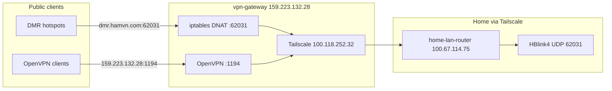

<!-- c1a7a374-4c80-4b82-9eab-817d81589a32 -->
---
todos:
  - id: "home-tailscale-online"
    content: "Bring home-lan-router (100.67.114.75) back online on Tailscale and verify HBlink4 listens on UDP 62031"
    status: pending
  - id: "vpn-gateway-iptables"
    content: "Add DNAT/MASQUERADE rules on vpn-gateway for UDP 62031 → 100.67.114.75 with persistent save"
    status: pending
  - id: "vpn-gateway-firewall"
    content: "Enable UFW on vpn-gateway: allow 22, 1194/udp, 62031/udp"
    status: pending
  - id: "home-firewall"
    content: "Close public UDP 62031 on home; allow only from vpn-gateway Tailscale IP 100.118.252.32"
    status: pending
  - id: "dns-cutover"
    content: "Update dmr.hamvn.com A record from 146.190.91.32 to 159.223.132.28"
    status: pending
  - id: "verify-and-decommission"
    content: "Test DMR + OpenVPN after reboot; destroy dmr-gateway droplet after stable period"
    status: pending
isProject: false
---
# Merge vpn-gateway and dmr-gateway into one VM

## Answer: Yes, one VM is enough

Both roles are lightweight and compatible on a single host:

| Function | Service | Port | Current VM | Resource cost |
|---|---|---|---|---|
| VPN | OpenVPN + Tailscale | UDP 1194 | vpn-gateway | ~350 MB RAM |
| DMR relay | iptables DNAT (kernel) | UDP 62031 | dmr-gateway | negligible |

**Keep [vpn-gateway](159.223.132.28)** — it already runs OpenVPN and Tailscale, has ~612 MB RAM free and 21 GB disk free. The 512 MB dmr-gateway droplet is too small to host both and currently has no services running anyway.

OpenVPN clients already point at `159.223.132.28` ([Working/openvpn/tailscale-openvn.ovpn](Working/openvpn/tailscale-openvn.ovpn)). Only DMR DNS needs to move.

## Target architecture



**Public exposure:** clients use `dmr.hamvn.com` or `159.223.132.28` only. Home public IP (`103.238.68.88`) is never published and does not need inbound UDP 62031 open.

## Prerequisites (blockers)

1. **Bring `home-lan-router` online on Tailscale** — currently offline ~13h. Without it, `100.67.114.75:62031` is unreachable and DMR forwarding cannot work.
2. **Confirm HBlink4 is listening** on home for UDP 62031 (bound to `0.0.0.0` or the Tailscale interface).

## Implementation on vpn-gateway (159.223.132.28)

### 1. Enable forwarding (if not already)

```bash
sysctl -w net.ipv4.ip_forward=1
echo 'net.ipv4.ip_forward=1' >> /etc/sysctl.d/99-gateway.conf
```

### 2. Add persistent DMR port-forward via Tailscale

```bash
# DNAT public UDP 62031 → home Tailscale IP
iptables -t nat -A PREROUTING -i eth0 -p udp --dport 62031 \
  -j DNAT --to-destination 100.67.114.75:62031

# SNAT so home replies via Tailscale, not public IP
iptables -t nat -A POSTROUTING -o tailscale0 -p udp -d 100.67.114.75 --dport 62031 \
  -j MASQUERADE
```

Install persistence so rules survive reboot (same issue that broke dmr-gateway today):

```bash
apt install -y iptables-persistent
netfilter-persistent save
```

Alternatively, a small systemd unit (`/etc/systemd/system/dmr-forward.service`) that applies rules on boot — more explicit and easier to audit.

### 3. Firewall

Allow only required inbound ports on the public interface:

```bash
ufw allow 22/tcp
ufw allow 1194/udp    # OpenVPN (verify if already allowed)
ufw allow 62031/udp   # DMR relay
ufw enable
```

Tailscale traffic is handled separately by existing `ts-input` / `ts-forward` chains — no conflict with OpenVPN `tun0` or DMR DNAT.

## Home server changes

On `home-lan-router` / HBlink4 host:

- **Close public inbound UDP 62031** on the home router/firewall (only Tailscale path needed).
- **Allow UDP 62031 from** `100.118.252.32` (vpn-gateway Tailscale IP) only.
- Verify HBlink4 config accepts connections on port 62031 (matches [mmdvm-board README](Working/repositories/hamvn.com/mmdvm-board/README.md) default).

## DNS update

| Record | Current | New |
|---|---|---|
| `dmr.hamvn.com` A | `146.190.91.32` | `159.223.132.28` |

- Keep as **DNS-only** (grey cloud / no HTTP proxy) — UDP 62031 cannot be Cloudflare-proxied.
- TTL: lower to 300s before cutover, raise after verification.

No change needed for OpenVPN (`159.223.132.28` already correct).

## Verification checklist

1. `tailscale ping home-lan-router` from vpn-gateway succeeds.
2. `ss -ulnp | grep 62031` on home shows HBlink4 listening.
3. From external host: `nc -u dmr.hamvn.com 62031` or test with an MMDVM hotspot using `HBLINK_ADDRESS=dmr.hamvn.com`.
4. OpenVPN still connects and can reach home LAN (`192.168.3.0/24` route already pushed in server config).
5. Reboot vpn-gateway and confirm rules persist + DMR still works.

## Decommission dmr-gateway

After 24–48h of stable operation:

1. Remove DNS record pointing to `146.190.91.32` (if any remain).
2. Destroy DigitalOcean droplet `146.190.91.32` (sgp1, 512 MB) — saves cost and removes a host that had home IP in bash history.
3. Optional: scrub `/root/.bash_history` on dmr-gateway before destroy.

## Risks and trade-offs

| Topic | Impact |
|---|---|
| Single point of failure | VPN and DMR both down if vpn-gateway fails — acceptable for homelab; was already true for VPN |
| Region | dmr-gateway is sgp1; confirm vpn-gateway region is acceptable for DMR latency to Vietnam users |
| Tailscale dependency | DMR relay requires home-lan-router online; more reliable than public-IP DNAT long-term |
| Rule persistence | Must install `iptables-persistent` or systemd unit — critical lesson from today's reboot |

## What stays unchanged

- OpenVPN server config on vpn-gateway (`/etc/openvpn/server/server.conf`, UDP 1194)
- Tailscale mesh membership
- MMDVM hotspot clients: still use `dmr.hamvn.com:62031` — only the resolved IP changes
- HBlink4 password and port (62031) per [mmdvm-hotspot.env.example](Working/repositories/hamvn.com/mmdvm-board/mmdvm-hotspot.env.example)
