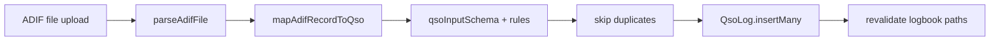

# ADIF QSO Import Plan

## Sample file analysis

Analyzed [`XV2DA up to date 20260816142841.adi`](/Users/hai.tran/Downloads/Telegram%20Desktop/XV2DA%20up%20to%20date%2020260816142841.adi) (QRZLogbook export, ADIF 3.1.1):

| Metric | Result |
|--------|--------|
| Records (`<EOR>`) | 69 (header says 16 — ignore header count) |
| Station callsign | All `XV2DA` |
| Modes | All `FT8` (supported in [`QSO_MODES`](src/lib/validations/qso.ts)) |
| Bands | `20m` (65), `40m` (4) (supported in [`QSO_BANDS`](src/lib/validations/qso.ts)) |
| Frequency | All present (`14.074` MHz style) |
| Grid | All present; 58 records use 4-char Maidenhead, 11 use 6-char (both valid) |
| RST | 2 records missing `RST_RCVD` (FT8-style `-16`/`-19` otherwise) |
| Duplicates | No exact duplicates on `(CALL, QSO_DATE, TIME_ON, MODE, BAND)` |

**Verdict: importable.** All core fields map to [`QsoLog`](src/models/QsoLog.ts). Extra QRZ fields (`app_qrzlog_*`, `qrzcom_*`, `dxcc`, etc.) can be ignored.



## Field mapping (ADIF → portal)

| ADIF field | Portal field | Notes |
|------------|--------------|-------|
| `CALL` | `workedCallsign` | Required; normalize uppercase via existing callsign helpers |
| `QSO_DATE` + `TIME_ON` | `qsoAt` | Parse `YYYYMMDD` + `HHMM`/`HHMMSS` as **UTC** (matches existing export in [`src/lib/adif/export.ts`](src/lib/adif/export.ts)) |
| `BAND` | `band` | Must map to `QSO_BANDS`; unknown → `"other"` |
| `FREQ` | `freqMhz` | Required by portal schema; skip record if missing/invalid |
| `MODE` | `mode` | Normalize case; unknown modes still allowed (schema max 32 chars) |
| `RST_SENT` / `RST_RCVD` | `rstSent` / `rstRcvd` | Default `"59"` if missing (covers 2 sample records) |
| `GRIDSQUARE` | `grid` | Uppercase; accept 4- or 6-char grids |
| `COMMENT` | `notes` | Optional |
| — | `qso_sent` | **Always `false` on import** (avoid confirmation email jobs) |
| — | `qso_confirmed` | **Always `false` on import** |

**Ownership guard:** if `STATION_CALLSIGN` is present and does not match the logged-in user’s callsign, **skip that record** and count it in the import summary (prevents importing another operator’s log into the wrong account).

**Duplicate policy (per your choice):** skip when an existing QSO matches `(userId, workedCallsign, qsoAt, band, mode)`.

## Implementation

### 1. ADIF parser library

Create [`src/lib/adif/parse.ts`](src/lib/adif/parse.ts):

- Parse ADIF 3.x `<FIELD:LEN>value` format (case-insensitive field names)
- Split header (`<EOH>`) from body; split records on `<EOR>`
- Return `{ header, records: AdifRecord[] }` where each record is a lowercase-key map
- Handle `\r\n` / `\n` line endings (QRZ file uses indented lines — parser must not depend on line structure beyond field tags)
- Enforce limits: max file size (e.g. **2 MB**) and max records (e.g. **5,000**)

Create [`src/lib/adif/import.ts`](src/lib/adif/import.ts):

- `mapAdifRecordToQsoInput(record, stationCallsign)` → `QsoInputValues | null` + skip reason
- Reuse [`qsoInputSchema`](src/lib/validations/qso.ts) for final validation
- Band/mode normalization helpers colocated here (or small additions to `validations/qso.ts` if shared)
- Unit-test the parser against a trimmed fixture copied from the sample file (first 2–3 records) — no test runner exists today, but parser logic is isolated enough to add later

### 2. Server action

Create [`src/lib/qso-import-actions.ts`](src/lib/qso-import-actions.ts) with `importQsoAdifAction(formData: FormData)`:

1. Require session + user callsign (same as [`createQsoAction`](src/lib/qso-actions.ts))
2. Accept `.adi` / `.adif` file from `FormData`
3. Parse → map → validate each record
4. Query existing QSO keys for duplicate detection (batch query on candidate `qsoAt` range or per-record `findOne` — keep simple first)
5. `QsoLog.insertMany` for accepted rows
6. `revalidateLogbook(callsign)` (reuse helper from `qso-actions.ts` — extract shared revalidation to avoid duplication)
7. Return summary:

```ts
{ ok: true, imported: number, skippedDuplicate: number, skippedInvalid: number, skippedStationMismatch: number, errors: string[] }
```

No confirmation emails on import (`qso_sent: false`).

### 3. UI (owner logbook only)

Update [`src/components/portal/qso-logbook.tsx`](src/components/portal/qso-logbook.tsx):

- Add **Import ADIF** control next to existing **Export ADIF** (owner toolbar only, `canEdit`)
- Hidden file input (`accept=".adi,.adif,text/plain"`) + button
- On submit: `FormData` → `importQsoAdifAction`
- Show result banner (imported / skipped counts; first few error lines)
- After success: `router.refresh()` so table reloads

Add i18n keys in [`messages/en.json`](messages/en.json) / [`messages/vi.json`](messages/vi.json): `importAdif`, `importing`, `importSuccess`, `importFailed`, etc.

### 4. Logbook data loading fix (recommended in same PR)

[`listUserQsos`](src/lib/qso.ts) currently defaults to `limit = 200`. After importing 69 records this is fine, but larger ADIF files would truncate the UI. Either:

- Remove the limit for ham profile page, **or**
- Pass a higher limit / add pagination at DB level later

Recommend removing the 200 cap (or setting a much higher default) when loading the owner’s logbook tab so imports are fully visible.

## Security and UX constraints

- **Auth required**; imports always attach to `session.user.id`
- **No admin cross-user import** in this scope (user’s own logbook only)
- **No email side effects** on import
- **Skip duplicates** rather than overwrite
- Invalid rows are skipped with reasons; valid rows still import (partial success)

## Verification

1. Import the sample QRZ file as user `XV2DA` → expect ~69 imported (minus any already manually logged)
2. Re-import same file → expect 0 imported, ~69 skipped as duplicates
3. Import as a different callsign user → records with `STATION_CALLSIGN: XV2DA` skipped
4. Confirm logbook table shows imported QSOs with correct date, FT8 mode, grid, RST
5. Run `pnpm lint` and `npx tsc --noEmit`

## Out of scope

- Admin import on behalf of users
- Importing into another operator’s public logbook
- Mapping QSL/QRZ confirmation state from ADIF
- Two-way sync with QRZ
