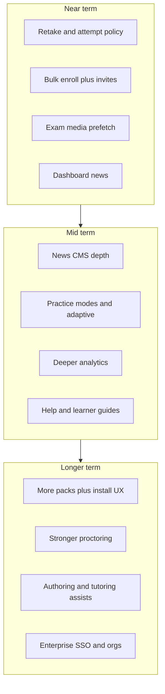

# Advanced features roadmap for ClassQ.io

ClassQ is already a full testing/certification platform (timed sessions, protection, reveal-during-exam, news, mailbox, certificates, jobs, plugin host + callsign). Advanced work should deepen **attempt policy, scale of enrollment, learning feedback, and plugin extensibility**—not rebuild core exam flow.

---

## Near term (high fit, builds on existing code)

| Feature | Why it fits | Anchor |
|---------|-------------|--------|
| **Retake / attempt policy UX** | Multi-session flag exists; learners still lack remaining attempts, cooldown, clear “why can’t enroll” | [`AGENTS.md` backlog](AGENTS.md), enrollment settings |
| **Bulk enrollment** | Admin enroll + `TypeBulkNotifyEnrollment` jobs exist; CSV/email list + invite mail closes the ops gap | Sessions CM + [`backend/internal/jobs`](backend/internal/jobs) |
| **Exam media prefetch** | Q&A text already bulk-loaded; auth images still hydrate per question | Plan: exam media prefetch cache |
| **Dashboard news surface** | News CMS + public routes exist; home lacks a feed | News package + dashboard |
| **Callsign plugin polish** | Pack is live; finish product gaps vs greenfield | [`plugins/callsign/`](plugins/callsign/) |

---

## Mid term (clear product lift)

| Feature | Notes |
|---------|--------|
| **News depth** | Dedicated cover image, draft preview, slug regenerate, light post analytics ([`AGENTS.md`](AGENTS.md)) |
| **Question bank intelligence** | Hardness from analytics, “weak areas” practice sets, level-suggestion already partially exists |
| **Practice modes** | Untimed practice, module-only drills, bookmark/wrong-answer review decks (reuse snapshots + jobs) |
| **Richer exam analytics** | Item discrimination, time-per-question, cohort compare; FE beyond current summary panels |
| **Help center** | `/help` is still a placeholder — bilingual guides for enroll, protection, certification profile |
| **Learner progress** | Cross-exam streaks, certification pathway progress (profile + certificates data) |
| **Result sharing** | Signed public result/certificate links with expiry (extends certification-check) |

---

## Longer term / “advanced platform”

| Feature | Notes | Caution |
|---------|--------|---------|
| **More plugins** | Second pack template; optional install-from-catalog when host grows beyond env-managed | Host currently env-gated install ([`plugins/README.md`](plugins/README.md)) |
| **Stronger proctoring** | Webcam presence, ID check, room scan — beyond DevTools/tab guard | Privacy, browser APIs, false positives |
| **AI authoring assist** | Draft MCQs from outline, bilingual translate, distractor suggestions | Cost, quality review workflow |
| **Adaptive testing** | IRT-style next-question selection | Needs psychometrics + large tagged banks |
| **Org / multi-tenant** | Teams, org admins, branded sub-portals | Large schema/auth change |
| **Enterprise SSO** | SAML/OIDC beyond Google | Fits Access settings pattern |
| **Offline / PWA exam** | Cache exam package; sync answers | Conflicts with protection + timer trust |
| **Live proctor dashboard** | CM watches active sessions | Scale + privacy |

---

## Recommended sequencing (default pick)

If choosing without further product debate, ship in this order:

1. **Retake / attempt policy UX** — unblocks certification ops clarity  
2. **Bulk enrollment + invite mail** — leverages jobs immediately  
3. **Exam media prefetch** — cheap UX win on existing bulk Q&A payload  
4. **Dashboard news + news cover/draft** — engagement surface  
5. **Analytics depth + wrong-answer practice** — learning loop  
6. **Help center** — reduce support load  
7. Defer proctoring/AI/SSO/orgs until a concrete customer need

---

## What not to prioritize now

- Rewriting exam session to “fetch one question at a time” (already full payload)
- Second exam engine / non-MCQ types before attempt policy and bulk enroll are solid
- Dynamic plugin marketplace before a second real pack exists

---

## How to use this plan

- Pick **1–2 near-term** items for the next implementation cycle  
- Treat mid/long lists as options, not commitments  
- For each chosen item, open a focused implementation plan (scope, APIs, FE surfaces, i18n) before coding
