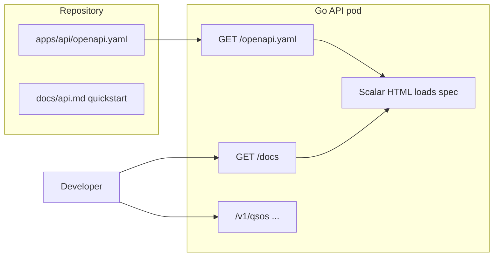

# API documentation plan

## Recommendation

| Layer | Tool | Why |
|-------|------|-----|
| **Contract** | [OpenAPI 3.1](https://spec.openapis.org/oas/v3.1.0) YAML | Industry standard; powers Try-it-out, client SDKs, and future contract tests. Already on your v1.1 backlog. |
| **Interactive UI** | [Scalar](https://scalar.com/products/api-references) | Modern docs UI, Bearer-auth support, embeddable with ~10 lines of HTML, no extra service to deploy. |
| **Quickstart** | Keep [`docs/api.md`](docs/api.md) | Short prose for repo/README; link to live docs. |

**Not recommended for v1:**
- **Swagger UI alone** — works, but dated UX vs Scalar.
- **swaggo/swag** (Go annotations) — adds comment noise; your API surface is small (~6 routes); hand-written OpenAPI is easier to maintain for now.
- **ReadMe / Stoplight** — overkill for a single internal QSO API.
- **Portal-hosted docs** — you chose the API subdomain; keeps docs next to the service they describe.



---

## 1. Add OpenAPI spec

Create [`apps/api/openapi.yaml`](apps/api/openapi.yaml) from the existing [`docs/api.md`](docs/api.md) content:

- **Info:** title `VARC QSO API`, version from `API_PUBLIC_URL` server entry (use `servers` with `https://api.hamvn.com` + `http://localhost:3100`)
- **Security:** `http` Bearer scheme (`Authorization: Bearer varc_…`)
- **Paths:**
  - `GET /health`
  - `GET|POST /v1/qsos` (list filters, pagination, create body)
  - `GET|PATCH|DELETE /v1/qsos/{id}`
- **Schemas:** mirror [`apps/api/internal/qso/dto.go`](apps/api/internal/qso/dto.go) and [`validate.go`](apps/api/internal/qso/validate.go) (bands enum, list query params, error shapes)
- **Document scopes:** `qso:read`, `qso:write` in operation `security` blocks

Embed the file in the Go binary with `//go:embed openapi.yaml` so the Docker image always ships the spec (no separate volume).

---

## 2. Serve docs from the Go API

Add [`apps/api/internal/handler/docs.go`](apps/api/internal/handler/docs.go):

- `GET /openapi.yaml` — `Content-Type: application/yaml`, embedded spec
- `GET /docs` — minimal HTML page loading Scalar from CDN, pointing at `/openapi.yaml`
- Optional: `GET /docs/` redirect to `/docs`

Register routes in [`apps/api/cmd/server/main.go`](apps/api/cmd/server/main.go) **before** auth middleware, same as `/health`.

Update [`apps/api/internal/middleware/middleware.go`](apps/api/internal/middleware/middleware.go) `BearerAuth` to skip public doc paths:

```go
// alongside /health
/docs, /openapi.yaml, /openapi.json
```

IP rate limit already applies only to `/v1/*` — no change needed.

**Scalar config highlights:**
- `authentication.preferredSecurityScheme: bearerAuth`
- Server URL from current host in dev, or fixed production URL in spec

---

## 3. Docker / K8s

- **Dockerfile:** no change if spec is `go:embed` (compiled into binary).
- **Ingress:** [`deploy/k8s/ingress.yaml`](deploy/k8s/ingress.yaml) already routes all paths on `api.hamvn.com` to `varc-api` — `/docs` works automatically after deploy.
- No new pod or ConfigMap required.

---

## 4. Update developer docs

[`docs/api.md`](docs/api.md):

- Add prominent link: **Interactive docs:** `https://api.hamvn.com/docs` (local: `http://localhost:3100/docs`)
- Trim duplicated endpoint tables over time; keep auth setup, env vars, caching, and deploy notes in markdown.

[`README.md`](README.md) — one line under API section pointing to `/docs`.

Portal Security tab ([`api-tokens-panel.tsx`](src/components/portal/api-tokens-panel.tsx)) — optional link next to API base URL: “API documentation” → `{apiPublicUrl}/docs`.

---

## 5. Maintenance rule

When changing API behavior, update **in order:**

1. Go handlers / validation
2. `apps/api/openapi.yaml`
3. `docs/api.md` (only if prose/quickstart affected)

Later (optional): CI step validating spec with [kin-openapi](https://github.com/getkin/kin-openapi) or a smoke test that `/docs` and `/openapi.yaml` return 200.

---

## Alternatives considered

| Option | Verdict |
|--------|---------|
| Redoc | Good static UI; Scalar has better Try-it-out and Bearer UX today |
| Postman public workspace | Fine for sharing collections; not a single source of truth in-repo |
| Markdown only | Already have this; no interactive Try-it-out for token holders |

---

## Files to touch

| File | Action |
|------|--------|
| [`apps/api/openapi.yaml`](apps/api/openapi.yaml) | **Create** — full spec |
| [`apps/api/internal/handler/docs.go`](apps/api/internal/handler/docs.go) | **Create** — embed + serve |
| [`apps/api/cmd/server/main.go`](apps/api/cmd/server/main.go) | Wire `/docs`, `/openapi.yaml` |
| [`apps/api/internal/middleware/middleware.go`](apps/api/internal/middleware/middleware.go) | Public path bypass for auth |
| [`docs/api.md`](docs/api.md) | Link to live docs |
| [`src/components/portal/api-tokens-panel.tsx`](src/components/portal/api-tokens-panel.tsx) | Optional docs link |

No new dependencies in `go.mod` if using embed + Scalar CDN.
