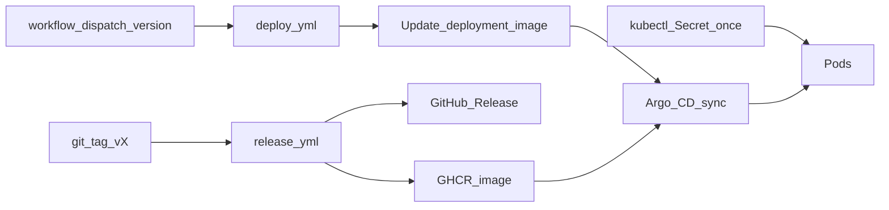

# Argo CD + on-demand deploy from GitHub Releases

## Decisions (locked)

- **Registry:** `ghcr.io/varc-vietnam/varc-portal` (GHCR)
- **Secrets:** Create `varc-portal-secrets` once in the cluster (outside Argo); Argo does not own Secret manifests
- **Deploy trigger:** On-demand via `workflow_dispatch` (not on tag push). Tag push only builds/publishes the release + image



## 1. Publish image on release (tag still builds; does not deploy)

Extend [`.github/workflows/release.yml`](.github/workflows/release.yml):

- After `pnpm build` (or in parallel with packaging), `docker build` / `docker push`:
  - `ghcr.io/varc-vietnam/varc-portal:v{version}`
  - `ghcr.io/varc-vietnam/varc-portal:{version}` (optional alias without `v`)
- Permissions: `packages: write` + `contents: write`
- Login: `docker/login-action` with `GITHUB_TOKEN`
- Keep existing tarball + GitHub Release notes as today

Update [`deploy/k8s/deployment.yaml`](deploy/k8s/deployment.yaml) image from `varc-portal:latest` to a pinned placeholder, e.g. `ghcr.io/varc-vietnam/varc-portal:v0.0.1`, and set `imagePullPolicy: IfNotPresent` (or `Always` for tags).

## 2. Argo CD Application (Git as source of truth)

Add [`deploy/argocd/application.yaml`](deploy/argocd/application.yaml):

- `source.repoURL`: this GitHub repo
- `source.path`: `deploy/k8s`
- `destination.namespace`: e.g. `varc` (create namespace if missing via Argo `CreateNamespace=true`)
- Sync policy: **automated** optional for when Git changes; deploy still only happens when you run the on-demand workflow (or manually edit the image tag)
- **Exclude** Secret from Git: keep [`secret.example.yaml`](deploy/k8s/secret.example.yaml) as docs only — move it to `deploy/k8s/secret.example.yaml` outside the sync path, or add an Argo ignore / do not put a real Secret under `deploy/k8s/`

Recommended layout:

- `deploy/k8s/` — Deployment, Service, Ingress, ConfigMap (synced by Argo)
- `deploy/k8s/secret.example.yaml` — rename/move to `deploy/docs/secret.example.yaml` so Argo never applies example secrets
- `deploy/argocd/application.yaml` — applied once to the cluster (`kubectl apply -f deploy/argocd/application.yaml`)

Document one-time cluster bootstrap:

```bash
kubectl create namespace varc
kubectl apply -f deploy/docs/secret.example.yaml   # edit values first, or kubectl create secret generic ...
kubectl apply -f deploy/argocd/application.yaml
```

GitHub Actions secrets/vars are **not** injected into Argo; they stay for CI (and optional future deploy auth only).

## 3. On-demand deploy workflow

Add [`.github/workflows/deploy.yml`](.github/workflows/deploy.yml):

- Trigger: `workflow_dispatch` with input `version` (e.g. `0.0.2` or `v0.0.2`)
- Steps:
  1. Normalize to `vX.Y.Z`
  2. Verify the GHCR tag / GitHub Release exists for that version (fail fast if you try to deploy something not released)
  3. Checkout, update `image:` in `deploy/k8s/deployment.yaml` to `ghcr.io/varc-vietnam/varc-portal:vX.Y.Z`
  4. Commit + push to the default branch (`chore: deploy vX.Y.Z` — already excluded from release notes)
- Argo CD watches the repo and syncs the new image

Permissions: `contents: write` for the bot commit. Use a fine-grained token or `GITHUB_TOKEN` with contents write on the same repo.

No kubeconfig required in GitHub if Argo pulls from Git (preferred).

## 4. GHCR pull access on the cluster

If the package is private:

- Create a `ghcr-pull` imagePullSecret in namespace `varc`
- Reference it on the Deployment `spec.template.spec.imagePullSecrets`

If the package is public, skip pull secrets.

## 5. Docs

Update README with:

- Release (tag) → image + GitHub Release
- One-time: Secret + Argo Application
- Deploy: Actions → “Deploy” → enter version → Run workflow

## Out of scope

- Auto-deploy on every tag
- Syncing GitHub Secrets into the cluster via Argo
- Deploying the standalone tarball as the runtime (image is the runtime artifact)
