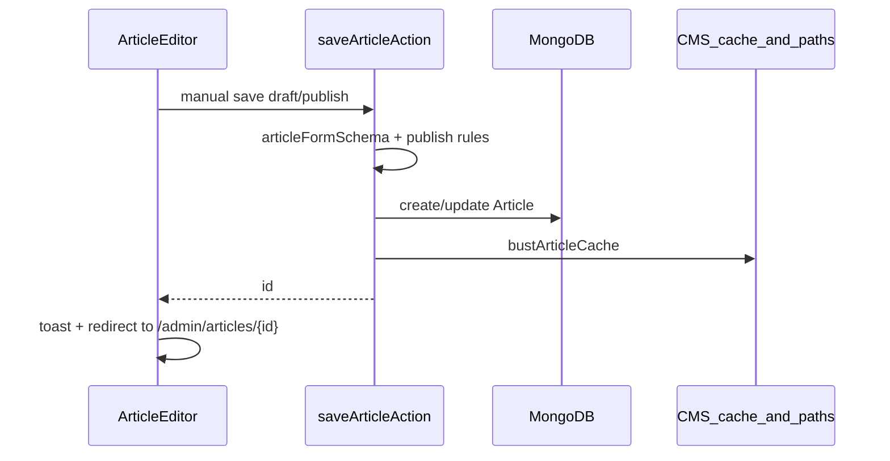

# Article auto-save plan

## Current behavior (baseline)

Today, articles are only persisted when the user clicks **Save draft** or **Publish** in [`src/components/admin/article-editor.tsx`](src/components/admin/article-editor.tsx), which calls [`saveArticleAction`](src/lib/actions.ts) with full validation and always runs [`bustArticleCache`](src/lib/actions.ts) (CMS key delete + `revalidatePath` for `/vi/news/{slug}` and `/en/news/{slug}`).



There is **no existing auto-save** pattern in the repo; debouncing elsewhere uses simple `setTimeout` (e.g. [`qso-logbook.tsx`](src/components/portal/qso-logbook.tsx)).

## Target behavior

| Scenario | Auto-save writes | Status | Public cache |
|----------|------------------|--------|--------------|
| New article (`/new`) | Creates draft once there is minimal content | Always `draft` | No bust (not public yet) |
| Editing draft | Updates fields | Stays `draft` | No bust |
| Editing published | Updates fields | **Preserved** (`published`) | **Deferred** until manual Save/Publish |

Per your choice: published articles are saved to DB on auto-save, but the live site is **not** revalidated until a manual save.

### UX

- Small status near the header actions: `Saving…` / `Saved 4:12 PM` / `Auto-save failed` (retry on next edit or subtle retry button).
- No success toast on auto-save (avoid noise); keep toasts for manual Save draft / Publish.
- `beforeunload` warning when there are unsaved changes or a save is in flight.
- After first auto-save on `/new`, silently `router.replace('/admin/articles/{id}')` so Preview / Trash / Clone become available without losing editor state.

### Auto-save will NOT

- Publish or unpublish (status never changes on auto-save).
- Replace manual **Publish** validation (VI title + content still required there).
- Auto-save completely empty **new** articles (avoid orphan blank drafts).

---

## 1. Server: dedicated auto-save action

Add `autoSaveArticleAction` in [`src/lib/actions.ts`](src/lib/actions.ts) rather than overloading `saveArticleAction`.

**Why a separate action:**
- [`articleFormSchema`](src/lib/validations/article.ts) runs publish `superRefine` when `status === "published"` — auto-save must not fail mid-edit on a published post.
- Auto-save must **never change** `status` / `publishedAt` semantics from what is already stored (for existing rows).
- Auto-save must **skip** `bustArticleCache` / `revalidateArticlePaths`.

### Validation schema

Add `articleAutoSaveSchema` in [`src/lib/validations/article.ts`](src/lib/validations/article.ts):

- Same field shape as `articleFormSchema` **input** (locales, images, categories, tags, dates, featured).
- Same transforms (`sanitizeHtml`, URL safety).
- **No** publish `superRefine` (partial/in-progress content allowed).
- Do **not** accept client `status` for updates (ignore it server-side).

### Action logic

```ts
autoSaveArticleAction(id: string | null, raw: unknown)
  -> { ok: true; id: string; savedAt: string } | { ok: false; error: string }
```

Shared helper (extract from current `saveArticleAction` to avoid drift):

- `buildArticleLocales(data, id)` — slug generation via `uniqueSlugFromTitle` + `articleSlugTaken`
- `normalizeArticleTags`, category ObjectId mapping (already inline today)

**Create (`id === null`):**
- Require minimal content gate (server-side mirror of client): at least one locale has non-empty title **or** non-empty HTML content.
- `Article.create({ ...fields, status: "draft", authorId, publishedAt: null })`
- No cache bust.

**Update (`id` set):**
- Load existing; 404 if missing/deleted.
- Apply content fields: `locales`, `featured`, `coverImageUrl`, `coverImageFocus`, `ogImageUrl`, `categoryIds`, `tags`, optional `createdAt` from form.
- **Do not modify** `status` or `publishedAt` on auto-save (keeps published articles published without touching schedule).
- No cache bust.

**Manual save stays unchanged:** `saveArticleAction` continues to set status, publishedAt rules, and call `bustArticleCache`.

---

## 2. Client: `useArticleAutosave` hook

New file: [`src/hooks/use-article-autosave.ts`](src/hooks/use-article-autosave.ts)

**Inputs:** `initialArticleId`, `form`, `initialForm` (for dirty baseline after load)

**State:**
- `articleId` — local copy; starts as prop, updated after first successful create
- `saveState`: `idle | saving | saved | error`
- `lastSavedAt: Date | null`
- `lastSavedSnapshot: string` — `JSON.stringify(normalizedForm)` for dirty detection
- `saveGenerationRef` — cancel stale debounced runs on unmount

**Debounce:** ~2.5s after last form change (`useEffect` + `setTimeout`, same style as logbook search).

**Save pipeline:**
1. Skip if `formSnapshot === lastSavedSnapshot`.
2. Skip if new article and `!hasMinimalContent(form)`.
3. Skip if a save is already in flight; set `pendingAfterSave` flag to run again when current finishes if still dirty.
4. Call `autoSaveArticleAction(articleId, formPayload)`.
5. On success: update `articleId`, `lastSavedSnapshot`, `lastSavedAt`, `saveState = saved`; if first create, `router.replace('/admin/articles/{id}', { scroll: false })`.
6. On failure: `saveState = error`, store message; no toast (inline indicator only).

**`hasMinimalContent(form)`:** VI/EN title trimmed non-empty OR `!isEmptyHtml` on VI/EN content (reuse [`isEmptyHtml`](src/lib/html.ts)).

**beforeunload:** register when dirty or `saveState === saving`.

**Return:** `{ articleId, saveState, lastSavedAt, saveError, flushSave }` — expose `flushSave` for optional manual "Save now" later; manual buttons keep using existing `onSave`.

---

## 3. Wire into `ArticleEditor`

Modify [`src/components/admin/article-editor.tsx`](src/components/admin/article-editor.tsx):

- Replace `articleId` prop usage for actions with hook's `articleId` (fallback to prop until first save).
- Call hook with `form` whenever local form state changes.
- Add compact status row in the header toolbar (next to Preview / Save draft / Publish):

```tsx
// idle + dirty → "Unsaved changes"
// saving → "Saving…"
// saved → "Saved {time}"
// error → "Auto-save failed" + optional retry
```

- Update **Delete / Clone / Preview** to use resolved `articleId` from hook.
- Refactor `onSave` to pass resolved `articleId` into `saveArticleAction` (so manual save after auto-create updates rather than creating a duplicate).
- After successful manual save, reset hook baseline: `syncSavedSnapshot(form)` so auto-save doesn't immediately re-fire.

Keep manual save redirect behavior (`router.push`) as-is for explicit user actions; auto-save uses `replace` only on first create.

---

## 4. Edge cases

| Case | Handling |
|------|----------|
| User types during in-flight save | Queue one trailing save after completion if still dirty |
| Slug changes while editing published | DB updated on auto-save; public slug unchanged until manual save busts cache (acceptable per defer-cache choice) |
| Invalid URL in cover field mid-edit | Auto-save fails validation; show inline error; user can fix and next debounce retries |
| User navigates away | `beforeunload` if dirty/saving |
| Concurrent tab editing same article | Out of scope (last write wins); note in code comment |
| Rich text paste/upload | Debounce naturally batches; no special TipTap hook needed |

---

## 5. Testing checklist

- **New article:** type VI title → wait → draft created, URL becomes `/admin/articles/{id}`, refresh shows same content.
- **New article:** open `/new`, wait without typing → no DB row created.
- **Draft edit:** change content → auto-save → reload edit page → changes persisted.
- **Published edit:** auto-save content change → public `/vi/news/{slug}` unchanged until manual Publish/Save; DB has new content.
- **Manual Publish** after auto-save on `/new` → still validates VI fields; publishes and busts cache.
- **Manual Save draft** on published article → still able to unpublish (existing behavior unchanged).
- Lint + `npx tsc --noEmit` after changes.

---

## Files to touch

| File | Change |
|------|--------|
| [`src/lib/validations/article.ts`](src/lib/validations/article.ts) | Add `articleAutoSaveSchema` |
| [`src/lib/actions.ts`](src/lib/actions.ts) | Extract shared builders; add `autoSaveArticleAction`; keep `saveArticleAction` cache bust |
| [`src/hooks/use-article-autosave.ts`](src/hooks/use-article-autosave.ts) | New debounced auto-save hook |
| [`src/components/admin/article-editor.tsx`](src/components/admin/article-editor.tsx) | Integrate hook + status UI; use resolved `articleId` |

No model/schema migration required — reuses existing [`Article`](src/models/Article.ts) document shape.
