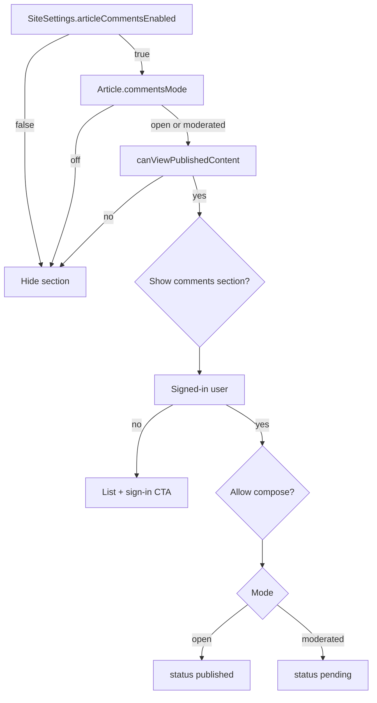

# Article commenting — design plan

No comment system exists today. This plan answers where comments live, who controls visibility, where toggles go, and who can post / review / delete — aligned with current roles and article admin patterns.

## Recommended model (defaults)

| Decision | Choice |
|----------|--------|
| Who can **post** | Signed-in users who can **view** the article (`canViewPublishedContent`) |
| Who can **read** published comments | Anyone who can view the article (including anonymous if article is public) |
| Threading | **Flat** list in v1 (no nested replies) |
| Moderation modes | Per article: `off` \| `open` \| `moderated` |
| Who **approves** | Users with `canManageArticles` (editors, administrators, setup_admin) |
| Who **deletes** | Same moderators, **or** the comment author (own comments) |
| Guest / anonymous posting | Not in v1 (avoids spam; fits club membership) |

## 1. Where comments should appear

**Public article page** ([`src/app/[locale]/(portal)/news/[slug]/page.tsx`](src/app/[locale]/(portal)/news/[slug]/page.tsx)):

- Mount **after** [`ArticleBody`](src/components/portal/article-body.tsx) (cover + content), still inside the article reading flow.
- For the default `"article"` template: after body, before closing `</article>`.
- For **custom article templates** (block renderer path): render the same comments section **below** `TemplateLayoutRenderer` so comments are not blocked on a new template block.

Do **not** put comments in the admin editor preview as a first requirement; admin moderation has its own queue (below).

## 2. Who controls visibility of the comments section

Two layers (both must allow):

1. **Site master switch** — `SiteSettings.articleCommentsEnabled` (default `false` until the club turns it on).
   - Gate: `canManageSite` (Site Settings).
2. **Per-article mode** — `Article.commentsMode`: `off` | `open` | `moderated` (default `off` so existing articles stay silent until editors opt in).
   - Gate: `canManageArticles` / editorial.

Additionally, the section only renders if the viewer passes existing **`canViewPublishedContent`** for that article (private articles keep comments private too).

**Pending** comments are visible only to:

- Moderators (`canManageArticles`), and
- The **author of that pending comment** (so they see “awaiting review”).

## 3. Where to put enable / disable controllers

| Control | UI location | Who |
|---------|-------------|-----|
| Global on/off | **Admin → Settings** ([`site-settings-editor.tsx`](src/components/admin/site-settings-editor.tsx) + [`SiteSettings`](src/models/SiteSettings.ts)) — checkbox “Enable article comments” | `canManageSite` |
| Per article | **Article editor → Access** aside ([`article-section-aside.tsx`](src/components/admin/article-section-aside.tsx)), with [`ContentAccessFields`](src/components/admin/content-access-fields.tsx) — select: Off / Open / Moderated | `canManageArticles` |

**Why Access (not Properties):** commenting is an interaction policy next to *who can view* the article. Properties stays for Featured / categories / tags. Do not add a separate comment allowlist in v1 — posting still requires `canViewPublishedContent` (and signed-in).

## 4. Actions and permissions

### Article modes

| Mode | Visitor sees | Signed-in member can | New comments |
|------|--------------|----------------------|--------------|
| `off` | Nothing | — | — |
| `open` | Published comments | Post | Immediately `published` |
| `moderated` | Published comments | Post | `pending` until approved |

### Comment actions

| Action | Who |
|--------|-----|
| **Create** | Signed-in + can view article + site on + mode ≠ `off` |
| **Edit own** (optional v1.1) | Author, within a short window; skip in v1 if you want less scope |
| **Delete own** | Comment author |
| **Approve / reject** (moderated) | `canManageArticles` |
| **Delete any** | `canManageArticles` |
| **List pending queue** | `canManageArticles` |

No new role capability in v1 — map moderation to existing **`canManageContent` / `canManageArticles`** (editors+). Article **author** without editorial caps does **not** moderate unless you later add that explicitly.

### Admin surfaces

- **Inline on article page** (moderators only): approve / delete buttons on each comment.
- **Admin queue** (new under Editorial, e.g. `/admin/comments`): filter by pending / published, link to article — patterned after form submissions review.

## 5. Data shape (implementation sketch)

New model `ArticleComment`:

- `articleId`, `authorUserId`, `body` (plain text / sanitized short HTML)
- `status`: `pending` | `published` | `rejected` (rejected hidden; soft-delete via `deletedAt` optional)
- `createdAt` / `updatedAt`
- Indexes: `{ articleId, status, createdAt }`

Article field: `commentsMode`.  
SiteSettings field: `articleCommentsEnabled`.

APIs / server actions: create, list (published + own pending), approve, reject, delete — all re-check site switch, article mode, view access, and role.

## 6. Out of scope for v1

- Nested replies / @mentions  
- Anonymous / guest comments  
- Reactions, email notifications  
- Template builder “Comments” block (append-below-renderer is enough)  
- Separate “comment moderator” capability bit  

## 7. Build order (when implementing)

1. Schema + settings/article form fields + admin toggles  
2. Public list + compose (open mode)  
3. Moderated flow + approve/reject  
4. Admin comments queue + delete  
5. Wire custom article template pages to the same footer section  
