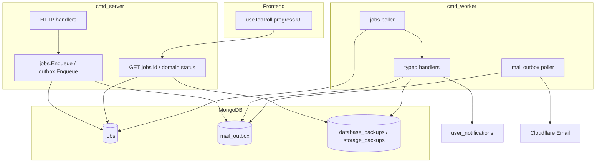
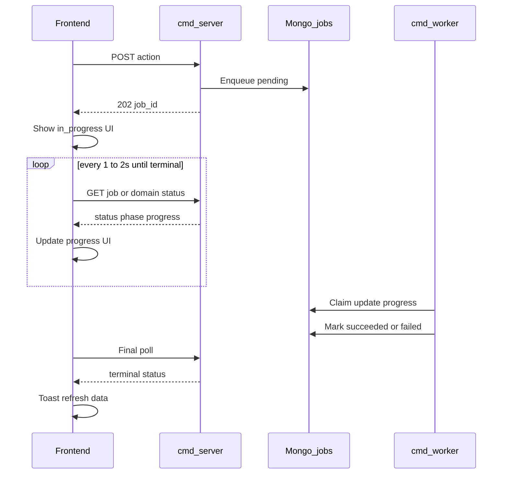

# Background job worker (full long-running / bulk migration)

## Goal

Every **long-running** or **bulk** operation that today blocks HTTP or runs as fire-and-forget `go` on the API pod becomes a **durable Mongo job** claimed by a dedicated [`cmd/worker`](backend/cmd/worker) process. The API **validates, persists intent, enqueues, returns quickly** (usually `202 Accepted` + id to poll).

While a job runs, the **frontend stays consistent** with worker progress by polling job/domain status (same pattern as today’s Advance backup UI)—never treating `202` alone as “done.”

Email **delivery** stays on [`mail_outbox`](backend/internal/mail/outbox.go); the worker drains outbox **and** `jobs`. Heavy work (DOCX render, fan-out inserts, mongodump/restore, ZIP pack) runs only in job handlers.

## Current pain

| Pattern today | Examples |
|---------------|----------|
| Sync on HTTP (can block minutes / OOM) | Storage restore (≤2 GiB, 15m), DB import prepare, content import (≤2000 Q), questions DOCX (≤5000), system broadcast InsertMany, bulk enroll notify loop, content delete-all |
| `go` on API process (lost on restart) | DB export, DB import restore, storage export |
| Sync side-effects on hot paths | Exam submit → CM notification fan-out + auto-grant DOCX enqueue; certificate grant → FillTemplate before outbox |

Mail SMTP is already async via outbox + in-process poller in [`cmd/server`](backend/cmd/server/main.go). Advance export/import UIs already poll domain status (`pollExportProgress` etc. in [`ApplicationSettingsView.vue`](frontend/src/views/ApplicationSettingsView.vue)).

## Decisions (locked)

| Choice | Decision |
|--------|----------|
| Process | Separate [`backend/cmd/worker`](backend/cmd/worker); same image/env as API |
| Store | New Mongo **`jobs`** collection (generic); keep **`mail_outbox`** for email payloads |
| Progress | Job doc carries `progress_percent` / `phase` / `result`; reuse `database_backups` / `storage_backups` — worker updates both |
| FE sync | **HTTP polling** 1–2s via shared `useJobPoll`; domain poll where it already exists; optional actor in-app notification on terminal |
| API flag | `RUN_BACKGROUND_WORKERS` — default `true` solo local; Compose/k8s API `false`, worker `true` |
| Poll interval (worker) | `JOB_POLL_INTERVAL` default 2s |
| Concurrency | 1 job at a time per worker process (+ mail claim); scale replicas later |



## Job document

```
type, status: pending|running|succeeded|failed|cancelled
payload (bson), result (bson, optional)
phase, progress_percent (optional)
attempts, max_attempts, next_attempt_at, last_error
parent_id, dedupe_key (sparse unique)
actor_email, created_at, updated_at, started_at, finished_at
```

Indexes: claim (`status` + `next_attempt_at`), `type`+`status`, `parent_id`, unique `dedupe_key`.

Stuck `running` reclaim after ~2 minutes. Backoff: 30s / 2m / 10m / 30m; default max attempts 5 (backups may use 1–2).

**Worker handlers must write `phase` / `progress_percent` (and linked domain docs) at meaningful steps** so FE polls are accurate.

## Job type catalog (all in scope)

### A — Backups / restore (must)

| Job type | Today | API after |
|----------|-------|-----------|
| `database.export` | `go runDatabaseExport` | `202` + backup id; worker runs `CompleteExport` |
| `database.import.prepare` | sync upload/inspect | accept upload → enqueue; poll until `awaiting_selection` |
| `database.import.restore` | `go runDatabaseImport` | enqueue on confirm; worker `CompleteImport` |
| `storage.export` | `go runStorageExport` | `202` + storage backup id |
| `storage.import` | **sync 15m** | upload + enqueue; poll job/domain status |

### B — Bulk communications / enroll

| Job type | Today | API after |
|----------|-------|-----------|
| `mail.system_broadcast` | sync InsertMany + EnqueueMany | one job; worker chunks; FE polls progress |
| `mailbox.system_broadcast` | sync InsertMany | same |
| `sessions.bulk_enroll` | sync sessions + notify | create sessions in request; enqueue `bulk_notify_enrollment` |
| `notify_enrollment` | sync notif + outbox | child/single job |
| `notifications.exam_completed_fanout` | sync CM loop on submit | enqueue after submit |

### C — Content / certificates

| Job type | Today | API after |
|----------|-------|-----------|
| `content.import` | sync ≤2000 Q | `202` + job id; FE poll → counts in `result` |
| `questions.export_docx` | sync ≤5000 | `202`; FE poll → download from `result` |
| `content.delete_all` | sync wipe | enqueue; FE poll until done |
| `certificate.render_and_mail` | DOCX on grant path | grant light; enqueue render+mail |
| `certificate.auto_grant` | on submit | enqueue after pass |

### D — Optional follow-ups

Wipe ops, CDN/Redis purge, single session DOCX — keep sync unless they timeout.

Auth emails stay **`outbox.Enqueue` only**.

## Package layout

- [`backend/internal/jobs/`](backend/internal/jobs/) — store, claim, models, runner
- [`backend/internal/jobs/handlers/`](backend/internal/jobs/handlers/) — backup, mail, quiz, certificates, notifications
- [`backend/cmd/worker/main.go`](backend/cmd/worker/main.go) — wire everything, graceful shutdown
- [`frontend/src/composables/useJobPoll.js`](frontend/src/composables/useJobPoll.js) — shared poll loop
- [`frontend/src/api/jobs.js`](frontend/src/api/jobs.js) — `fetchJob(token, id)`

## API contract pattern

1. Authorize + validate.
2. Create domain status row if it already exists (backup docs); link `job_id`.
3. `jobs.Enqueue(type, payload)`.
4. Respond **`202 Accepted`** with `{ job_id, …ids }`.
5. Poll:
   - Domain: existing export/import/latest endpoints — **worker keeps updating these**.
   - Generic: `GET /api/admin/jobs/{id}` (admin); optional `GET /api/me/jobs/{id}` for actor-owned jobs.

## Frontend status consistency (required)



### Mechanism (v1 locked)

| Layer | Approach |
|-------|----------|
| Transport | HTTP polling 1–2s (reuse Advance export/import pattern) |
| Helper | `useJobPoll({ fetchStatus, isTerminal, onUpdate, onTerminal })` |
| Source of truth | Domain status when present (backups); else job document |
| Worker | Updates job + domain `phase` / `progress_percent` during work |
| Completion | Toast success/error; clear progress; refresh lists; enable download from `result` |
| Leave page | Resume from `job_id` / backup id + existing “latest” endpoints where applicable |
| Actor alert | Optional in-app notification on terminal state so status is visible if admin navigated away |

### Per-surface UI

| Surface | While running | When done |
|---------|---------------|-----------|
| DB/storage export & import | Existing progress % / phase; polls keep working | Ready/failed + download as today |
| Storage restore (new async) | Progress panel like storage export | Toast + counts from `result` |
| System / mailbox broadcast | Loading + progress from job | Toast counts; refresh mail queue |
| Bulk enroll | Quick session create; “Notifying…” until notify job done | Soft success; refresh |
| Content import | Progress; block double-submit | Counts/errors; refresh CM |
| Questions DOCX | Progress then download ready | Download via `result` token/URL |
| Content delete-all | Progress after confirm | Empty state refresh |
| Certificate mail | “Email queued” is enough | Optional silent |

### Non-goals for status UX

- WebSockets / SSE in v1 (polling matches existing Advance UI).
- Global all-jobs dashboard in v1 (optional later).

## Phased delivery

**Phase 0 — Foundation**  
Config, `jobs` store, `cmd/worker`, `GET …/jobs/{id}`, `useJobPoll` + `api/jobs.js`, compose/k8s stub.

**Phase A — Backups**  
Five backup/import jobs; remove API `go` / sync storage restore; **Advance polls remain accurate**.

**Phase B — Bulk comms & enroll**  
Broadcasts, enroll notify, exam fan-out; **poll/toast on those UIs**.

**Phase C — Content & certificates**  
Import, questions export, delete-all, cert mail; **poll/download-ready**.

**Phase D — Hardening**  
Tests (including status fields updated for FE), docs, optional jobs list + actor notifications.

## Deploy

- Dockerfile: `server` + `worker`.
- Compose: `worker` same env; backend `RUN_BACKGROUND_WORKERS=false`.
- k8s Worker Deployment (replicas: 1 initially).
- Host: `go run ./cmd/server` + `go run ./cmd/worker`.

## Success criteria

- No API `go` for DB/storage export/import.
- Heavy/bulk work is enqueued; HTTP returns quickly with ids to poll.
- Worker reclaim/retry; mail claim stays atomic; shared env.
- **While a job runs, initiating UI shows live status/progress from poll; on terminal state it shows success/failure and refreshes dependent data — never false “done” after `202` alone.**

## Explicit non-goals

- Redis/Asynq instead of Mongo.
- Moving SMTP bodies into `jobs` payloads.
- WS/SSE job push in v1.
