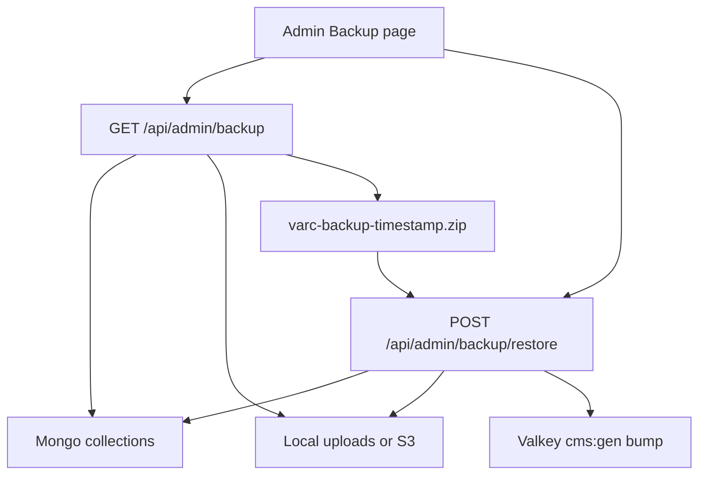

# Admin site backup and restore

Site managers (Setup Admin + Administrator) get **Admin → Backup**: download a ZIP, upload it to replace the site. Restore is destructive and replace-only (not merge).

## Archive format

Single ZIP named `varc-backup-YYYYMMDD-HHmmss.zip`:

- `manifest.json` — `formatVersion: 1`, app `package.json` version, createdAt, createdBy email, collection names, media file count/bytes, source `STORAGE_DRIVER`, source public media base URL (for rewrite on restore)
- `mongo/<collection>.jsonl` — one [EJSON](https://www.mongodb.com/docs/manual/reference/mongodb-extended-json/) document per line (keep `_id`, dates, ObjectIds)
- `media/<storage-key>` — blobs keyed as stored (`2026/08/...`, `form-uploads/...`)

Collections (whitelist only, never dump the whole DB): every Mongoose model in [`src/models/`](src/models/) — articles, pages, templates, categories, menus, site settings, forms, submissions, mailbox, media metadata, users, roles, callsigns (+ operators/licenses/imports).

Media files to include:

- Every `Media.key`
- Every `form-uploads/` key found on form submissions
- Skip missing blobs (count in manifest as `missingMedia`) rather than failing the whole backup

Do not archive Valkey, `.env`, or k8s secrets.

## Backup download

- New page [`src/app/admin/(dashboard)/backup/page.tsx`](src/app/admin/(dashboard)/backup/page.tsx) behind `requireSitePage()`.
- **Download backup** hits [`src/app/api/admin/backup/route.ts`](src/app/api/admin/backup/route.ts) (`GET`). Auth in the route (proxy skips `/api/`).
- Stream the ZIP with `archiver` (add to `serverExternalPackages` next to `exceljs`). Cursor Mongo dumps collection-by-collection; pipe each media object via existing [`getObjectStream`](src/lib/media/storage.ts). Do not buffer the archive in memory (pod limit is 512Mi).
- In-process lock so backup and restore cannot run together.
- Page shows estimated size (sum of `Media.size` + known form uploads) and a warning if it is larger than the restore upload cap.

## Restore upload

- Multipart POST [`src/app/api/admin/backup/restore/route.ts`](src/app/api/admin/backup/restore/route.ts).
- UI: file input + type `RESTORE` to enable the button; confirm modal that this **replaces** current content, users, and files.
- Validate `manifest.formatVersion === 1` and that collection files match the whitelist.
- Replace only whitelisted collections: `deleteMany({})` then insert EJSON docs. Leave unknown collections in the same Mongo DB untouched.
- Write media from the ZIP using a new **streaming** `putObject` (today [`putObject`](src/lib/media/storage.ts) takes a `Buffer` — large videos must not load fully).
- Rewrite `Media.url` (and stored public URL prefix from the manifest) to the **current** local `/media/...` or `S3_PUBLIC_URL` so a prod backup works locally and vice versa.
- After success: `invalidateCmsTags` / bump `cms:gen` so public pages are not stale.
- Auth stays JWT ([`src/auth.config.ts`](src/auth.config.ts)); warn that if the backup’s users do not include the current account, the next request will require login as a restored admin.

Failure: if restore dies mid-way the site may be partial. Keep the operation ordered (collections then media then cache) and return a clear error; no automatic rollback (too large for the pod).

## Limits and infra

Production Ingress is [`proxy-body-size: 50m`](deploy/k8s/ingress.yaml) — too small for a media ZIP. Raise to **512m** (still bounded; page warns if estimate exceeds it). Local Next route handlers have no 50MB cap.

Do not add a CronJob or CLI in this pass.

## Admin chrome

- Sidebar System group: **Backup** next to Site Settings (`flag: "site"`) in [`src/components/admin/admin-sidebar.tsx`](src/components/admin/admin-sidebar.tsx).
- Dashboard card linking to `/admin/backup`.
- Gate `/admin/backup` in [`src/proxy.ts`](src/proxy.ts) with the other `canManageSite` paths.
- Short README section: what is in the ZIP, who can restore, Valkey not included.

## Out of scope

- Scheduled backups, S3-to-S3 copy of the live bucket, merge restore, per-collection export, trash undelete (already exists).
