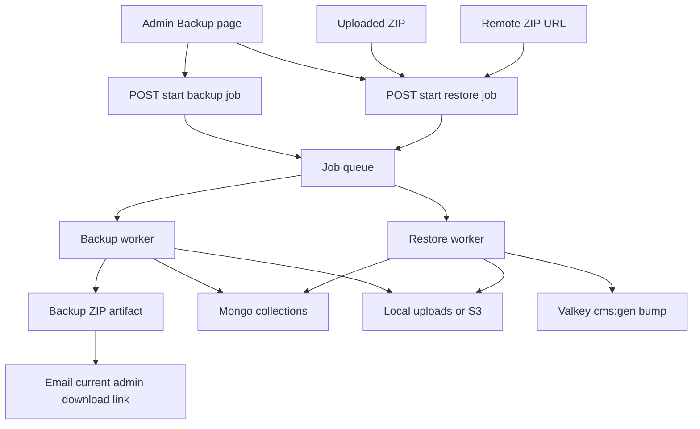

# Admin site backup and restore

Site managers (Setup Admin + Administrator) get **Admin → Backup** backed by a dedicated queue worker. Backups no longer stream directly in the request: an admin starts a job, the worker builds the ZIP in the background, stores it as an artifact, and emails the initiating admin a download link. Restore is also an async job and can start from either an uploaded ZIP or a remote URL.

## Archive format

Single ZIP named `varc-backup-YYYYMMDD-HHmmss.zip`:

- `manifest.json` — `formatVersion: 1`, app `package.json` version, createdAt, createdBy email, collection names, media file count/bytes, source `STORAGE_DRIVER`, source public media base URL (for rewrite on restore)
- `mongo/<collection>.jsonl` — one [EJSON](https://www.mongodb.com/docs/manual/reference/mongodb-extended-json/) document per line (keep `_id`, dates, ObjectIds)
- `media/<storage-key>` — blobs keyed as stored (`2026/08/...`, `form-uploads/...`)

Collections (whitelist only, never dump the whole DB): every Mongoose model in [`src/models/`](src/models/) — articles, pages, templates, categories, menus, site settings, forms, submissions, mailbox, media metadata, users, roles, callsigns (+ operators/licenses/imports).

Media files to include:

- Every `Media.key`
- Every `form-uploads/` key found on form submissions
- Skip missing blobs (count in manifest as `missingMedia`) rather than failing the whole backup

Do not archive Valkey, `.env`, or k8s secrets.

## Job model

Add a dedicated Mongo-backed job model such as [`src/models/BackupJob.ts`](src/models/BackupJob.ts) to track:

- `kind`: `backup` or `restore`
- `status`: `queued`, `running`, `succeeded`, `failed`
- `requestedBy`: current admin user id + email
- `progress`: phase + counts (`collectionsDone`, `mediaDone`, `bytesDone`)
- `source`: for restore, either uploaded artifact key or remote URL
- `artifact`: for backup, stored ZIP key + signed/public download URL metadata
- `error`: sanitized failure summary

This plan now assumes a **real worker/queue** instead of app-local background work:

- start a job in an API route / server action
- persist job state in Mongo immediately
- enqueue work for a dedicated worker process / pod
- worker updates progress in Mongo as each phase completes
- enforce a single active backup/restore at a time with a DB-backed lock or queue concurrency of `1`

Use Valkey as the queue backend if possible, since the project already runs it in-cluster; if not, keep the queue abstraction narrow so it can fall back to Mongo-backed polling without changing the admin UI contract.

## Backup flow

- New page [`src/app/admin/(dashboard)/backup/page.tsx`](src/app/admin/(dashboard)/backup/page.tsx) behind `requireSitePage()`.
- **Create backup** starts a queued job via [`src/app/api/admin/backup/jobs/route.ts`](src/app/api/admin/backup/jobs/route.ts) or equivalent server action. The request returns quickly with a job id.
- The backup worker uses `archiver` (add to `serverExternalPackages` next to `exceljs`) to build the ZIP from Mongo EJSON plus media streams from existing [`getObjectStream`](src/lib/media/storage.ts). Do not buffer the archive in memory.
- Store the finished ZIP as a backup artifact:
  - local dev: under a dedicated directory such as `.backup-artifacts/`
  - deployed env: in object storage, ideally a dedicated prefix/bucket rather than the public media namespace
- Email the **current signed-in admin** when the backup succeeds. Reuse the existing Cloudflare email path in [`src/lib/mail/cloudflare-mail.ts`](src/lib/mail/cloudflare-mail.ts); add a backup-email helper and record the message in the mailbox if that pattern is already used elsewhere.
- The email contains a download link to a new authenticated artifact route such as [`src/app/api/admin/backup/artifacts/[id]/route.ts`](src/app/api/admin/backup/artifacts/[id]/route.ts).
- Page shows recent jobs, current status/progress, estimated size, and failure messages.

## Restore flow

- Restore can start from either:
  - an uploaded ZIP file
  - a remote HTTPS URL to a ZIP file
- UI offers a source toggle: **Upload file** or **Remote link**.
- `Upload file` posts multipart data to a start-restore endpoint, which first stores the uploaded ZIP as a temporary artifact, then enqueues the restore job.
- `Remote link` stores the URL in the job and lets the worker fetch the ZIP server-side. Restrict this to HTTPS and reject localhost/private-network targets.
- UI still requires typed confirmation `RESTORE` and warns that this replaces current content, users, and files.
- Worker validates `manifest.formatVersion === 1` and the collection whitelist.
- Replace only whitelisted collections: `deleteMany({})` then insert EJSON docs. Leave unknown collections untouched.
- Write media from the ZIP using a new **streaming** object-write API (today [`putObject`](src/lib/media/storage.ts) takes a `Buffer`; large videos must not load fully).
- Rewrite `Media.url` and any stored public media prefixes to the **current** `/media/...` or `S3_PUBLIC_URL` so prod backups restore locally and vice versa.
- After success: `invalidateCmsTags` / bump `cms:gen`.
- Auth stays JWT ([`src/auth.config.ts`](src/auth.config.ts)); warn that if restored users do not include the current account, the next request may require a new login.

Failure: if a restore dies mid-way the site may be partial. Keep the operation ordered (collections then media then cache), persist progress/error on the job, and return clear admin-visible failure states. No automatic rollback in this pass.

## Limits and infra

Production Ingress is [`proxy-body-size: 50m`](deploy/k8s/ingress.yaml) — too small for uploaded restore ZIPs. Raise it to **512m** or **1g** depending on the largest practical admin upload size. Remote-link restore avoids this limit for very large backups.

Add conservative cleanup for old backup artifacts and temporary uploaded ZIPs, for example a max age / max retained count enforced by the worker or a small maintenance task. No public CLI in this pass.

## Admin chrome

- Sidebar System group: **Backup** next to Site Settings (`flag: "site"`) in [`src/components/admin/admin-sidebar.tsx`](src/components/admin/admin-sidebar.tsx).
- Dashboard card linking to `/admin/backup`.
- Gate `/admin/backup` in [`src/proxy.ts`](src/proxy.ts) with the other `canManageSite` paths.
- Backup page includes:
  - create-backup action
  - recent jobs table with status/progress
  - restore form with source mode: upload or remote link
  - typed confirmation modal for restore
- Short README section: async backup email flow, what is in the ZIP, restore modes, Valkey not included.

## Out of scope

- Scheduled backups, S3-to-S3 copy of the live bucket, merge restore, per-collection export, trash undelete (already exists).
