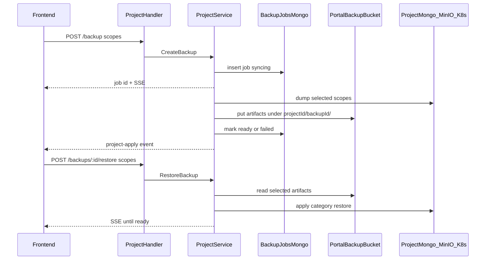

# Backup / Restore (per-category)

## Scope

Three independently selectable categories on both backup and restore:

| Category ID | What |
|-------------|------|
| `mongodb` | Full dump of the project MongoDB database (`Credentials.Database.Name` / alias) |
| `storage` | All objects in the project MinIO bucket (`storageBucketForAlias`) |
| `app-settings` | Exact live cluster data for `{ns}-configmap`, `{ns}-configmap-ro`, `{ns}-plugins`, and project secrets (`{ns}-mongodb`, `{ns}-redis`, `{ns}-storage`, `{ns}-app`, `{ns}-setup-admin`, `{ns}-cf-mail`, `{ns}-cf-image-transform`, `{ns}-cf-cache`) |

Secrets **are** included in `app-settings` so restore puts ConfigMaps/Secrets back to the same values. Portal Mongo credential fields that drive those secrets are updated from the restored Secret data afterward so the next portal sync does not overwrite them. Setup-admin follows the same rule when `app-settings` is restored; a MongoDB-only restore does **not** change setup-admin and re-syncs the current portal Administration account into the tenant after the dump is applied.

Gate: require `project.Settings.Plan.BackupRestoreEnabled` (SKU entitlement).

## Architecture



Artifact layout in dedicated bucket `BACKUP_S3_BUCKET` (default `classq-portal-backups`):

```
{projectId}/{backupId}/manifest.json
{projectId}/{backupId}/mongodb.archive.bson.gz   # optional
{projectId}/{backupId}/storage/…                 # optional object mirror
{projectId}/{backupId}/app-settings.json         # optional ConfigMaps+Secrets
```

Job metadata lives in portal Mongo collection `project_backups` (not in the tenant DB).

## Backend

### Model + repository
- New [`backend/internal/model/project_backup.go`](backend/internal/model/project_backup.go): `ProjectBackup` with `ID`, `ProjectID`, `OwnerID`, `Scopes[]`, `Status` (`syncing|ready|failed`), `Message`, `CreatedAt`, `CompletedAt`, per-scope artifact paths/sizes, optional restore sync fields.
- New repository CRUD: create, list by project, get by id, update status.

### Storage helper
- Extend MinIO wiring (reuse root client from [`minio_user.go`](backend/internal/service/minio_user.go) / `ClusterMinioConfig`) with a small `BackupArtifactStore` that ensures `BACKUP_S3_BUCKET`, and Put/Get/List/Delete under the prefix above.
- New env in [`main.go`](backend/cmd/server/main.go): `BACKUP_S3_BUCKET` (default `classq-portal-backups`).

### Category workers ([`backend/internal/service/project_backup.go`](backend/internal/service/project_backup.go))
1. **MongoDB**
   - Connect via cluster admin `CLUSTER_MONGO_URI` (or decrypted project URI + `buildMongoConnectionString`) to the project DB.
   - Dump all collections with the mongo driver into a gzip BSON/JSON archive (no `mongodump` binary dependency).
   - Restore: drop+recreate collections from archive (destructive for that DB only), then re-apply current portal setup-admin into tenant when `app-settings` was not part of the same restore.
2. **Storage**
   - Using root MinIO client: list/get every object in the project bucket; put under `…/storage/` in the backup bucket (preserve keys + content-type/metadata).
   - Restore: optionally clear then copy objects back into the live project bucket.
3. **App-settings**
   - Backup: `GetConfigMapData` / `GetSecretData` for the fixed name list; write encrypted JSON blob (reuse `CredentialCipher` with AAD `projectID:backup` or store as portal-only object with bucket IAM).
   - Restore: `ReplaceConfigMapData` + `EnsureSecret` with exact snapshot maps; mirror restored values into portal `ProjectSettings` / `Credentials` where those fields are the source of truth (Google client ID, app-config limits/URLs, mail/CDN secret material, mongo/redis/storage/app/setup-admin passwords); re-render GitOps ConfigMaps via existing manifest ensure path so Argo does not fight the live restore; restart backend (and frontend if configmap changed).

### Async + API
- Mirror existing apply pattern (`beginApply`, SSE `publishApplyEvent`, durable status).
- New apply kinds: `backup`, `restore`.
- Service methods on `ProjectService`: `CreateBackup`, `ListBackups`, `GetBackup`, `RestoreBackup`, `DeleteBackup`.
- Routes in [`main.go`](backend/cmd/server/main.go) / [`project_handler.go`](backend/internal/handler/project_handler.go):
  - `POST /api/projects/:id/backups` body `{ "scopes": ["mongodb","storage","app-settings"] }` (non-empty subset)
  - `GET /api/projects/:id/backups`
  - `GET /api/projects/:id/backups/:backupId`
  - `POST /api/projects/:id/backups/:backupId/restore` body `{ "scopes": [...] }` (must be subset of scopes present on that backup)
  - `DELETE /api/projects/:id/backups/:backupId`

### Tests
- Unit tests for scope validation, app-settings JSON round-trip, fake MinIO/mongo dump helpers where feasible (fakes already used in [`project_service_test.go`](backend/internal/service/project_service_test.go)).

## Frontend

Update [`ProjectBackupRestorePanel.vue`](frontend/src/components/ProjectBackupRestorePanel.vue) and [`projects.ts`](frontend/src/stores/projects.ts):

- **Backup tab**: checkboxes for the three categories (Redis stays excluded); Create backup calls API; show job progress via SSE/`sync_status`; list prior backups with scopes + timestamp.
- **Restore tab**: pick a ready backup; checkboxes only for scopes that exist on that backup; Restore runs independently; warn that MongoDB/storage restores overwrite live data and app-settings restores ConfigMaps/Secrets exactly.
- Wire store methods: `createProjectBackup`, `listProjectBackups`, `restoreProjectBackup`, `deleteProjectBackup`.

## Defaults locked in

- Artifacts: dedicated portal MinIO bucket, not the project bucket.
- App-settings = live ConfigMaps + Secrets listed above (including secrets), not a narrow portal AppConfig-only export.
- Independent scopes on create and restore.
- Mongo-only restore keeps current portal Administration account and re-syncs it after dump apply.