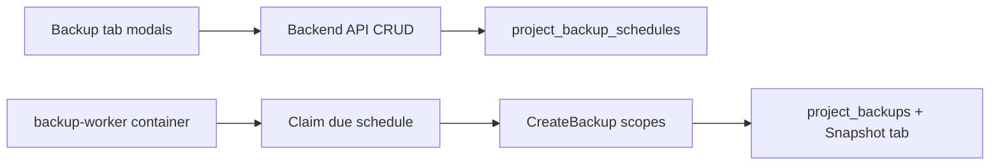

# Backup create modal + schedule backups

## Scheduler placement (decision)

Run scheduled backups in a **separate worker process/container**, not inside the API backend.

Why:
- Scheduled mongodump / MinIO copy / kube reads are CPU and I/O heavy; keeping them out of `classq-server` avoids latency spikes on portal HTTP.
- Same stack: reuse the backend image with a different binary/CMD, share env + kubeconfig + templates volumes.
- Manual **Create backup** stays request-scoped in the API (short-lived `go` job on user click). Only **cron/schedule fires** move to the worker.

### Worker packaging
- New binary [`backend/cmd/backup-worker/main.go`](backend/cmd/backup-worker/main.go): boots Mongo, MinIO backup store, kube/cluster dialers, project service subset needed for backups; loops `ProcessDueBackupSchedules` every **1 minute**. No HTTP server.
- Build in [`backend/Dockerfile`](backend/Dockerfile): `go build -o /classq-backup-worker ./cmd/backup-worker` and `COPY` into runtime image (same pattern as seed/migrate).
- New Compose service in [`docker-compose.yml`](docker-compose.yml): `backup-worker`
  - `profiles: [app]`
  - `build: ./backend` (same image as backend)
  - `command: ["./classq-backup-worker"]`
  - Same env / kubeconfig / templates mounts as `backend`
  - `depends_on: mongo` (healthy)
- API process does **not** start a schedule ticker.

Due work uses indexed `next_run_at` + atomic Mongo claim (`FindOneAndUpdate`) so one fire has one owner even if multiple workers are scaled later.

**Multi-schedule:** one `backup-worker` serves **all projects / all schedules**. Each tick it claims every due row (loop `ClaimDue` until none), then runs those backups sequentially (or with a small concurrency limit, e.g. 2) so one heavy dump does not stampede the cluster. A project may have multiple schedules (cap 5); each has its own `cron` / `next_run_at` / scopes.

## Backend

### Model + repo
- New [`backend/internal/model/project_backup_schedule.go`](backend/internal/model/project_backup_schedule.go):
  - `cadence`: `hourly` | `daily` | `weekly` | `monthly` | `custom`
  - `cron` (5-field, always stored; presets map to fixed expressions)
  - `scopes` (same as backups)
  - `enabled`, `next_run_at`, `last_run_at`, `last_backup_id`, `last_error`
  - `project_id`, `owner_id`, timestamps
- New collection `project_backup_schedules` + repository (Create / ListByProject / FindByID / Delete / ClaimDue).
- Index: `{ enabled: 1, next_run_at: 1 }` for due scans.
- Cap **5 schedules per project**.

Preset cron (UTC):
- hourly → `0 * * * *`
- daily → `0 0 * * *`
- weekly → `0 0 * * 0`
- monthly → `0 0 1 * *`
- custom → user-supplied; validated with `robfig/cron/v3` (add dep; use for parse + `Next()`, not its built-in scheduler)

### APIs (mirror backup auth)
Under `/api/projects/:id/backups/schedules` in [`main.go`](backend/cmd/server/main.go) + handlers in [`project_handler.go`](backend/internal/handler/project_handler.go):

| Method | Path | Behavior |
|--------|------|----------|
| GET | `.../schedules` | List schedules for project |
| POST | `.../schedules` | Create (`cadence`, optional `cron`, `scopes`) |
| DELETE | `.../schedules/:scheduleId` | Delete |

Gate create/list/delete on **`project.Settings.Plan.AutoBackupEnabled`** (and existing project access). Manual backup path stays on `BackupRestoreEnabled`.

### Runner (worker only)
- `ProcessDueBackupSchedules(ctx)` on project service (logic beside [`project_backup.go`](backend/internal/service/project_backup.go)):
  1. Claim due rows (`enabled && next_run_at <= now`) via atomic update advancing `next_run_at` to the following tick (claim = ownership of this fire).
  2. Skip if plan no longer has `AutoBackupEnabled` (record skip / last_error).
  3. Call internal create that reuses `runBackupJob` / same artifact path (schedule-driven allowed when `AutoBackupEnabled`, even if manual backup flag is off).
  4. Record `last_run_at` / `last_backup_id` / `last_error`.
- Invoked only from `cmd/backup-worker`, not from `cmd/server`.

## Frontend

Primary file: [`ProjectBackupRestorePanel.vue`](frontend/src/components/ProjectBackupRestorePanel.vue).

### Backup tab layout
- Replace inline scope toggles + create with a header action row:
  - **`+ Create backup`** → opens modal (scopes → create; reuse restore-modal Teleport pattern).
  - **`+ Schedule backup`** → shown only when `project.plan?.auto_backup_enabled` (from store `currentProject` / loaded project). Opens schedule modal.
- Below actions: **Schedules** list (empty state if none): cadence label, cron, scopes, next/last run, delete.
- Snapshot tab unchanged.

### Modals
1. **Create backup** — scope switches (mongo/storage/settings) + Create / Cancel.
2. **Schedule backup** — cadence radios (hourly/daily/weekly/monthly/custom); custom shows cron input; same scope switches; Create schedule / Cancel.

### Store
In [`projects.ts`](frontend/src/stores/projects.ts): types + `listProjectBackupSchedules`, `createProjectBackupSchedule`, `deleteProjectBackupSchedule`.

## Tests
- Cron preset + custom validation; ClaimDue only one winner.
- Create schedule rejected when `auto_backup_enabled` false.
- Worker claim advances `next_run_at` and invokes backup create path (fake repo).
- Manifest/UI smoke not required beyond existing panel compile.
