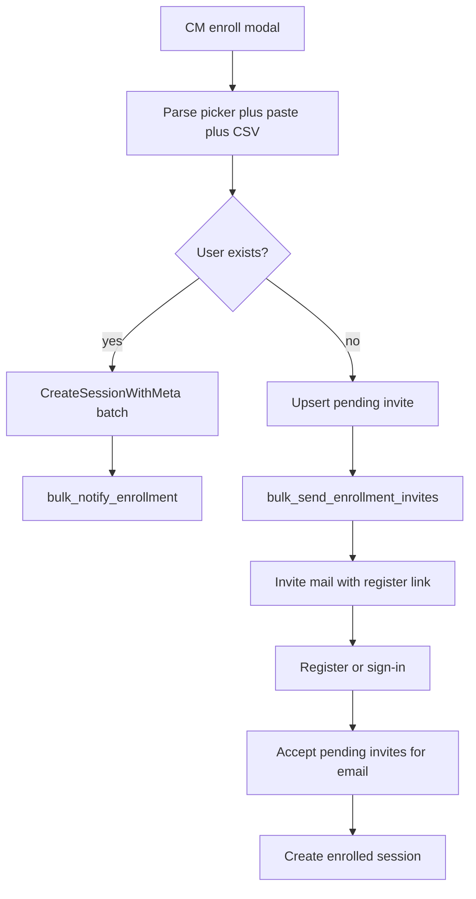

# Bulk exam grant with pending invites (1A)

## Decisions (locked)

- **Unknown emails:** pending invite only — no user account, no session until they join (**1A**).
- **Input:** keep `UserSelect` **and** support **paste email list** + **CSV upload**.
- **Existing users:** enroll immediately (current `CreateSession` path) + existing `bulk_notify_enrollment`.
- **Invite accept:** when an account with that email is created or signs in (password register, Google, or later login if invite still pending), create the `enrolled` session and mark invite accepted.

---

## Backend

### 1. Pending invite store

New collection (e.g. `exam_enrollment_invites`) in [`backend/internal/quiz/`](backend/internal/quiz/) (or small `enrollmentinvite` package used by quiz):

| Field | Notes |
|-------|--------|
| `email` | lowercased |
| `exam_id` | ObjectID |
| `enrollment_batch_id` | same batch as the grant request |
| `token_hash` | hash of opaque invite token (never store raw) |
| `status` | `pending` \| `accepted` \| `revoked` \| `expired` |
| `invited_by` | admin email |
| `created_at` / `expires_at` | default expiry **30 days** |
| `accepted_at` / `accepted_user_id` | on accept |

Indexes:

- Partial unique: `(email, exam_id)` where `status: pending`
- `token_hash` unique
- `enrollment_batch_id` for CM batch expand

### 2. Extend grant API

Evolve [`POST /api/content/sessions`](backend/internal/quiz/handler.go) (same permission `content.manage`):

- Request still accepts `exam_id` + `user_emails[]` (and singular `user_email`).
- For each email (deduped, validated):
  - **User exists** → `CreateSessionWithMeta` (unchanged rules: already enrolled → failure row).
  - **User missing** → create/refresh **pending invite** (if already pending for same exam, rotate token + bump expiry; if already has active session somehow impossible without user — skip).
- Response shape expand:
  - `sessions` / `created` / `failed` (existing)
  - `invited` count + `invites: [{ email, invite_id }]`
  - `notify_job_id` and/or `invite_job_id`

Do **not** fail the whole request if some emails are unknown — treat invite as success for that row.

Optional follow-ups (same PR or tight follow-up):

- `GET /content/sessions/batches/{batchID}` also returns pending invites for that batch.
- `DELETE /content/enrollment-invites/{id}` revoke pending invite.

### 3. Accept invites on join

Shared helper `AcceptPendingExamInvites(email)` called from:

- Password [`Register`](backend/internal/auth/handler.go) after user create
- Google auth path after user create **or** login (so invited people who already registered elsewhere aren’t stuck — also run on successful password login once if cheap)

Per pending invite for that email (not expired): create session with stored `enrollment_batch_id` + `EnrollmentSourceAdmin`, mark invite `accepted`. Conflicts (`already enrolled`) → mark accepted/noop.

### 4. Mail + jobs

- New job type `bulk_send_enrollment_invites` (mirror [`HandleBulkNotifyEnrollment`](backend/internal/jobs/handlers/notify.go)).
- New mail kind/template `exam_enrollment_invite` (EN/VI markdown under [`backend/internal/mail/`](backend/internal/mail/)): exam title, site name, **register URL with `?invite=<token>`** (and login URL).
- Gate sending with existing `EmailSendingEnabled` + `ExamEnrollmentMailEnabled` (same as enrollment mail). If mail off: still create pending invites; CM sees them in UI; admin can resend later (v1 can skip resend button if time-boxed).

### 5. Public invite resolve (lightweight)

- `GET /api/public/enrollment-invites/{token}` → `{ email, exam_title, expires_at }` (no auth) so register page can prefill email and show context.
- Register form: if `?invite=` present, prefill/lock email to invite email when resolved.

---

## Frontend

### CM enroll modal ([`ContentManagementView.vue`](frontend/src/views/ContentManagementView.vue))

Keep exam select + [`UserSelect`](frontend/src/components/UserSelect.vue), add:

1. **Paste emails** — textarea; parse commas/newlines/semicolons; validate; merge into grant list.
2. **CSV upload** — accept `.csv`/`.txt`; first column or `email` header; merge + dedupe.
3. Summary chips: existing users vs “will invite” (client can only guess “not in picker options”; server response is source of truth for invited vs enrolled).
4. Result toast: `X enrolled, Y invited, Z failed` (i18n).

### Register / invite UX

- [`Register` view](frontend/src/views/) (or auth register component): read `invite` query; call public resolve; prefill email; after success, session already created server-side — send them toward dashboard / my spaces.
- i18n EN + VI for modal copy, errors, invite email labels, register banner.

### Sessions table

- When expanding a grant batch, show **pending invites** (email + status + expiry) alongside member sessions so admins can see who hasn’t joined yet.

---

## Security / edge cases

- Token: high-entropy; store hash only; constant-time lookup by hash.
- Rate-limit public invite resolve.
- Cap emails per grant (e.g. **200**) to protect jobs/mail.
- Invite email must match on accept (register with different email does not steal invite).
- Expired invites: status `expired` or filter by `expires_at`; do not create session.
- Multi-session settings: accept path uses same `CreateSessionWithMeta` rules as admin enroll.

---

## Docs / backlog

- Update [`AGENTS.md`](AGENTS.md) suggested next item 3 to describe pending-invite bulk grant.
- Short note in sessions/docs if a relevant doc exists.

---

## Test plan

- Unit: parse email list; invite upsert uniqueness; accept creates one session; expired skipped.
- API: mix of existing + unknown emails → sessions + invites; unknown-only grant → invites only.
- Manual: CSV upload, paste, picker; invite mail link → register → session appears in CM batch; login with existing account that had a pending invite.
