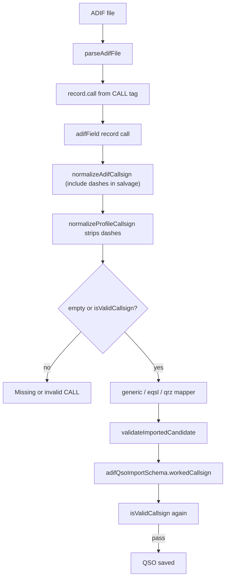

# CALL Validation — Fix dash handling in ADIF import

## Problem

`<CALL:8>US-L-872<Q` fails with **"Missing or invalid CALL"** because `normalizeAdifCallsign()` uses a salvage regex that **stops at the first hyphen**:

```typescript
const match = /^[A-Z0-9/]+/i.exec(trimmed);  // "US-L-872" → "US" only
return normalizeProfileCallsign(match?.[0] ?? trimmed);  // "US" → 2 chars → invalid
```

If the full string were normalized (hyphens stripped), it would become `USL872` (6 chars) and pass validation.

## Proposed fix

**File:** [`src/lib/adif/import/shared.ts`](src/lib/adif/import/shared.ts)

Update `normalizeAdifCallsign()` to include `-` in the salvage prefix regex, then delegate to existing `normalizeProfileCallsign()` (which already strips hyphens):

```typescript
export function normalizeAdifCallsign(raw: string): string {
  const trimmed = raw.trim();
  const match = /^[A-Z0-9/-]+/i.exec(trimmed);
  return normalizeProfileCallsign(match?.[0] ?? trimmed);
}
```

**Behavior after fix:**

| Raw ADIF value | Salvage prefix | After normalizeProfileCallsign | Valid? |
|----------------|----------------|--------------------------------|--------|
| `US-L-872` | `US-L-872` | `USL872` | Yes |
| `RU6BU<` (corrupt) | `RU6BU` | `RU6BU` | Yes |
| `W4-UAT` | `W4-UAT` | `W4UAT` | Yes |
| `US` | `US` | `US` | No (too short) |

No change to `isValidCallsign()` or `normalizeProfileCallsign()` — stored worked callsign remains **dash-free** (`USL872`), consistent with manual log entry.

## Validation pipeline (unchanged aside from Step 2)



## Scope

- **One-line regex change** in `normalizeAdifCallsign` only
- Used by all three import mappers: [`generic.ts`](src/lib/adif/import/generic.ts), [`eqsl.ts`](src/lib/adif/import/eqsl.ts), [`qrz.ts`](src/lib/adif/import/qrz.ts)
- Does **not** change manual form validation, profile callsign rules, or stored format (still uppercase alphanumeric without dashes)

## Out of scope (for now)

- Preserving dashes in the database (e.g. storing `US-L-872` as-is)
- Specific per-record error messages ("CALL too short", etc.)
- ITU / callsign-database validation

## Test plan

1. Re-import ADIF record containing `<CALL:8>US-L-872` — should import as worked callsign `USL872`
2. Confirm existing corrupt-tag salvage still works (`RU6BU<` → `RU6BU`)
3. Run `npm run lint` and `npx tsc --noEmit`
