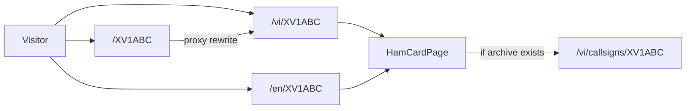

# Personal pages at `/{callsign}`

## Product

- **When:** the page exists as soon as `User.callsign` is non-empty (verified or not).
- **What:** a public ham card — callsign, display name, verification badge, optional avatar (`User.image`), and a link to the license archive at `/callsigns/[sign]` when that record exists. No email, QSO list, or documents.
- **Who:** anyone on the internet (same as news/callsign directory). `/account` and `/logbook` stay private.

Keep **two distinct pages**:

| URL | Meaning |
|---|---|
| `/{callsign}` | Portal member (this work) |
| `/callsigns/{sign}` | 1991–2021 license archive (existing) |

## Routing (locale + bare URL)

The site uses `localePrefix: "always"` in [`src/i18n/routing.ts`](src/i18n/routing.ts). Unprefixed paths already 307 to `/vi/...`. Changing that globally is unsafe (past rewrite loops). Handle personal pages **narrowly** in [`src/proxy.ts`](src/proxy.ts):

1. If `pathname` is a single segment, looks like a callsign (`^[A-Za-z0-9]{3,15}$`), and is **not reserved**, **rewrite** (not redirect) to `/vi/{SIGN}` so the browser URL stays `/XV1ABC`.
2. Do **not** rewrite `/en/...` or `/vi/...`. Those hit the same page via next-intl as usual.
3. Reserved first segments (reject as a ham page and as a saved callsign): `admin`, `api`, `media`, `account`, `callsigns`, `categories`, `logbook`, `news`, `pages`, `qso`, `vi`, `en`, plus Next internals.

Add the App Router page as a sibling of static portal folders so they still win:

- New: [`src/app/[locale]/(portal)/[callsign]/page.tsx`](src/app/[locale]/(portal)/[callsign]/page.tsx)
- Register pathname `"/[callsign]": "/[callsign]"` in [`src/i18n/routing.ts`](src/i18n/routing.ts)
- Extend [`src/lib/locale-hrefs.ts`](src/lib/locale-hrefs.ts) with `hamHref(sign)`
- Teach [`src/components/portal/language-switcher.tsx`](src/components/portal/language-switcher.tsx) to switch `/[callsign]` like `/callsigns/[sign]` (today unknown dynamic params fall through to slug types and break)

Canonical `<link>` / Open Graph URL: unprefixed `https://…/XV1ABC` via existing [`getPublicBaseUrl()`](src/lib/public-url.ts). Locale pages still exist for VI/EN copy.

On the page: if the param is reserved, invalid, or no user has that callsign → `notFound()`. Uppercase-normalize with [`normalizeCallsignQuery`](src/lib/callsigns-normalize.ts). Optional 308 from mixed-case `/xv1abc` to `/XV1ABC` (rewrite target already uppercased).

## Data and uniqueness

Today `User.callsign` is only a **sparse non-unique** index ([`src/models/User.ts`](src/models/User.ts)). Admin create/update checks uniqueness; **self-serve profile does not** ([`updateProfileAction`](src/lib/account-actions.ts)). Two members could claim the same URL.

For a 1:1 page:

- Reuse the admin uniqueness check in `updateProfileAction`.
- Replace the index with a **partial unique** index, e.g. `{ unique: true, partialFilterExpression: { callsign: { $gt: "" } } }`. Empty string stays allowed for users with no callsign.
- If duplicates already exist, the unique index will fail until they are cleaned — include a one-off note in implementation (list duplicates, keep verified or oldest, clear the rest).

Lookup helper (new, e.g. `src/lib/ham-profile.ts`): `findPublicHamByCallsign(sign)` → `{ callsign, name, image, callsignVerified }` plus `archiveExists` from `Callsign.findOne({ sign })`. Never return email.

## UI

Public page (portal chrome from [`src/app/[locale]/layout.tsx`](src/app/[locale]/layout.tsx)):

- Large callsign, name, verified / not-verified badge (same green/amber language as admin cards).
- Avatar if `image` is set.
- Link “License history” → existing `callsignHref(sign)` when the archive has that sign.
- i18n in [`messages/en.json`](messages/en.json) / [`messages/vi.json`](messages/vi.json) (new `ham` namespace).

Account ([`src/components/portal/account-profile-form.tsx`](src/components/portal/account-profile-form.tsx)): after a callsign is saved, show the public URL (`/{CALLSIGN}`) and open-in-new-tab. Block reserved names in [`profileFormSchema`](src/lib/validations/qso.ts) / [`adminCallsignSchema`](src/lib/validations/qso.ts).

Optional: sitemap entries for users with a callsign in [`src/app/sitemap.ts`](src/app/sitemap.ts).

## Out of scope (later)

- Public QSO list / documents
- Bio, grid, QRZ fields (not on User today)
- Merging archive operator history into the ham card beyond a link
- Changing `localePrefix` for the whole site
