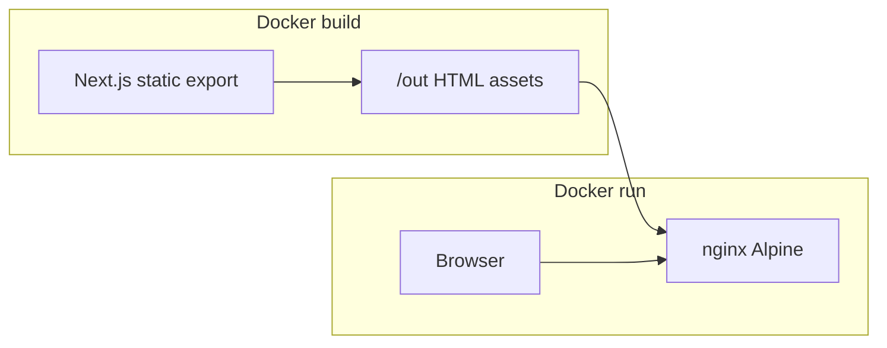

# classq.io Landing Page Plan

**Design read:** One-page learning/certification marketing site for learners and training buyers, modern education-trust language (not purple SaaS), Next.js static export + Tailwind + restrained motion.

**Defaults locked (change before build if needed):**
- Product copy: placeholder ClassQ as courses + professional certifications
- Primary CTA: soft “Get notified” linking to `mailto:hello@classq.io` (swap later when an app/waitlist URL exists)
- Theme: light-first with cool slate neutrals + one teal/emerald accent (education/trust, not AI-purple)

## Stack (SEO, no backend)

| Choice | Why |
|--------|-----|
| **Next.js App Router** + `output: 'export'` | Static HTML/CSS/JS = strongest SEO without a server; file-based meta, OG, sitemap |
| **Tailwind CSS v4** | Fast layout/styling for a marketing page |
| **`next/font`** | Self-hosted display + body sans (e.g. Outfit + Source Sans 3), no render-blocking Google CSS |
| **Motion (`motion/react`)** | Hero fade + feature scroll-reveal only; honor `prefers-reduced-motion` |
| **nginx Alpine Docker image** | Serve static `out/` with gzip, cache headers, SPA-safe 404 → index only if needed |

No API routes, no database, no form backend.



## Page structure (single route `/`)

One composition, scrolled sections with in-page anchors:

1. **Top banner** — slim announcement strip (e.g. early access / certifications focus); dismissible optional via client island
2. **Header** — logo wordmark `classq.io`, anchor links (Features, How it works, Contact), primary CTA; sticky, ≤72px, single-line desktop
3. **Hero** — full-bleed background image (`min-h-[100dvh]`), dark scrim for contrast, brand-forward title, one headline, ≤20-word subcopy, one primary + one secondary CTA; no cards/stat strips in hero
4. **Features** — asymmetric grid (not three equal cards): learn paths, practice/assessment, earn certificates; Phosphor icons; scroll reveal
5. **How it works** — 3 short steps in a different layout family (numbered horizontal track or stacked rows, not another card grid)
6. **Closing CTA** — single intent matching hero (“Get notified”)
7. **Footer** — logo, nav anchors, contact mailto, copyright

## SEO (static)

- Root [`app/layout.tsx`](app/layout.tsx): metadata (`title`, `description`, Open Graph, Twitter, canonical `https://classq.io`)
- [`app/robots.ts`](app/robots.ts) + [`app/sitemap.ts`](app/sitemap.ts) for static export
- Semantic HTML (`header`, `main`, `section`, `footer`), one `h1`, logical heading order
- JSON-LD `Organization` / `WebSite` in layout or page
- Hero image via `next/image` with `priority` for LCP; real generated or seeded photo (education/classroom mood), not gradient-only

## Project layout (to create)

```
classq-landing/
  app/
    layout.tsx
    page.tsx
    globals.css
    robots.ts
    sitemap.ts
  components/
    TopBanner.tsx
    Header.tsx
    Hero.tsx
    Features.tsx
    HowItWorks.tsx
    ClosingCta.tsx
    Footer.tsx
  public/
    images/hero.jpg   # generated or placeholder seed asset
    logo.svg          # simple wordmark mark
  Dockerfile
  nginx.conf
  .dockerignore
  package.json
  next.config.ts      # output: 'export', images unoptimized for static
```

## Docker

- **Multi-stage Dockerfile:** `node:22-alpine` → `npm ci && npm run build` → copy `out/` into `nginx:alpine`
- **nginx.conf:** `root /usr/share/nginx/html`, gzip, long-cache for `/_next/static`, `try_files` for clean URLs
- Expose port **80**; document `docker build -t classq-landing . && docker run -p 8080:80 classq-landing`

## Design dials

- `DESIGN_VARIANCE: 7` — left-aligned hero copy over full-bleed media; features asymmetric
- `MOTION_INTENSITY: 5` — entrance + scroll reveal; no scroll-hijack
- `VISUAL_DENSITY: 4` — airy section padding, education-trust calm

## Implementation order

1. Scaffold Next.js + Tailwind + static export config
2. Global tokens (CSS variables), fonts, base layout metadata
3. Build section components top → bottom; wire anchors
4. Add hero image asset + SEO files
5. Dockerfile + nginx.conf + verify `docker build` / local `npm run build` + preview `out/`

## Out of scope

- Backend, auth, CMS, i18n, blog, analytics SDKs (can add later as script tags)
- Multi-page product app
