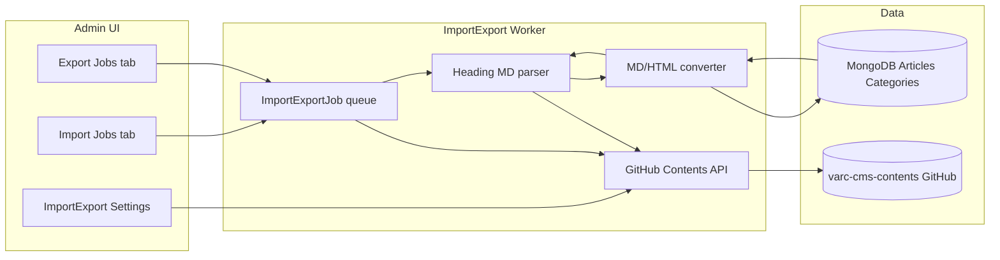
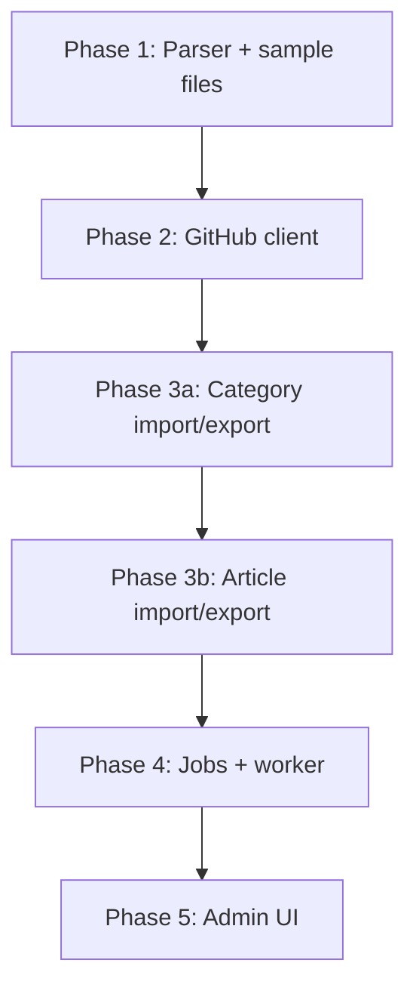
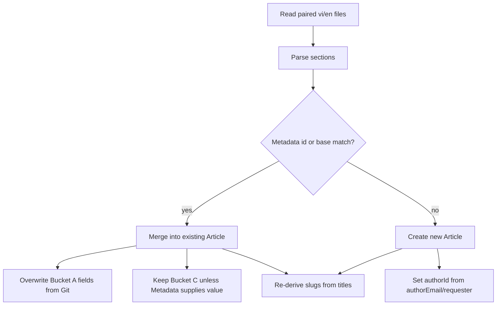

# CMS Article/Category GitHub Markdown Import-Export

## Feasibility

**Verdict: feasible**, with clear gaps to close first.

| Area | Status | Notes |
|------|--------|-------|
| GitHub connection | Done | Settings + PAT verify in [`src/lib/import-export-verify.ts`](src/lib/import-export-verify.ts) |
| Content repo layout | Scaffold only | [`varc-cms-contents`](file:///Users/hai.tran/Working/repositories/varc-cms-contents) has READMEs only — no sample files yet |
| CMS models | Ready | [`Article.ts`](src/models/Article.ts), [`Category.ts`](src/models/Category.ts) — bilingual `locales.vi` / `locales.en` |
| Job infrastructure | Pattern exists | [`BackupJob`](src/models/BackupJob.ts) + polling worker in [`instrumentation.ts`](instrumentation.ts) — reuse same shape |
| Markdown pipeline | Missing | Portal stores **HTML** (TipTap); repo stores **Markdown** — need MD→HTML on import, HTML→MD on export |
| Heading parser | Missing | No frontmatter; need custom section parser per your format choice |
| GitHub read/write | Partial | Verify uses Contents API; list/write/commit not implemented |

**Main risks**
1. **Heading-based parsing is brittle** — section labels must be standardized and documented (recommend fixed H2 labels, not free-form `##` order).
2. **HTML↔MD fidelity** — TipTap HTML (embeds, classes) will not round-trip perfectly; acceptable for text-heavy articles, not for complex layouts.
3. **Article identity** — no `key` on Article; paired files need a stable **sync base name** (filename) + optional Mongo `id` in Metadata section for upserts.
4. **authorId required** — imports must assign an author (job requester or configured system user).



---

## Agreed file format (formalize in varc-cms-contents README)

Keep [`article/`](file:///Users/hai.tran/Working/repositories/varc-cms-contents/article) and [`category/`](file:///Users/hai.tran/Working/repositories/varc-cms-contents/category) folders. **Paired locale files** using a shared base name:

```
{importGithubPath}/
  category/
    bai-huong-dan.vi.md
    bai-huong-dan.en.md
  article/
    danh-sach-khach-moi.vi.md
    danh-sach-khach-moi.en.md
```

`importGithubPath` / `exportGithubPath` from existing settings (`./` = repo root).

### Category file (`category/{base}.{locale}.md`)

Align with existing README + add Description section:

```markdown
# Category display name

## Description
Optional category description for this locale.

### [Parent display name](parent-base-name)
```

- **Filename `base`** = stable sync identifier (prefer `Category.key` when set, else VI slug).
- **Parent link** = H3 markdown link; parent slug references parent file `base` (not locale slug).
- Import builds tree topologically (parents before children).

### Article file (`article/{base}.{locale}.md`)

Extend the README heading layout with fixed H2 labels:

```markdown
# Article title

## Excerpt
Short summary for cards and previews.

## Categories
bai-huong-dan, danh-sach-thanh-vien

## Metadata
id: 665a1b2c3d4e5f6789012345
status: published
publishedAt: 2026-08-23T10:00:00.000Z
tags: ham-radio, event
featured: false

## SEO
metaTitle: Optional override title
metaDescription: Search/social description

## Content

## First section
Markdown body from here (H2–H6 allowed after this delimiter).

## Another section
More markdown...
```

**Section rules**
- `#` → `locales.{locale}.title`
- `## Excerpt` → `excerpt`
- `## Categories` → comma-separated category **base names** → resolve to `categoryIds`
- `## Metadata` → key:value lines for shared article fields (`status`, `publishedAt`, `tags`, `featured`, optional `id`, `coverImageUrl`, etc.)
- `## SEO` → `metaTitle`, `metaDescription`
- `## Content` → **last schema section**; everything after is raw markdown body (H2–H6) → convert to HTML for `locales.{locale}.content`
- **Pairing**: `{base}.vi.md` + `{base}.en.md` merge into one Article document; Metadata should be identical across locales (import validates or merges with VI winning conflicts).

---

## Field mapping summary

### Category → MongoDB

| Markdown | DB field |
|----------|----------|
| `#` name | `locales.{locale}.name` |
| `## Description` | `locales.{locale}.description` |
| H3 parent link slug | `parentId` (resolve by base name) |
| filename `base` | match `key` or `locales.vi.slug` for upsert |
| (export only) | `sortOrder`, `isSystem`, `key` preserved via Metadata H2 on export |

### Article → MongoDB

| Markdown | DB field |
|----------|----------|
| `#` | `locales.{locale}.title` |
| slug | derived from title via existing [`makeSlug`](src/lib/slug.ts) unless Metadata includes explicit slug later |
| `## Excerpt` | `locales.{locale}.excerpt` |
| `## Categories` | `categoryIds[]` |
| Metadata `status` | `status` |
| Metadata `publishedAt` | `publishedAt` |
| Metadata `tags` | `tags[]` |
| Metadata `featured` | `featured` |
| Metadata `id` | upsert by `_id` |
| `## SEO` | `metaTitle`, `metaDescription` |
| `## Content` (body: H2–H6) | `content` (HTML after MD conversion) |
| (import) | `authorId` = job requester |

---

## Implementation plan (varc-portal)

### Phase 1 — Schema docs + parser foundation

1. Update [`varc-cms-contents`](file:///Users/hai.tran/Working/repositories/varc-cms-contents) READMEs with the formal heading spec above and 1–2 real sample files.
2. Add deps: `remark` + `remark-gfm` + `remark-rehype` + `rehype-stringify` (MD→HTML), `turndown` + `turndown-plugin-gfm` (HTML→MD).
3. New lib: `src/lib/import-export/markdown/`:
   - `parse-category-markdown.ts` — heading section extractor
   - `parse-article-markdown.ts` — same + Metadata key:value parser
   - `serialize-category-markdown.ts` / `serialize-article-markdown.ts`
   - `md-html.ts` — conversion wrappers
4. Unit tests for parser round-trip on sample files.

### Phase 2 — GitHub content I/O

New `src/lib/import-export/github-client.ts` (reuse auth headers from verify):
- `listMarkdownFiles(repo, branch, path, prefix)` — recursive tree via Git Trees API
- `getFileContent(path)` / `putFileContent(path, content, message, sha?)` — Contents API
- Resolve repo/branch/path from [`ImportExportSettings`](src/models/ImportExportSettings.ts)
- Respect configured `importGithubPath` prefix (e.g. repo root → `article/`, `category/`)

### Phase 3 — Sync engine (core logic)

New `src/lib/import-export/sync/`:
- **`import-categories.ts`** — read all `category/*.{vi,en}.md`, pair by base, upsert Category, resolve `parentId`, skip/update `isSystem` categories carefully
- **`import-articles.ts`** — categories first, then articles; pair locale files; upsert by Metadata `id` or base name + locale slugs
- **`export-categories.ts`** — walk non-deleted categories, emit paired files
- **`export-articles.ts`** — walk non-deleted articles (config: include drafts?), emit paired files
- **`resolve-references.ts`** — base name ↔ ObjectId maps

Reuse existing save validation patterns from [`saveCategoryAction`](src/lib/actions.ts) / [`saveArticleAction`](src/lib/actions.ts) where possible, or direct Mongoose upserts with same slug/tag normalization.

### Phase 4 — Job model + worker

Mirror backup pattern:

| Piece | New file |
|-------|----------|
| Model | `src/models/ImportExportJob.ts` — `kind: import \| export`, `scope: categories \| articles \| all`, status/progress fields |
| Job CRUD | `src/lib/import-export/jobs.ts` |
| Worker | `src/lib/import-export/worker.ts` + `worker-runtime.ts` |
| Startup | hook in [`instrumentation.ts`](instrumentation.ts) behind `IMPORT_EXPORT_WORKER_ENABLED=1` |
| Actions | `runImportJobAction`, `runExportJobAction` in [`actions.ts`](src/lib/actions.ts) |
| API (optional) | `src/app/api/admin/import-export/jobs/route.ts` for polling UI |

Job progress: phases `fetching` → `parsing` → `syncing` → `committing` (export) with counts (`filesDone/filesTotal`, `errors[]`).

### Phase 5 — Admin UI

Replace placeholders in [`import-export/page.tsx`](src/app/admin/(dashboard)/import-export/page.tsx):
- **Import Jobs tab**: "Run import" button (scope: all / categories only / articles only), job history table, status/progress, error log
- **Export Jobs tab**: same for export
- Pattern UI after [`backup-manager.tsx`](src/components/admin/backup-manager.tsx)

Settings tab stays as-is (already configures GitHub repo/branch/path/PAT).

### Phase 6 — Local dev workflow

For your clone at `/Users/hai.tran/Working/repositories/varc-cms-contents`:
- Point import settings to `VARC-Vietnam/varc-cms-contents`, branch `main`, path `./`
- Run import job against GitHub (or add optional **local path override** env `IMPORT_EXPORT_LOCAL_REPO_PATH` for dev-only reads/writes without push — optional stretch goal)

---

## Recommended delivery order (MVP → full)



**MVP milestone**: category import/export end-to-end through GitHub + job UI.  
**Full milestone**: articles + bilingual pairing + Import/Export tabs.

---

## Media sync (images)

Git holds **Markdown + binaries** under `media/{article-base}/`. At runtime the portal serves from the **S3/local media bucket**; import hydrates the bucket, export writes back to Git.

### Repo layout

```
media/
  gioi-thieu-anten-hf/
    cover.svg
    og.svg
    dipole-diagram.svg
article/
  gioi-thieu-anten-hf.vi.md   # references media/… paths
```

Samples live in [`varc-cms-contents`](file:///Users/hai.tran/Working/repositories/varc-cms-contents).

### URL classification

| URL in Git / CMS | Type | Import | Export |
|------------------|------|--------|--------|
| `media/{base}/file.svg` | Bundled | Fetch from GitHub → `putObject()` → `Media.create()` (dedupe by key/hash) → rewrite to `publicUrlForObjectKey()` | Download from bucket → commit under `media/{base}/` → rewrite to relative path |
| `https://external…` | External | Keep URL as-is in `coverImageUrl`, `ogImageUrl`, `` | Keep URL as-is |
| `/media/…` or `{S3_PUBLIC_URL}/…` | Portal media | Treat as existing bucket object if reachable; else warn | Download → `media/{base}/` → relative path |
| Empty | — | Clear field | Omit from Metadata |

### By field

| Field | Git | Import | Export |
|-------|-----|--------|--------|
| `coverImageUrl` | `media/{base}/cover.jpg` or external URL | Upload bundled → portal public URL | Pull from bucket → `media/` |
| `ogImageUrl` | `media/{base}/og.jpg` or external URL | Same | Same; dedupe file if same as cover |
| `coverImageFocus` | Metadata `50,50` or `50,50,70,70` | Parse rect | Serialize |
| Content `` | `` in Markdown | MD→HTML; rewrite `src` to portal URL | HTML→MD; rewrite to relative path |

### Implementation (`src/lib/import-export/media/`)

- `collect-article-images.ts` — scan Metadata + HTML for image URLs
- `resolve-media-url.ts` — classify bundled / portal / external
- `import-media-asset.ts` — GitHub fetch → `putObject` + optional `Media` record
- `export-media-asset.ts` — bucket `getObjectStream` → write to Git path
- `rewrite-content-urls.ts` — update Markdown and Metadata paths in both directions

Reuse [`putObject`](src/lib/media/storage.ts), [`publicUrlForObjectKey`](src/lib/media/storage.ts), and backup worker’s media collection patterns from [`backup/worker.ts`](src/lib/backup/worker.ts).

### Phasing

1. **Phase 1 (MVP):** URL pass-through only — external and portal URLs copied as strings (works same-env).
2. **Phase 2 (recommended):** Full `media/` bundling as in samples — required for cross-environment import.
3. **Phase 3 (optional):** `mirrorExternalImages` job flag to download external hotlinks into `media/`.

### External links in content

Markdown links to third-party sites stay unchanged. Only **image** URLs participate in media sync; optional mirroring is off by default.

---

## Out of scope (for later)

- Deleting repo files when CMS deletes articles (tombstone Metadata flag?)
- Bidirectional conflict merge (start with **import overwrites** or **export overwrites repo** per job kind)
- Custom URL source (settings support it; implement GitHub first)
- Auto-scheduled sync (cron) — manual job trigger first
- TipTap figure/caption perfect round-trip (best-effort via alt text)

---

## Open decisions (defaults proposed)

| Decision | Proposed default |
|----------|------------------|
| Import conflict | Upsert by Metadata `id`, else match by article `base` / category `base` |
| Export scope | All non-deleted articles/categories; include drafts with `status: draft` in Metadata |
| Slug on import | Auto-generate from title (current CMS behavior); filename `base` is sync key only |
| Export commit message | `cms-export: {N} articles, {M} categories` |
| System categories | Export yes; import updates locales/description only, never deletes `uncategorized` |

---

## Article field management (complete)

Every field on [`Article`](src/models/Article.ts) is classified into one of four buckets. This keeps heading-based Markdown readable while avoiding data loss on export/import.

### Bucket A — Synced via Markdown sections (source of truth in Git)

| Field | Locale? | Markdown location | Import behavior | Export behavior |
|-------|---------|-------------------|-----------------|-----------------|
| `locales.{locale}.title` | per locale | `#` H1 | Set directly | From DB title |
| `locales.{locale}.excerpt` | per locale | `## Excerpt` | Set directly | From DB excerpt |
| `locales.{locale}.metaTitle` | per locale | `## SEO` → `metaTitle:` line | Set directly | From DB |
| `locales.{locale}.metaDescription` | per locale | `## SEO` → `metaDescription:` line | Set directly | From DB |
| `locales.{locale}.content` | per locale | `## Content` (body: H2–H6) | MD → HTML via remark/rehype + `sanitizeHtml()` | HTML → MD via turndown |
| `categoryIds` | shared | `## Categories` (comma-separated base names) | Resolve base → ObjectId; empty → `[uncategorized]` | Emit category base names |
| `status` | shared | `## Metadata` → `status:` | `draft` \| `published` | From DB |
| `publishedAt` | shared | `## Metadata` → `publishedAt:` ISO | Parse datetime; null if draft | ISO string or omitted |
| `tags` | shared | `## Metadata` → `tags:` comma-list | Lowercase, dedupe (same as save action) | Comma-separated |
| `featured` | shared | `## Metadata` → `featured:` bool | Parse boolean | `true` / `false` |
| `coverImageUrl` | shared | `## Metadata` → `coverImageUrl:` | Relative `media/…` → upload to bucket; external URL as-is | Relative path or portal URL → `media/…` |
| `ogImageUrl` | shared | `## Metadata` → `ogImageUrl:` | Same as cover | Same as cover |
| `coverImageFocus` | shared | `## Metadata` → `coverImageFocus:` as `x,y` or `x,y,width,height` | Parse to `{x,y,width?,height?}` | Serialize focus point |

**Metadata block example (shared across `.vi.md` / `.en.md`; must match or VI wins):**

```markdown
## Metadata
id: 665a1b2c3d4e5f6789012345
base: danh-sach-khach-moi
status: published
publishedAt: 2026-08-23T10:00:00.000Z
tags: ham-radio, event
featured: false
coverImageUrl: media/gioi-thieu-anten-hf/cover.svg
coverImageFocus: 50,30
ogImageUrl: media/gioi-thieu-anten-hf/og.svg
authorEmail: editor@varc.vn
createdAt: 2026-01-01T00:00:00.000Z
updatedAt: 2026-08-20T12:00:00.000Z
```

### Bucket B — Derived on import (not authored in Git)

| Field | Rule |
|-------|------|
| `locales.{locale}.slug` | Auto from title via [`makeSlug()`](src/lib/slug.ts) + collision suffix (`-2`, `-3`…), same as admin save. Filename `base` is the **sync key**, not the slug. Optional future: `slug:` line in Metadata for explicit override. |
| `_id` | Upsert: use Metadata `id` if present and valid; else find by `base` (match prior export's `base` stored in sync manifest or infer from filename); else create new. |

### Bucket C — CMS-only (preserved on import, written on export)

| Field | Import behavior | Export behavior |
|-------|-----------------|-----------------|
| `authorId` | **Preserve existing** on update. On create: Metadata `authorEmail` → lookup User; fallback to job requester; fallback to configured `IMPORT_EXPORT_DEFAULT_AUTHOR_EMAIL` env. | Emit `authorEmail:` in Metadata (resolved from User) |
| `createdAt` | Preserve existing on update. On create: Metadata `createdAt` or `now`. | Emit ISO `createdAt:` |
| `updatedAt` | Set to import timestamp (or Metadata `updatedAt` if doing no-op detection) | Emit ISO `updatedAt:` |
| `deletedAt` | **Never set from Git** — import only upserts live articles. Soft-delete stays CMS-only. | **Skip** deleted articles (`deletedAt != null`) |

### Bucket D — Out of scope / not in Markdown

| Field | Reason |
|-------|--------|
| TipTap-specific HTML (custom nodes, embeds) | MD round-trip may simplify; complex blocks flagged in job warnings |
| Menu/page block references | Articles are standalone entities |
| Revision history | Not stored on Article model |

*(Image binaries are synced via `media/` — see [Media sync](#media-sync-images) above.)*

### Import merge policy (per field)



- **Import overwrites** all Bucket A fields from Git (Git is source of truth for content).
- **Bucket C** fields are preserved when updating unless Metadata explicitly provides a value (e.g. don't reset `authorId` on every import).
- **Validation** runs through the same rules as [`articleFormSchema`](src/lib/validations/article.ts) where applicable (published requires title + content per locale, safe URLs, tag limits).

### Export fidelity notes

- Empty optional fields are **omitted** from Metadata (shorter files).
- `base` is always exported (filename stem) for stable re-import even if slugs change.
- `id` is exported once article exists in MongoDB so subsequent imports upsert reliably.
- Draft articles export with `status: draft` and no `publishedAt` (or explicit null).

### Category fields (for completeness)

| Field | Markdown | Notes |
|-------|----------|-------|
| `locales.{locale}.name` | `#` H1 | |
| `locales.{locale}.description` | `## Description` | |
| `locales.{locale}.slug` | derived from name | Same slug rules as admin |
| `parentId` | H3 `[name](parent-base)` | |
| `key` | Metadata `key:` on export | Required for `uncategorized` |
| `sortOrder` | Metadata `sortOrder:` | Export only unless added to import spec |
| `isSystem` | never imported as new | Update locales only for system cats |
| `deletedAt` | CMS-only | Skip deleted on export |
