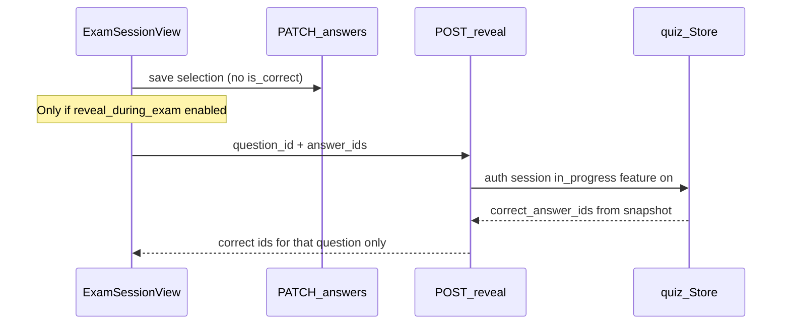

# Show correct answers during exams

## Behavior

- New setting: **Show correct answers during exams** (`reveal_correct_answers_during_exam`), placed in Protection settings directly under **Show correct answers on review**.
- Independent of post-exam review flags (not gated by `reveal_exam_result`).
- During an in-progress session when enabled:
  - **Single-select:** after the learner selects an option, call reveal and mark correct/incorrect options.
  - **Multi-select:** wait until `selected_answer_ids.length === correct_answer_count`, then reveal. If they change the selection away from that count, hide reveal chrome until the count matches again.
- Correct answers stay based on the session **question snapshot** (same as scoring).

## Security model

- Do **not** add `is_correct` to [`LearnerAnswerOption`](backend/internal/quiz/models.go) in `buildLearnerExamState`.
- When the feature is on, include only `correct_answer_count` on each learner question (count of correct options) so the client knows when multi-select is “complete.”
- New endpoint (learner auth + existing exam mutation rate limit):

`POST /api/me/sessions/{sessionID}/answers/reveal`

Body: `{ question_id, answer_ids }`

Server checks:

1. Session belongs to JWT email, status `in_progress`, within time limit
2. Resolved exam behavior has `RevealCorrectAnswersDuringExam == true` (app default or exam protection override)
3. `question_id` is in the session’s frozen question set
4. For single: `len(answer_ids) == 1`; for multi: `len(answer_ids) == correctCount` and all ids exist on the question
5. Returns `{ question_id, correct_answer_ids, selected_answer_ids }` only

- If the feature is off → `403` / clear error (no correct ids).
- UI calls this API **only when** `examState.reveal_correct_answers_during_exam` is true.

## Backend changes

| Area | Work |
|------|------|
| [`backend/internal/users/settings.go`](backend/internal/users/settings.go) | Add `RevealCorrectAnswersDuringExam`; default `false`; load/save |
| [`backend/internal/admin/handler.go`](backend/internal/admin/handler.go) | Wire update request + `settingsSnapshot` |
| [`backend/internal/quiz/models.go`](backend/internal/quiz/models.go) | Exam field + `LearnerExamState.RevealCorrectAnswersDuringExam` + `LearnerExamQuestion.CorrectAnswerCount` (omitempty / only when feature on) |
| [`backend/internal/quiz/exam_behavior.go`](backend/internal/quiz/exam_behavior.go) | Add flag to `ExamBehaviorSettings` / `ResolveExamBehavior` |
| [`backend/internal/quiz/exams.go`](backend/internal/quiz/exams.go) + handler create/update | Persist exam override field (with other protection overrides) |
| [`backend/internal/quiz/learner_sessions.go`](backend/internal/quiz/learner_sessions.go) | Set count when feature on; add `RevealLearnerQuestionAnswers(...)` |
| [`backend/internal/quiz/handler.go`](backend/internal/quiz/handler.go) | `withExamProtection` exposes flag; register reveal route; reuse `examMutationLimiter` |
| [`backend/cmd/server/main.go`](backend/cmd/server/main.go) | Route: `POST /me/sessions/{sessionID}/answers/reveal` |

## Frontend changes

| Area | Work |
|------|------|
| [`ApplicationSettingsView.vue`](frontend/src/views/ApplicationSettingsView.vue) | Toggle under reveal-correct-on-review in Protection section; include in certification settings snapshot/payload |
| [`ContentManagementView.vue`](frontend/src/views/ContentManagementView.vue) | Exam override toggle next to existing reveal toggles when custom protection is on |
| [`frontend/src/api/examSession.js`](frontend/src/api/examSession.js) | `revealExamAnswer(token, sessionId, { question_id, answer_ids })` |
| [`ExamSessionView.vue`](frontend/src/views/ExamSessionView.vue) | After successful selection path: if feature on and selection complete, call reveal; store per-question `correct_answer_ids`; style options (correct / incorrect / selected); clear/re-request when multi selection incomplete again |
| i18n EN/VI | Settings + exam form labels/descriptions; optional short exam hint |

## UI styling (session)

Reuse accent/emerald/red patterns already used on result review: selected vs correct vs wrong after reveal; keep keyboard nav working (highlight ring separate from correctness).

## Out of scope

- Changing post-exam result review behavior
- Revealing explanations/sources mid-exam (review-only today)
