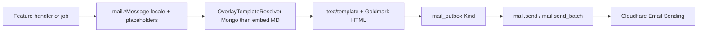

# Email templates across functions

## Verdict

Templates are **not shared across product features**. Each feature has its own catalog id, Markdown file, `*Message` builder, and outbox `Kind*`. What is shared is the **pipeline**: resolve template → render → enqueue outbox → `mail.send` job → Cloudflare.

Closest “cross-function” coupling: **existing-user enrollment** and **pending invite** both gate on `EmailSendingEnabled` + `ExamEnrollmentMailEnabled`, but they use **different** templates (`exam_enrollment` vs `exam_enrollment_invite`).

---

## Shared infrastructure (cross-function)

| Piece | Location | Role |
|-------|----------|------|
| Catalog + placeholders | [`backend/internal/mail/template_defs.go`](backend/internal/mail/template_defs.go) | Editable template ids for admin UI |
| Builders + render | [`backend/internal/mail/templates.go`](backend/internal/mail/templates.go) | `*Message`, `renderNamedTemplate`, locale, site name |
| Embedded MD EN/VI | [`backend/internal/mail/templates/{en-US,vi}/`](backend/internal/mail/templates/) | Default subject (YAML frontmatter) + body |
| Mongo overrides | [`backend/internal/mail/template_store.go`](backend/internal/mail/template_store.go) | Admin customizations per `(template_id, locale)` |
| Outbox kinds | [`backend/internal/mail/outbox.go`](backend/internal/mail/outbox.go) | `Kind*` aligned 1:1 with template ids |
| Delivery | [`backend/internal/mail/jobs_scheduler.go`](backend/internal/mail/jobs_scheduler.go) + jobs handlers | Enqueue → worker send |
| Flags | Application settings | Master `email_sending_enabled` + per-feature toggles |
| Links | `APP_PUBLIC_URL` / `APP_HOSTNAME` | Absolute URLs in placeholders |

**Locale:** `NormalizeLocale` → `en-US` or default **`vi`**. Invite builders often pass `""` → VI.

**Admin edit:** Settings → Mail templates loads catalog; overrides stored in Mongo; render prefers override then embed.

---

## Per-feature template map

| Kind / Template id | MD file | Builder | Typical callers | Feature flag |
|--------------------|---------|---------|-----------------|--------------|
| `welcome` | `welcome.md` | `WelcomeMessage` | auth register / verify / Google | `WelcomeEmailEnabled` |
| `activation` | `activation.md` | `ActivationMessage` | auth + admin resend | `ActivationEmailEnabled` |
| `password_reset` | `password-reset.md` | `PasswordResetMessage` | auth forgot password | `ForgotPasswordEnabled` |
| `password_changed` | `password-changed.md` | `PasswordChangedMessage` | profile | master only |
| `account_deletion` | `account-deletion.md` | `AccountDeletionMessage` | profile | master only |
| `exam_enrollment` | `exam-enrollment.md` | `ExamEnrollmentMessage` | quiz grant + `bulk_notify_enrollment` | `ExamEnrollmentMailEnabled` |
| `exam_enrollment_invite` | `exam-enrollment-invite.md` | `ExamEnrollmentInviteMessage` | quiz invite + `bulk_send_enrollment_invites` | same enrollment flag |
| `exam_result_report` | `exam-result-report.md` | `ExamResultReportMessage` | learner “email my result” | `ExamResultMailEnabled` |
| `certificate_granted` | `certificate-granted.md` | `CertificateGrantedMessage` | certificate grant jobs (+ DOCX) | `CertificateMailEnabled` |
| `database_backup` / `storage_backup` | matching MD | backup builders | admin / export jobs | master only |
| `test` / `system_broadcast` | none / inline | special builders | admin only | not in editable catalog |

Enrollment dual path (same template, two entry points):

- Sync: [`quiz/handler.go`](backend/internal/quiz/handler.go) `notifyEnrollmentAssigned` / `sendEnrollmentInviteEmail`
- Async bulk: [`jobs/handlers/notify.go`](backend/internal/jobs/handlers/notify.go) `HandleBulkNotifyEnrollment` / `HandleBulkSendEnrollmentInvites`

Both call the same `ExamEnrollmentMessage` / `ExamEnrollmentInviteMessage` — that is the only intentional “cross-path” reuse (handler vs job), not cross-feature template reuse.

---

## How one send works (enrollment example)

1. CM grants exam → sessions and/or pending invites created.
2. Job payload carries emails + exam title (+ invite tokens for unknowns).
3. Job checks `EmailSendingEnabled && ExamEnrollmentMailEnabled`.
4. Builder loads `exam-enrollment.md` or `exam-enrollment-invite.md` for locale, fills placeholders (`ExamTitle`, `DashboardURL` or `RegisterURL`/`LoginURL`, `SiteName`).
5. `outbox.Enqueue(Kind…)` stores HTML/text/subject.
6. Scheduler creates `mail.send`; worker delivers via Cloudflare.

---

## Implications

- Editing **exam enrollment** in Mail templates does **not** change invite, certificate, or result emails.
- To add a new cross-feature email: new catalog id + MD (EN/VI) + `Kind*` + `*Message` + caller + (usually) a settings toggle.
- Do not reuse one MD for two features unless placeholders and copy are identical; enrollment vs invite already split for that reason.

No code changes in this investigation. If you want a follow-up (e.g. diagram in AGENTS.md, or refactor shared enrollment gating), say which.
