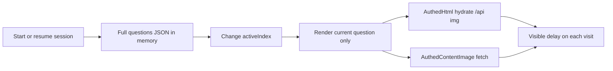

# Exam question media pre-fetch

## Current behavior (important)

The learner exam API already returns **all questions and answer options** in one response once the session is `in_progress`:

- [`GET /api/me/sessions/{id}/exam`](frontend/src/api/examSession.js) → [`LearnerExamState.questions[]`](backend/internal/quiz/models.go) with `prompt`, `images`, `answers[{id,text}]`, selections, etc.
- [`ExamSessionView`](frontend/src/views/ExamSessionView.vue) keeps that array in memory and only changes `activeIndex` — **no per-question network call** for text/options.
- Enrolled preview deliberately omits questions ([`buildLearnerExamPreview`](backend/internal/quiz/learner_sessions.go)); full payload arrives after **Start**.

What *is* lazy today (and feels like “fetching the next question”):

- [`AuthedHtml.vue`](frontend/src/components/AuthedHtml.vue) fetches each `/api/…` image as a blob when that HTML is mounted.
- [`AuthedContentImage.vue`](frontend/src/components/AuthedContentImage.vue) does the same for attached question images.
- Re-visiting a question remounts and **re-fetches** (no shared cache).

## Approach

Keep the bulk question payload as-is. Add a **client-side authenticated media prefetch + shared blob cache**, started as soon as `examState` becomes `in_progress`.

1. **Shared cache module** — e.g. [`frontend/src/lib/authedMediaCache.js`](frontend/src/lib/authedMediaCache.js)
   - `getAuthedObjectUrl(src, token)` → deduped in-flight fetches, Map of `resolvedSrc → objectURL`
   - `prefetchAuthedUrls(urls, token, { concurrency })` with a small pool (e.g. 4)
   - `collectExamMediaUrls(examState)` walks all questions: `images[]` plus `/api/` `img[src]` parsed from `prompt` and each `answer.text`
   - `clearAuthedMediaCache()` revoke object URLs on session end / leave exam route

2. **Wire consumers to the cache**
   - [`AuthedHtml.vue`](frontend/src/components/AuthedHtml.vue): use cache instead of local-only `apiFetch` + revoke-on-unmount (do **not** revoke shared URLs on unmount)
   - [`AuthedContentImage.vue`](frontend/src/components/AuthedContentImage.vue): same for preview (and enlarge if same URL)

3. **Kick off prefetch from the exam session**
   - In [`ExamSessionView.vue`](frontend/src/views/ExamSessionView.vue), when `sessionActive` becomes true (after `loadSession` / `startExamSession`):
     - Priority: current question media, then `activeIndex±1`, then the rest via `requestIdleCallback` / chunked `setTimeout`
   - On `onUnmounted` / leaving session: clear the cache

4. **Out of scope (unless we discover a real second bottleneck)**
   - New per-question APIs or splitting the exam JSON
   - Prefetching correct-answer payloads before reveal
   - Changing answer-save PATCH behavior (already optimistic via [`useExamAnswerQueue`](frontend/src/composables/useExamAnswerQueue.js))

## Success criteria

- After start/resume, navigating between questions shows prompts, options, and images without a fresh loading flicker for already-prefetched media.
- First paint of Q1 stays as fast as today (prefetch is background; current question still loads immediately via the same cache path).
- Cache is torn down when leaving the exam so blobs do not leak across sessions.

## Files to touch

- New: [`frontend/src/lib/authedMediaCache.js`](frontend/src/lib/authedMediaCache.js) (+ small URL collector helper)
- Edit: [`frontend/src/components/AuthedHtml.vue`](frontend/src/components/AuthedHtml.vue), [`frontend/src/components/AuthedContentImage.vue`](frontend/src/components/AuthedContentImage.vue), [`frontend/src/views/ExamSessionView.vue`](frontend/src/views/ExamSessionView.vue)
- Docs note (short): [`docs/exam-session-improvements.md`](docs/exam-session-improvements.md) — “media prefetch for in-progress sessions”
