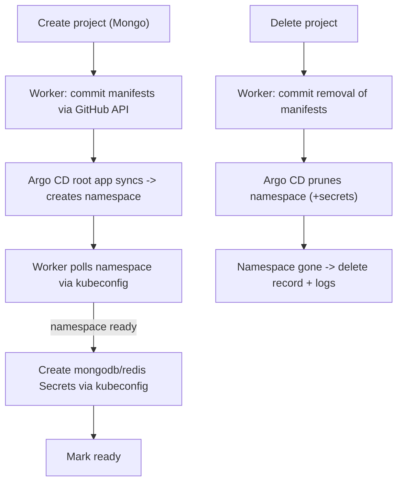

## GitOps manifest provisioning

Replace the direct namespace-create step with a commit to `github.com/epiHATR/classq-portal-manifest`. Argo CD's root app (`bootstrap/root-app.yaml`) then syncs the new project. MongoDB/Redis Secrets and all status reads stay on kubeconfig (credentials never touch Git).

### How the manifest repo works (confirmed)
- `apps/<app>/base/` -> raw manifests + `kustomization.yaml`
- `apps/<app>/overlays/production/kustomization.yaml` -> references `../../base`, sets `namespace:`
- `bootstrap/apps/<app>-production.yaml` -> Argo CD `Application` (`CreateNamespace=true`, automated prune+selfHeal)
- `bootstrap/root-app.yaml` -> app-of-apps watching `bootstrap/apps/`, so a new file there is auto-adopted.

### New provisioning/deletion flow

### Files generated per project (dir = namespace `<alias>-<id>`)
- `apps/<ns>/base/namespace.yaml`, `apps/<ns>/base/kustomization.yaml`
- `apps/<ns>/overlays/production/kustomization.yaml` (`namespace: <ns>`)
- `bootstrap/apps/<ns>.yaml` -> Argo CD `Application` with the `resources-finalizer.argocd.argoproj.io` finalizer (so removing it cascades namespace deletion), `path: apps/<ns>/overlays/production`, `destination.namespace: <ns>`, `CreateNamespace=true`.

### Backend changes
- New `[backend/internal/service/manifest_git.go](backend/internal/service/manifest_git.go)`: a small GitHub Git Data API client (plain `net/http`+`encoding/json`, no new dependency) plus a `ManifestRepository` interface: `EnsureProjectManifests(ctx, project, ns)` (atomic multi-file commit via blobs -> tree -> commit -> update ref; skips when unchanged) and `RemoveProjectManifests(ctx, project, ns)`. Pure YAML-builder helpers kept separately for testing.
- `[backend/internal/service/project_service.go](backend/internal/service/project_service.go)`:
  - Inject `manifestRepo ManifestRepository` (new `NewProjectService` arg).
  - `provisionProjectResources`: commit manifests (idempotent via stored SHA) -> `namespaceManager.Check`; if namespace not present yet, return a `errWaitingForSync` sentinel that keeps the project `pending` (publishes "waiting for Argo CD sync", not a failure); once present, `EnsureSecret` mongodb/redis as today.
  - `ProcessNamespaceProvisioning`: treat `errWaitingForSync` as retry (no failure mark), keep `ready` on full success.
  - `ProcessProjectDeletions`: replace `namespaceManager.Delete` with `manifestRepo.RemoveProjectManifests`, then wait for `Check` to report `NotFound` before deleting the record + logs.
  - Add log entries: `manifest.committed`, `manifest.removed` (with commit SHA); update provisioning messages.
- `[backend/internal/model/project.go](backend/internal/model/project.go)`: add `ManifestCommitSHA string` (idempotency + logging).
- `[backend/internal/repository/project_repository.go](backend/internal/repository/project_repository.go)`: add `SetManifestCommit(ctx, id, sha)` to the interface + impl.
- `[backend/cmd/server/main.go](backend/cmd/server/main.go)`: read new env, build the manifest service, pass to `NewProjectService`; keep `namespaceManager` for secrets + status.
- Tests: add `fakeManifestRepo` and update `NewProjectService` call sites in `[backend/internal/service/project_service_test.go](backend/internal/service/project_service_test.go)`; new `manifest_git_test.go` asserting generated YAML for the Application/kustomization/namespace.

### Config / env (PAT access)
- New vars: `MANIFEST_GITHUB_PAT` (required), `MANIFEST_REPO_OWNER` (default `epiHATR`), `MANIFEST_REPO_NAME` (default `classq-portal-manifest`), `MANIFEST_REPO_BRANCH` (default `main`), `MANIFEST_GIT_AUTHOR_NAME`, `MANIFEST_GIT_AUTHOR_EMAIL`.
- Add to `[.env.example](.env.example)`, `[.env](.env)`, and the backend service block in `[docker-compose.yml](docker-compose.yml)`.
- `[README.md](README.md)`: document the GitOps flow and new env vars.

### Notes / trade-offs
- PAT needs `repo` (contents read/write) scope on the manifest repo.
- Secrets are intentionally NOT committed to Git; they are created in-namespace via kubeconfig after Argo CD creates the namespace, so provisioning is a hybrid (Git for namespace/app, kubeconfig for secrets + status).
- kubeconfig remains required for secret creation, status cards, and deletion-completion checks.
</plan>
<todos>[{"id": "manifest-service", "content": "Add manifest_git.go: GitHub Git Data API client + ManifestRepository (ensure/remove) + YAML builders"}, {"id": "model-repo", "content": "Add ManifestCommitSHA to Project model and SetManifestCommit repo method"}, {"id": "service-flow", "content": "Rewrite provisioning/deletion in project_service.go to commit/remove manifests, wait for Argo CD sync, keep secrets+status on kubeconfig"}, {"id": "wire-main", "content": "Wire manifest service and new env vars in main.go"}, {"id": "config-env", "content": "Add manifest env vars to .env.example, .env, docker-compose.yml and document in README"}, {"id": "tests", "content": "Add fakeManifestRepo + manifest_git_test and update NewProjectService call sites"}, {"id": "verify", "content": "Run backend build/tests and frontend build"}]