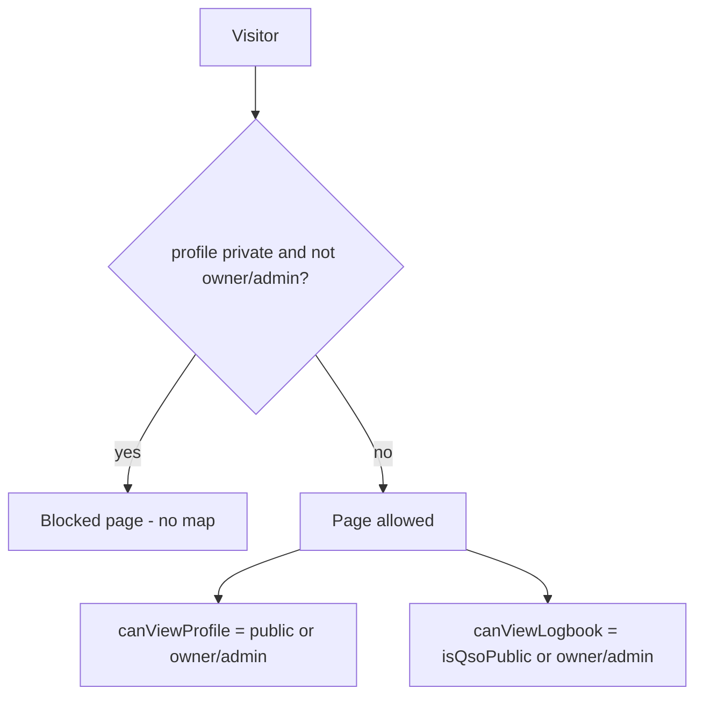
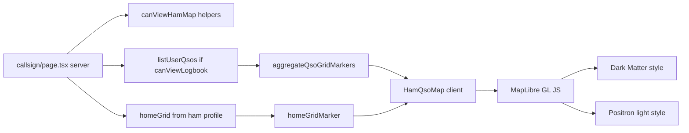

# Ham profile map view (`?view=map`)

## Current state (investigation)

- **No map implementation exists** — no `view=map` handling, no map library in [`package.json`](package.json).
- **Page routing** — [`src/app/[locale]/(portal)/[callsign]/page.tsx`](src/app/[locale]/(portal)/[callsign]/page.tsx) only reads `searchParams.tab`; renders [`HamProfileTabs`](src/components/portal/ham-profile-tabs.tsx).
- **Access model today** (unchanged per your choice):



- **QSO data** — [`QsoLog.grid`](src/models/QsoLog.ts) stores contact Maidenhead grid (uppercase). Loaded via [`listUserQsos`](src/lib/qso.ts) when `canViewLogbook`.
- **No operator/home grid** — [`User`](src/models/User.ts) has no home location field; must add `homeGrid` (your choice).

## ADIF message fields → `notes` (added requirement)

**Investigation:** [`QsoLog.notes`](src/models/QsoLog.ts) already exists and [`importQsoAdifAction`](src/lib/qso-import-actions.ts) persists `item.notes` on insert. Mapping is **inconsistent** across import sources:

| Mapper | Current `notes` source | Issue |
|--------|------------------------|-------|
| [`eqsl.ts`](src/lib/adif/import/eqsl.ts) | Merges `qslmsg`, `comment`, `notes` with ` · ` | Correct pattern |
| [`generic.ts`](src/lib/adif/import/generic.ts) | `adifField(record, "comment", "notes", "qslmsg")` | **First match only** — if `COMMENT` exists, `QSLMSG` is dropped |
| [`qrz.ts`](src/lib/adif/import/qrz.ts) | `adifField(record, "comment", "notes")` | **Missing `qslmsg`** entirely |

Files like `CEDB3712.adi` / eQSL exports use `<QSLMSG:31>TNX FOR THE FB QSO...` — these import via generic/adif and **do** save when `QSLMSG` is the only message field, but fail when multiple message tags exist on one record.

**Fix (implement before or alongside map work):**

1. Add shared helper in [`src/lib/adif/import/shared.ts`](src/lib/adif/import/shared.ts):

```typescript
const ADIF_NOTE_FIELDS = [
  "qslmsg", "comment", "notes",
  "qsl_rcvd_msg", "qsl_sent_msg", // optional extra ADIF message tags
] as const;

function adifNotesFromRecord(record: AdifRecord): string {
  const parts: string[] = [];
  for (const name of ADIF_NOTE_FIELDS) {
    const value = adifField(record, name);
    if (value && !parts.includes(value)) parts.push(value);
  }
  return parts.join(" · ").slice(0, 2000);
}
```

2. Replace per-mapper `notes` logic in [`generic.ts`](src/lib/adif/import/generic.ts), [`eqsl.ts`](src/lib/adif/import/eqsl.ts), [`qrz.ts`](src/lib/adif/import/qrz.ts) with `adifNotesFromRecord(record)`.

3. Verify with sample records containing only `QSLMSG`, and records with both `COMMENT` + `QSLMSG` — both texts should appear in `notes` after import.

No schema/DB migration needed (`notes` field already on QSO model).

## Target behavior

| URL | Who | Result |
|-----|-----|--------|
| `/{callsign}?view=map` | Owner / admin | Full map: home marker + all QSO grid markers |
| `/{callsign}?view=map` | Public visitor, profile public, logbook public | Home marker (if set) + QSO grid markers |
| `/{callsign}?view=map` | Public visitor, profile public, logbook private | Home marker only (if set); empty-state for QSO markers |
| `/{callsign}?view=map` | Public visitor, profile private | Same blocked page as today (no map) |

**Marker rules:**
- **QSO markers** — one marker per unique non-empty valid grid in the logbook (multiple QSOs in `OK30` → single marker). Popup shows grid + QSO count (+ optional callsign sample).
- **Home marker** — separate styled marker at profile `homeGrid` center; represents the operator (profile owner). Omitted if `homeGrid` empty/invalid.

## Architecture



## Map basemap — Dark Matter + theme switch

[Dark Matter GL Style](https://github.com/openmaptiles/dark-matter-gl-style) is a **MapLibre GL vector style** (not compatible with Leaflet raster tiles). Both Dark Matter and a paired light style ([Positron](https://github.com/openmaptiles/positron-gl-style) or [OSM Bright](https://github.com/openmaptiles/osm-bright-gl-style)) load vector tiles and fonts from **MapTiler**:

```json
"url": "https://api.maptiler.com/tiles/v3-openmaptiles/tiles.json?key={key}"
"glyphs": "https://api.maptiler.com/fonts/{fontstack}/{range}.pbf?key={key}"
```

**Implication:** Use **MapLibre GL JS** (`maplibre-gl`) instead of Leaflet.

### Environment

- Add `NEXT_PUBLIC_MAPTILER_API_KEY` (MapTiler free-tier key from [maptiler.com](https://www.maptiler.com/)).
- Document in `.env` example and [`deploy/docs/secret.example.yaml`](deploy/docs/secret.example.yaml).
- Page passes key to `HamQsoMap`; if missing → translated `mapUnavailable` message.

### Style assets

- Vendor style JSON under [`public/map/styles/`](public/map/styles/) from OpenMapTiles repos (sprites hosted on OpenMapTiles CDN).
- Helper [`src/lib/map/maptiler-style.ts`](src/lib/map/maptiler-style.ts): `resolveMapStyle(theme, apiKey)` injects API key into `{key}` placeholders.

### Theme modes

| Mode | Style | Use case |
|------|-------|----------|
| `dark` | [Dark Matter](https://github.com/openmaptiles/dark-matter-gl-style) | Dark basemap, good for marker contrast |
| `light` | Positron (recommended) | Matches default portal light UI |

- Toolbar toggle: Light / Dark.
- Persist in `localStorage` (`ham-map-theme`).
- Default first visit: `prefers-color-scheme: dark` → dark, else light.
- On switch: `map.setStyle(...)` then re-add markers (style swap clears custom layers).
- Marker pin colors adjusted per theme for visibility.

### Attribution

Show MapLibre / OpenMapTiles / OSM attribution (MapTiler ToS requirement).

## 1. Data model — optional home grid

**Files:** [`src/models/User.ts`](src/models/User.ts), [`src/lib/account-types.ts`](src/lib/account-types.ts), [`src/lib/account.ts`](src/lib/account.ts), [`src/lib/ham-profile.ts`](src/lib/ham-profile.ts)

- Add `homeGrid: { type: String, default: "", trim: true, uppercase: true }` to User schema.
- Extend `AccountProfileDto` and `PublicHamProfile` with `homeGrid: string`.
- Include in `getAccountProfile` / `findPublicHamByCallsign` select + mapping.
- Invalidate ham cache on profile grid update (existing `invalidateQsoAndHamCache` / revalidate paths in [`account-actions.ts`](src/lib/account-actions.ts)).

## 2. Profile editing — home grid field

**Files:** [`src/lib/validations/qso.ts`](src/lib/validations/qso.ts), [`src/lib/account-actions.ts`](src/lib/account-actions.ts), [`src/components/portal/account-profile-form.tsx`](src/components/portal/account-profile-form.tsx), [`messages/en.json`](messages/en.json), [`messages/vi.json`](messages/vi.json)

- Add optional `homeGrid` to `profileFormSchema` (validate 4–12 char Maidenhead; empty allowed).
- New profile card + edit dialog (same pattern as name/callsign cards).
- Show read-only home grid on public profile tab in [`page.tsx`](src/app/[locale]/(portal)/[callsign]/page.tsx) when `canViewProfile`.

## 3. Maidenhead + marker aggregation utilities

**New files:**
- [`src/lib/maidenhead.ts`](src/lib/maidenhead.ts) — `normalizeGrid`, `isValidMaidenheadGrid`, `maidenheadToLatLng` (field center; support 4/6/8+ char locators used in logbook).
- [`src/lib/qso-map.ts`](src/lib/qso-map.ts) — types + helpers:

```typescript
type QsoGridMarker = { grid: string; lat: number; lng: number; qsoCount: number; workedCallsigns: string[] };
type HomeGridMarker = { grid: string; lat: number; lng: number; callsign: string };

function aggregateQsoGridMarkers(qsos: QsoListItemDto[]): QsoGridMarker[];
function buildHomeGridMarker(homeGrid: string, callsign: string): HomeGridMarker | null;
```

Skip invalid/empty grids silently (many imported ADIF QSOs lack grid).

## 4. Access helpers

**New file:** [`src/lib/ham-map-access.ts`](src/lib/ham-map-access.ts)

```typescript
canAccessHamMapPage(isBlockedProfile: boolean): boolean;
canViewQsoMapMarkers(canViewLogbook: boolean): boolean;
canViewHomeMapMarker(canViewProfile: boolean, homeGrid: string): boolean;
```

Used by page server component before rendering map or fetching QSOs.

## 5. Page integration — `?view=map`

**File:** [`src/app/[locale]/(portal)/[callsign]/page.tsx`](src/app/[locale]/(portal)/[callsign]/page.tsx)

- Extend `searchParams` to `{ tab?: string; view?: string }`.
- Preserve `view=map` in callsign normalization redirect (alongside `tab`).
- When `view === "map"` and `canAccessHamMapPage`:
  - Keep existing header (callsign, verified badge, profile access line).
  - Replace `HamProfileTabs` with new [`HamQsoMap`](src/components/portal/ham-qso-map.tsx) (full-width panel below header).
  - Pass server-computed props: `qsoMarkers`, `homeMarker | null`, flags for empty states.
- When `view=map` but no markers and no home grid → translated empty state.
- Add link in header or logbook area: “Map view” → `?view=map`; “Back to profile” → `/{callsign}`.

## 6. Map UI component

**New file:** [`src/components/portal/ham-qso-map.tsx`](src/components/portal/ham-qso-map.tsx) (`"use client"`)

- Dynamic import MapLibre to avoid SSR issues (`next/dynamic`, `ssr: false`).
- **Dependencies to add:** `maplibre-gl` (and `@types/maplibre-gl` if needed); optional `react-map-gl` maplibre re-export for React bindings.
- Import `maplibre-gl/dist/maplibre-gl.css` once.
- Load basemap via `resolveMapStyle(theme, mapTilerKey)`.
- **Theme toolbar** — light/dark toggle + `localStorage` persistence; default from `prefers-color-scheme`.
- Default bounds: fit all markers; fallback center `[20, 0]` zoom `1.5` if no markers.
- Markers as MapLibre `Marker` or GeoJSON source + circle layers:
  - **Home** — distinct color/icon + popup (`{callsign} · {grid}`).
  - **QSO grids** — standard markers + popup (grid, count, short callsign list).
- On theme change: swap style, re-register markers.
- If `!mapTilerKey`: show translated fallback panel instead of map canvas.

## 7. i18n

**Namespace:** `ham.map.*` in [`messages/en.json`](messages/en.json) and [`messages/vi.json`](messages/vi.json)

Keys: `title`, `viewMap`, `backToProfile`, `themeLight`, `themeDark`, `homeMarkerLabel`, `qsoMarkerLabel`, `qsoCount`, `emptyTitle`, `emptyMessage`, `logbookPrivateNotice`, `mapUnavailable`.

## 8. Security / privacy summary

- No new public API route required — map data computed server-side in page, same as logbook.
- QSO list never sent to client if `!canViewLogbook` (only aggregated markers when allowed).
- `homeGrid` exposed only when `canViewProfile` (public profile or owner/admin).
- Private profile still blocks entire page including map (your choice).

## Out of scope (follow-ups)

- Lines/paths connecting markers (not requested; dedupe only).
- Map when profile private but logbook public (explicitly declined).
- Storing `MY_GRIDSQUARE` from ADIF on each QSO (home grid on profile is sufficient).

## Test plan

0. Import ADIF with `QSLMSG` only → `notes` saved; import with `COMMENT` + `QSLMSG` → both merged in `notes`.
1. Set `homeGrid` on profile → open `/{callsign}?view=map` as owner → home marker visible.
2. Import QSOs with grids → one marker per unique grid; popup count correct.
3. Public visitor + public profile + public logbook → sees both marker types.
4. Public visitor + public profile + private logbook → home only + notice.
5. Private profile visitor → blocked page (no map).
6. VI locale → all map strings translated.
7. Toggle dark ↔ light → basemap swaps; markers remain; preference persists after reload.
8. Dark mode default when OS prefers dark (first visit only).
9. `npm run lint` + `npx tsc --noEmit`.
