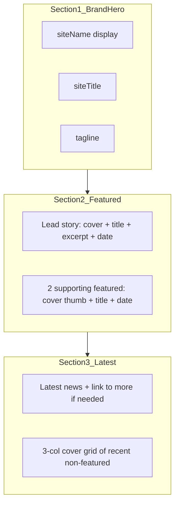

# Home page modern CMS layout

**Design read:** Public org CMS homepage for VARC visitors — editorial / trust-first, not SaaS landing. Keep existing Outfit + Newsreader and green token system (`accent` `#1f6b4a`, soft sage surfaces). Overhaul composition; do not invent a purple/cream AI theme.

## Layout draft (sections, top → bottom)

### 1. Brand hero (one job: brand)
- Full-bleed atmospheric plane (existing soft green radial / gradient — refine, don’t flatten to one color).
- Content budget only: **siteName** (hero-level), **siteTitle**, **tagline**. No stats, no post cards, no overlays on imagery.
- Mobile: stack, generous bottom padding into the next section.

### 2. Featured (one job: curated stories)
- Section label + short line (i18n: e.g. “Nổi bật” / “Featured”).
- Desktop **2–1 split**: large lead (cover as dominant visual + title/excerpt/date/read more) | two stacked supporting featured items (smaller cover + title + date).
- Mobile: lead first, then two supports stacked.
- No generic equal 3-card row; lead must visually dominate.
- Data: articles with `featured: true`, published, sorted by `publishedAt` desc, take up to **3**. If fewer than 1 featured, **fallback** to the 3 newest published (so empty CMS still looks intentional).

### 3. Latest news (one job: browse recent)
- Heading from existing `home.title`.
- **Cover-led grid** (1 col → 2 → 3): image, title, date, optional short excerpt — skip articles already shown in Featured to avoid duplicates.
- Replace today’s text-only divider list.
- Keep “read more” / empty copy via existing next-intl keys; add keys for Featured section.

## Data / admin

- Add `featured: boolean` (default `false`, indexed) on [`src/models/Article.ts`](src/models/Article.ts).
- Extend form schema + article editor checkbox (“Featured on home”).
- New helper in [`src/lib/articles.ts`](src/lib/articles.ts), e.g. `listFeaturedArticles(locale, limit=3)` + extend `listPublishedArticles` usage on home (fetch enough for grid, exclude featured IDs).
- No media-library or category shortcuts in v1 (categories exist but unused publicly).

## Code structure

- Split [`src/app/[locale]/page.tsx`](src/app/[locale]/page.tsx) into small portal components under `src/components/portal/`:
  - `home-hero.tsx`
  - `home-featured.tsx`
  - `home-latest.tsx`
  - shared `article-card.tsx` (variants: `lead` | `support` | `grid`)
- Reuse `coverImageUrl` already returned by `PublicArticleCard` but unused on home today.
- Light motion only: fade/slide-in on featured + grid (2–3 intentional reveals), CSS/`IntersectionObserver` — no heavy carousel in v1.

## Out of scope
- Separate “all news” index page (unless already needed later).
- Homepage CMS blocks / drag-drop builder.
- Changing header/footer chrome beyond what spacing needs.

## Acceptance
- Home reads as one brand composition in the first viewport, then featured, then latest.
- Editors can pin up to 3 featured posts from admin.
- Covers render; missing cover uses a quiet accent-soft placeholder (not a noisy card stack).
- VI/EN both work with existing branding + article locale rules.
