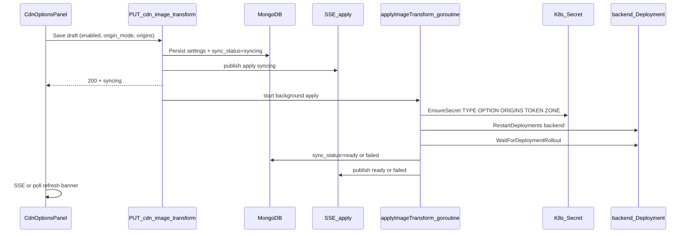
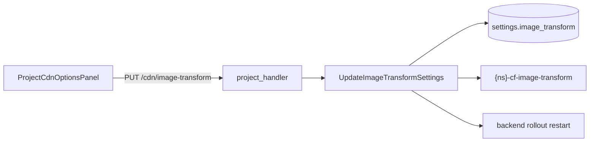

# Image Transformation On/Off plan

## UI options (clarified)

Tab: **CDN options → Image Transformation**

### Level 1 — Image Transformation (always visible)

Two mutually exclusive choices (radio / segmented control):

| Label | Meaning | Secret effect |
|-------|---------|---------------|
| **Off** | Image transformation disabled for this project | `CF_IMAGE_TRANSFORM_OPTION=1` |
| **On** | Image transformation enabled | Reveals Level 2 settings below; always sets `CF_IMAGE_TRANSFORM_TYPE=default` |

### Level 2 — Origin settings (visible only when Level 1 = **On**)

Section title: **Origin settings**

Two mutually exclusive choices:

| Label | Meaning | Secret effect |
|-------|---------|---------------|
| **Allow from all origins** | Any origin may use transforms | `CF_IMAGE_TRANSFORM_OPTION=2`, `CF_IMAGE_TRANSFORM_ORIGINS` empty |
| **Allow from specific domain** | Only listed origins | `CF_IMAGE_TRANSFORM_OPTION=3` + domain box |

### Level 3 — Allowed domains (visible only when Level 2 = **Allow from specific domain**)

- Label: **Allowed domains**
- Control: multiline text box
- Input rule: **one origin URL per line**
- Placeholder example:

```text
https://cdn.example.com
https://media.example.com
```

- On Save → joined as `CF_IMAGE_TRANSFORM_ORIGINS=https://cdn.example.com,https://media.example.com`
- Empty lines ignored; Save requires at least one valid `http://` or `https://` URL when this mode is selected

### Visibility summary

```text
Image Transformation
  ( ) Off
  (•) On
      └─ Origin settings          ← only if On
           (•) Allow from all origins
           ( ) Allow from specific domain
                └─ Allowed domains (textarea)  ← only if specific domain
```

### Save

- Explicit **Save** button (Mail settings pattern).
- Draft edits do not write secrets until Save.
- Sync banner: applying / ready / failed.

Token/zone (`CF_IMAGE_TRANSFORM_API_TOKEN`, `CF_IMAGE_TRANSFORM_ZONE_ID`) are **not** shown in the UI; kept from portal seed / existing secret.

## Full steps when secrets change (wiring)

Image transform follows the **same apply pipeline as Mail settings**. Manifest wiring already exists — Save does **not** change GitOps YAML; it updates the live Secret and restarts the backend so pods pick up new env values.

### Why restart is required

Backend env vars are wired once in [`backend-deployment.yaml`](templates/apps/__NAMESPACE__/base/backend-deployment.yaml) via `secretKeyRef` → `{namespace}-cf-image-transform`. Kubernetes injects secret values **at pod start**. Updating the Secret alone does not refresh running containers, so the portal must **rollout-restart `backend`** after `EnsureSecret`.



### Step-by-step (Image Transformation Save)

1. **UI Save** — POST/PUT draft: `enabled`, `origin_mode`, `origins[]`.
2. **Validate** — Off→option 1; On+all→2; On+specific→3 + ≥1 valid origin URL.
3. **Persist Mongo** — `settings.image_transform` + `sync_status=syncing`, `sync_message=Applying…`.
4. **Publish SSE** — `kind=image-transform` (mirror `mail-settings`), status syncing.
5. **Return immediately** — HTTP 200 with syncing; work continues in background (15m timeout), guarded by `beginApply` / `endApply`.
6. **Background apply**
   - Resolve namespace; if namespace missing / manager nil → mark ready (settings saved only) or fail on check error (same as mail).
   - Build secret map:
     - `CF_IMAGE_TRANSFORM_TYPE` / `OPTION` / `ORIGINS` from UI mapping
     - `CF_IMAGE_TRANSFORM_API_TOKEN` / `ZONE_ID` from existing secret if present, else portal defaults
   - **`EnsureSecret`** create-or-update `{namespace}-cf-image-transform` (full key set; Update replaces StringData).
   - Activity log: secret synced.
   - **`restartDeploymentsAndWait(namespace, "backend")`** — annotation rollout restart, then wait until new generation Ready (up to 5m).
   - Activity log: backend restarted.
7. **Finish** — `sync_status=ready` (“Image transform settings applied”) or `failed` + error message; SSE again.
8. **UI** — listen for apply SSE + light poll while syncing (Mail panel pattern); disable Save while applying.

### What does *not* change on Save

- No GitOps commit / Argo sync for this path.
- No edit to `backend-deployment.yaml` (secretKeyRef already mounts all five keys).
- Frontend deployment is not restarted (image-transform env is backend-only).

### Initial / reconcile path (separate from Save)

On project provision or secret re-ensure, `ensureCFImageTransformSecret` must write **project-stored settings when present**, else portal `CF_IMAGE_TRANSFORM_*` defaults — so reconcile does not wipe a user’s Off/On choice.

## Secret mapping (source of truth)

| UI state | Keys written |
|----------|--------------|
| **Off** | `OPTION=1` (keep TYPE / token / zone; clear `ORIGINS`) |
| **On** + Allow from all origins | `TYPE=default`, `OPTION=2`, `ORIGINS=` empty |
| **On** + Allow from specific domain | `TYPE=default`, `OPTION=3`, `ORIGINS=` comma-joined list |



## Frontend

Update [`frontend/src/components/ProjectCdnOptionsPanel.vue`](frontend/src/components/ProjectCdnOptionsPanel.vue) to match the UI options above:

- Load settings on mount via store.
- Level 1 Off/On; Level 2 origin radios when On; Level 3 textarea when specific.
- **Save** + sync status banner (same pattern as [`ProjectMailSettingsPanel.vue`](frontend/src/components/ProjectMailSettingsPanel.vue)).

Add store helpers in [`frontend/src/stores/projects.ts`](frontend/src/stores/projects.ts):

- `fetchImageTransformSettings(id)` → `GET /api/projects/:id/cdn/image-transform`
- `updateImageTransformSettings(id, payload)` → `PUT ...`

Payload shape:

```ts
{
  enabled: boolean                      // Off=false, On=true
  origin_mode: 'all' | 'specific'       // Level 2; ignored when Off
  origins: string[]                     // Level 3 lines; used when specific
}
```

Backend maps: Off→`1`, On+all→`2`, On+specific→`3`.

## Backend

### Model

Add to [`backend/internal/model/project.go`](backend/internal/model/project.go) under `ProjectSettings`:

```go
ImageTransform ProjectImageTransformSettings `bson:"image_transform,omitempty"`

type ProjectImageTransformSettings struct {
  Enabled    bool     // false => option 1
  OriginMode string   // "all" | "specific"
  Origins    []string // stored as list; secret writes comma-joined
  SyncStatus string
  SyncMessage string
}
```

### Repository

Mirror `SetMailSettings` / `SetMailSync` in [`backend/internal/repository/project_repository.go`](backend/internal/repository/project_repository.go): persist option fields + sync status.

### Service ([`backend/internal/service/project_service.go`](backend/internal/service/project_service.go))

- `ImageTransformSettings` / `UpdateImageTransformSettings` — validate:
  - Off → option `1`
  - On + all → type `default`, option `2`, origins cleared
  - On + specific → type `default`, option `3`, require ≥1 valid origin (trim, reject blanks; accept `http(s)://…`)
- Apply path (like mail): set syncing → `EnsureSecret` on `{ns}-cf-image-transform` with full key map (merge: new TYPE/OPTION/ORIGINS + existing or portal default TOKEN/ZONE) → restart backend → mark ready/failed → SSE apply event (`ApplyKindImageTransform`).
- Change [`ensureCFImageTransformSecret`](backend/internal/service/project_service.go) so reconcile uses **project settings when present**, else portal `defaultCFImageTransformData()` (today always overwrites with portal defaults — that would wipe UI changes).

### Handler + routes

- [`backend/internal/handler/project_handler.go`](backend/internal/handler/project_handler.go): GET + PUT
- [`backend/cmd/server/main.go`](backend/cmd/server/main.go):  
  `GET|PUT /api/projects/:id/cdn/image-transform`

### Tests

Extend [`backend/internal/service/project_service_test.go`](backend/internal/service/project_service_test.go) similar to `TestUpdateMailSettingsWritesEmailSecretAndRestartsBackend`: Off→option 1; On+all→2; On+specific→3 + ORIGINS; invalid origins rejected; ensure reconcile does not reset option after update.

## Out of scope

- No Cloudflare API calls from portal for this tab (secret keys only).
- No change to deployment env wiring in [`templates/apps/__NAMESPACE__/base/backend-deployment.yaml`](templates/apps/__NAMESPACE__/base/backend-deployment.yaml) (already mounts these keys).
- Portal `.env` `CF_IMAGE_TRANSFORM_*` remains seed/defaults for new projects only.