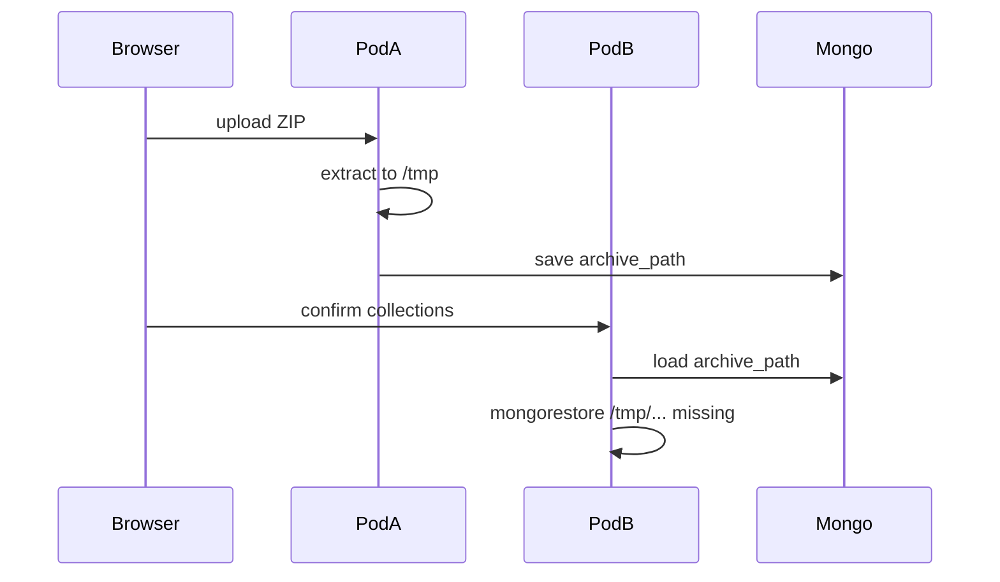

# Fix K8s database restore (shared import staging)

## Root cause

Import today writes the dump under `os.MkdirTemp` (`/tmp/ham-check-import-*`) and stores only that path in Mongo:

```165:225:backend/internal/backup/import.go
workDir, err := os.MkdirTemp("", "ham-check-import-*")
// ...
ArchivePath: archivePath,
```

Confirm then runs `CompleteImport` on **whichever pod handled the confirm request** ([`backend/internal/admin/import.go`](backend/internal/admin/import.go) `go h.runDatabaseImport(...)`).

On K8s the example backend has **`replicas: 2`** ([`deploy/k8s/example/ham-check.example.yaml`](deploy/k8s/example/ham-check.example.yaml)). Upload and confirm usually hit different pods → `stat .../tmp/ham-check-import-...: no such file or directory`. Locally a single process shares `/tmp`, so it works.



Secondary K8s footgun: Ingress `proxy-body-size: 50m` while the API allows up to **512 MiB** imports — large ZIPs can fail at the ingress before the API sees them.

## Approach

Reuse the existing export pattern: put the extracted archive in `BlobStore` under `imports/{importID}/...`, then download to a local temp file on the pod that runs restore. Prefer blob over sticky sessions or forcing `replicas: 1`.

## Implementation

### 1. Persist staging object in import records

Update [`backend/internal/backup/import.go`](backend/internal/backup/import.go):

- Add `StorageKey string` on `importRecord` (and clear it when done, like `archive_path`).
- After successful extract + collection listing in `PrepareImportUpload`:
  - `Put` archive to `imports/{id}/{basename}` via `s.blobs` (content-type `application/octet-stream`).
  - Keep a short-lived local `work_dir` only for dry-run listing on that request; still record `storage_key` as source of truth.
- `CompleteImport`:
  - Resolve archive: if local `ArchivePath` exists use it; otherwise `Open` from `StorageKey`, copy into a fresh temp file, restore from that.
  - Preflight with a clear error if neither local file nor blob exists (“import staging expired — re-upload”).
  - On success/failure/cancel: delete blob key + local work dir (mirror export cleanup).
- `CancelImport` / `failImport` / stuck recovery: also `Delete` the blob when `storage_key` is set.

### 2. Tests

Extend [`backend/internal/backup/mongorestore_args_test.go`](backend/internal/backup/mongorestore_args_test.go) or add a small import staging test with an in-memory/local `BlobStore` if one exists; otherwise test helpers around “download staging to temp” path with the local filesystem store under a temp root.

### 3. K8s example hygiene

In [`deploy/k8s/example/ham-check.example.yaml`](deploy/k8s/example/ham-check.example.yaml):

- Raise ingress annotation to at least `520m` (or `600m`) so 512 MiB imports are not truncated.
- Short comment that DB import requires shared S3 (already the default `STORAGE_BACKEND: s3`); local `emptyDir` uploads alone are not enough for multi-replica import staging.

### 4. Verify

- `go test ./internal/backup/ -count=1`
- Mentally / manually: upload → confirm with 2 backend replicas must succeed after redeploy.

## Out of scope

- Changing replica count or adding session affinity.
- Moving mongorestore into a Job/sidecar (heavier than needed once blob staging exists).
