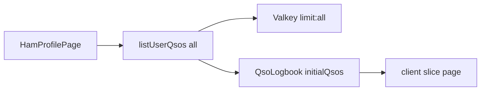
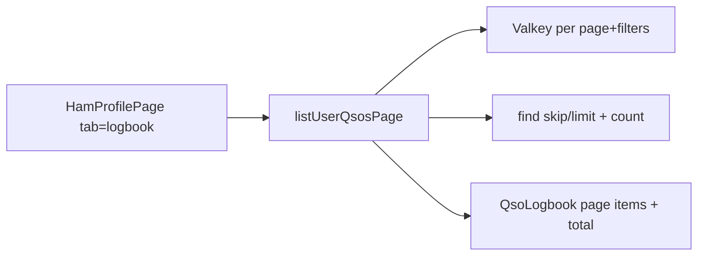

# Server-side logbook paging

## Problem

[`HamProfilePage`](src/app/[locale]/(portal)/[callsign]/page.tsx) always calls unbounded `listUserQsos(ham.id)` whenever the viewer can see the logbook (line ~211), then passes the full array into client [`QsoLogbook`](src/components/portal/qso-logbook.tsx) as `initialQsos`.

UI pagination (`PAGE_SIZE` 20/50/100) only **slices after** the whole list is already in memory. With 1k+ QSOs that freezes because of:

1. Mongo load + DTO map of every row
2. Valkey get/set of one giant `limit:all` blob ([`QsoCacheKeys.qsoList`](src/lib/cache/qso-cache.ts))
3. RSC serialization of `initialQsos` into a `"use client"` boundary
4. Client `useMemo` filter/sort over the full array

SSR already happens; the bug is **unbounded data**, not missing SSR. Page is `force-dynamic` / `force-no-store`, so Next Data Cache is off—Valkey is the right cache layer.

## Approach

URL-param SSR paging (same idea as callsigns search): `?tab=logbook&page=1&pageSize=20&q=&sort=qsoAt&dir=desc`. No client-held full list for browsing.

## Implementation

### 1. Server query API — [`src/lib/qso.ts`](src/lib/qso.ts) + [`src/lib/cache/qso-cache.ts`](src/lib/cache/qso-cache.ts)

Add `listUserQsosPage({ userId, page, pageSize, search, sortKey, sortDir })` returning `{ items, total, page, pageSize }`.

- Mongo: `find({ userId, ...searchFilter }).sort(...).skip().limit()` + `countDocuments` (reuse existing `{ userId: 1, qsoAt: -1 }` index for default sort).
- Search: case-insensitive on `workedCallsign`, `mode`, `band`, `grid`, `notes` (mirror current client haystack fields that are in Mongo; date formatting stays display-only).
- Allowed `pageSize`: 20 | 50 | 100; clamp page ≥ 1.
- Valkey key includes all filter dims, e.g. `qso:list:user:{id}:p{page}:s{pageSize}:q{hash}:sort{key}:{dir}:v2`, TTL 300s, same user tag invalidation (`invalidateQsoUserCache` already deletes tagged keys).
- Keep `listUserQsos(userId, limit?)` for map/export/import refresh paths; stop using unbounded list for the profile logbook tab.

### 2. Fetch only when logbook tab is active — [`src/app/[locale]/(portal)/[callsign]/page.tsx`](src/app/[locale]/(portal)/[callsign]/page.tsx)

- Parse `page`, `pageSize`, `q`, `sort`, `dir` from `searchParams` when `activeTab === "logbook"`.
- Call `listUserQsosPage` **only** for that tab; other tabs get no QSO list (empty / omit prop).
- Pass `{ items, total, page, pageSize, search, sortKey, sortDir }` into `QsoLogbook`.
- Map view (`?view=map`) stays on `listUserQsos` for now (separate concern; optional later cap/aggregate-only query). Do not load map QSOs when rendering tabs.

### 3. Wire UI to server paging — [`src/components/portal/qso-logbook.tsx`](src/components/portal/qso-logbook.tsx)

- Replace client-wide `filteredSorted` + local page state with **URL navigation** (`router.push` / `Link` on the same `/{callsign}` path preserving `tab=logbook`).
- Table renders `items` from the server; footer uses `total` for range/prev/next.
- Search: debounce ~300ms then update `q` + reset `page=1` via URL (SSR round-trip).
- Sort headers update `sort`/`dir` in URL.
- After create/update/delete/import server actions: `router.refresh()` (already used) is enough; drop optimistic full-list `setQsos` merges that assume a complete in-memory array, or only patch the current page and refresh.
- Import success path in [`src/lib/qso-import-actions.ts`](src/lib/qso-import-actions.ts) that returns `listUserQsos` for UI: return `{ imported, total }` (or nothing) and let the page refresh the current page instead of shipping all rows.

### 4. Cache correctness

- Invalidate-on-write already via `invalidateQsoAndHamCache` / `revalidateLogbook` — keep as-is so page keys under the user tag are cleared.
- Do not cache a single `limit:all` blob for the logbook UI.
- Page remains `force-dynamic`; Valkey is the shared cache across pods.

### 5. Verify

- `pnpm lint` + `npx tsc --noEmit`
- Manual: profile with 1k+ QSOs — first logbook paint, page 2, search, sort, add/delete QSO, confirm no full-list payload in flight and UI stays responsive.
