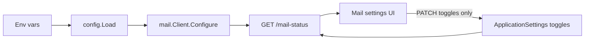

# Mail provider credentials from environment

## Decision

- **Env (runtime source of truth):** `CLOUDFLARE_ACCOUNT_ID`, `CLOUDFLARE_API_TOKEN`, `CLOUDFLARE_ZONE_ID`, `MAIL_FROM`
- **Mongo (unchanged):** feature toggles — `email_sending_enabled`, welcome / forgot-password / activation / exam result / exam enrollment
- **Already env-locked:** `APP_PUBLIC_URL` / `APP_HOSTNAME` (keep as today)
- **Do not wipe** existing Mongo credential fields; stop reading/writing them for mail configure. Stale DB values become unused.

## Backend

### 1. Load credentials in config

Extend [`backend/internal/config/config.go`](backend/internal/config/config.go) with:

- `CloudflareAccountID`, `CloudflareAPIToken`, `CloudflareZoneID`, `MailFrom`

Read from the env vars above (same sanitizers as `users.Sanitize*` where practical, or trim + reuse existing helpers).

### 2. Configure mail client from env at startup

In [`backend/cmd/server/main.go`](backend/cmd/server/main.go):

- Remove `migrateMailSettingsFromEnv` (and its call)
- Configure `mailClient` from `cfg` (not `GetApplicationSettings()` credentials)

### 3. Stop re-applying Mongo credentials onto the client

In [`backend/internal/admin/handler.go`](backend/internal/admin/handler.go):

- Change `applyMailProviderSettings` to configure from `h.cfg` (env), optionally merging `AppPublicURL` resolution as today
- In `UpdateMailSettings`: if request includes `cloudflare_account_id` / `cloudflare_api_token` / `cloudflare_zone_id` / `mail_from`, return **400** with a clear message (same pattern as `MEDIA_PUBLIC_BASE_URL` — deploy-managed)
- Keep toggle + CF image processing + custom hostname updates working

### 4. Overlay env credentials on settings API responses

CDN panel ([`CdnSettingsPanel.vue`](frontend/src/components/CdnSettingsPanel.vue)) gates transforms on `cloudflare_zone_id` + `cloudflare_api_token_set` from `GET /application-settings`.

In `withMediaURLHints` (or equivalent settings response path): overlay env account/zone/`mail_from` and set `cloudflare_api_token_set` from whether `cfg.CloudflareAPIToken` is non-empty, so CDN + mail status stay consistent without Mongo.

`GET /mail-status` already reflects the live `mail.Client` snapshot once configured from env.

### 5. Leave Mongo schema alone

Keep BSON fields on `ApplicationSettings` for backward compatibility; do not require a DB migration. `EnsureCloudflareAPITokenEncrypted` can remain for any leftover stored tokens (harmless).

## Frontend

### Mail settings (`/settings?tab=mail_settings`)

In [`ApplicationSettingsView.vue`](frontend/src/views/ApplicationSettingsView.vue):

- Remove editable `mail_from` form + `saveMailProviderSettings` for setup admin
- Replace with a locked/read-only block (mirror CDN hostname lock pattern): show sender from `mailStatus.mail_from`, note that credentials are managed by deploy/env
- Keep toggles, test email, refresh status

### i18n

Update [`en-US.json`](frontend/src/i18n/locales/en-US.json) / [`vi.json`](frontend/src/i18n/locales/vi.json): new copy for deploy-managed provider config; drop/adjust strings only used by the save form.

## Deploy / docs

- [`docker-compose.app.yml`](docker-compose.app.yml): add `MAIL_FROM: ${MAIL_FROM:-}` (CLOUDFLARE_* already present); update comment (runtime config, not one-time bootstrap)
- [`docker-compose.yml`](docker-compose.yml) app profile backend: pass `CLOUDFLARE_*`, `MAIL_FROM`, `APP_PUBLIC_URL` / `APP_HOSTNAME` for parity
- [`backend/.env.example`](backend/.env.example): document the four vars (replace “configured in Application Settings” note)
- [`deploy/infra.env.example`](deploy/infra.env.example) / instance example: document `MAIL_FROM` (often per-instance)

## Out of scope

- Moving feature toggles to env
- Deleting credential fields from Mongo documents
- Changing Cloudflare Email Sending / outbox worker behavior
