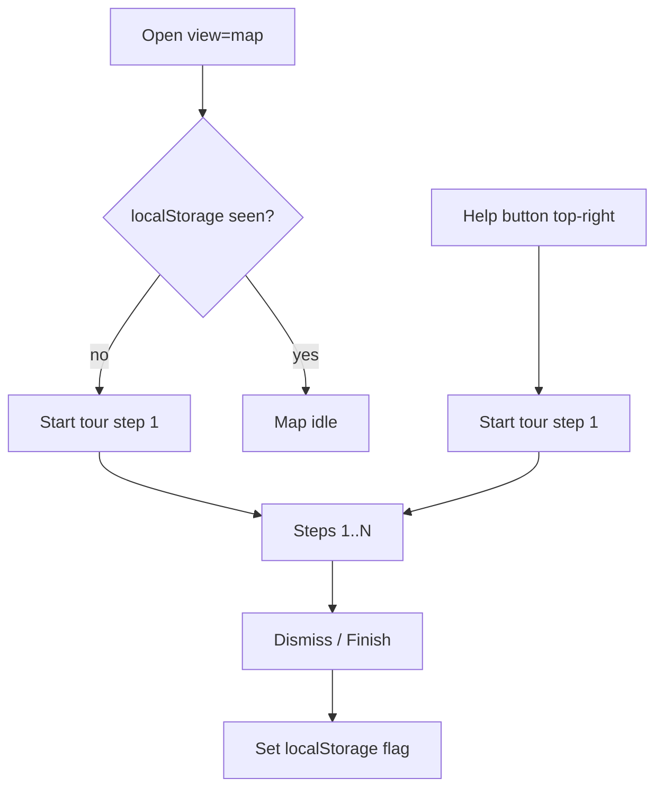

# Map tutorial + 24h default

## Defaults

- Tutorial: **both** — auto first-visit tour + **Help (?)** top-right to replay
- Time filter: default **`24h`** (currently `"all"` in [`ham-map-fullscreen-view.tsx`](src/components/portal/ham-map-fullscreen-view.tsx) ~line 720)

## 1. Default time range → 24h

In [`HamMapFullscreenView`](src/components/portal/ham-map-fullscreen-view.tsx):

```ts
const [qsoTimeRange, setQsoTimeRange] = useState<HamMapQsoTimeRange>("24h");
```

No persistence needed for this change unless already stored (it is not). List panel + markers + traces already use `filterQsosByTimeRange(qsos, qsoTimeRange)`, so they follow automatically.

## 2. Tutorial UX

Lightweight custom coach marks (no new dependency). Match existing map chrome (theme-aware panels like [`HamMapControlsPanel`](src/components/portal/ham-map-controls-panel.tsx)).



**Help button placement:** top of the existing top-right stack (`absolute right-3 top-3`), **above** layer/fullscreen controls so it stays top-right:

```
[ ? Help ]
[ layers / fullscreen ]
[ time filter ]
```

**Storage:** `localStorage` key e.g. `ham-map-tour-v1` = `"1"` when finished or skipped (same pattern as [`HAM_MAP_THEME_STORAGE_KEY`](src/lib/map/maptiler-style.ts)).

**Tour steps (5–6, short copy):**

1. **Welcome** — QSO map overview; note default last 24h
2. **Time filter** (spotlight top-right chips) — change lookback
3. **Layer toggles** — grids / pins / traces
4. **QSO logbook** (left handle) — open list, select a QSO to focus
5. **Pins & rectangles** — click pin for tooltip; grids are 4-char fields
6. **Done** — Help (?) replays anytime

Each step: dim overlay + tooltip near target (`data-tour` anchors on controls / list handle / map shell). Actions: Next / Back / Skip. Finish or Skip writes the storage flag. Replay from Help clears nothing until Finish/Skip again (or always allow replay without clearing).

**A11y:** focus trap in tooltip, `Esc` skips/closes, `aria-modal` on overlay.

## 3. Files

| File | Change |
|------|--------|
| [`src/components/portal/ham-map-fullscreen-view.tsx`](src/components/portal/ham-map-fullscreen-view.tsx) | Default `qsoTimeRange` to `"24h"`; mount tour + Help; add `data-tour-*` on control wrappers |
| New `src/components/portal/ham-map-tour.tsx` | Tour state machine, overlay, steps, Help trigger API (`startTour()`), read/write localStorage |
| New helpers in `src/lib/map/ham-map-tour.ts` (optional) | Storage key + `hasSeenHamMapTour` / `markHamMapTourSeen` |
| [`messages/en.json`](messages/en.json) / [`messages/vi.json`](messages/vi.json) under `ham.map` | `tourHelp`, `tourSkip`, `tourNext`, `tourBack`, `tourFinish`, step titles/bodies |

Wire Help as a small circular `?` button in the top-right column (same visual language as control panel buttons). Auto-start tour once after map theme is ready (`themeReady`) and MapTiler key present, only if not seen.

## 4. Verify

- `pnpm lint` + `npx tsc --noEmit`
- Open `/{callsign}?view=map`: filter shows **24h** selected; tour runs first visit
- Skip/Finish → no auto tour on reload; Help top-right replays
- VI/EN strings present
