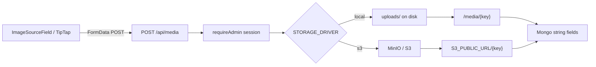

# Media upload: local + MinIO/S3

## Current state

Images today are inlined as **base64 data URLs** via [`src/lib/tiptap-utils.ts`](src/lib/tiptap-utils.ts) (`handleImageUpload`) and reused by:

- [`ImageSourceField`](src/components/admin/image-source-field.tsx) (article cover/OG, site logo/favicon/OG)
- TipTap [`ImageUploadNode`](src/components/tiptap-templates/simple/simple-editor.tsx) (article/page body HTML)

There is **no** upload API; only `/api/health` and `/api/auth`. Strings land in Mongo (`coverImageUrl`, `ogImageUrl`, `logoUrl`, HTML `content`). That bloats documents and breaks poorly behind Cloudflare/caching.

## Chosen scope (v1)

**Upload API + wire existing editors.** No admin media library UI yet. Existing data URLs and remote `https://` / `/…` URLs keep working; only **new uploads** go through storage.

## Architecture



### Storage drivers

Single interface in something like [`src/lib/media/storage.ts`](src/lib/media/storage.ts):

```ts
type StoredObject = { key: string; url: string; contentType: string; size: number };
async function putObject(key: string, body: Buffer, contentType: string): Promise<StoredObject>
async function deleteObject(key: string): Promise<void> // for later; optional in v1
```

| Driver | When | Write | Public URL |
|--------|------|-------|------------|
| `local` | default when `STORAGE_DRIVER=local` or unset in dev | `{UPLOAD_DIR}/…` (default `./uploads`) | `/media/{key}` served by `GET /api/media/[...key]` |
| `s3` | `STORAGE_DRIVER=s3` | `@aws-sdk/client-s3` `PutObject` to MinIO | `{S3_PUBLIC_URL}/{key}` |

Key format: `{yyyy}/{mm}/{uuid}-{safeOriginalName}` (e.g. `2026/08/a1b2-logo.png`).

### API

- **`POST /api/media`** ([`src/app/api/media/route.ts`](src/app/api/media/route.ts))
  - Auth: session via `auth()` + `isAdminRole` (same gate as admin actions)
  - Body: `multipart/form-data` field `file`
  - Validate: MIME `image/jpeg|png|gif|webp|svg+xml`, max **5MB** (match `MAX_FILE_SIZE`)
  - Response: `{ url, key, contentType, size }`
- **`GET /api/media/[...key]`** (local driver only)
  - Stream file from `UPLOAD_DIR`; `Cache-Control: public, max-age=31536000, immutable`
  - Reject path traversal

Optional rewrite in [`next.config.ts`](next.config.ts): `/media/:path*` → `/api/media/:path*` so stored URLs stay clean as `/media/...`.

### Client swap point

Change [`handleImageUpload`](src/lib/tiptap-utils.ts) to `FormData` + `fetch("/api/media")` and return `json.url`. That automatically fixes TipTap and `ImageSourceField` with one change.

Keep remote-URL mode in `ImageSourceField` unchanged.

### Env (draft)

#### Local development — append to [`.env.example`](.env.example) / `.env`

```bash
# --- Media storage ---
# local = disk under UPLOAD_DIR (default for development)
# s3    = S3-compatible (MinIO / AWS)
STORAGE_DRIVER=local
UPLOAD_DIR=./uploads

# Optional overrides (defaults shown)
# MEDIA_MAX_BYTES=5242880
# MEDIA_ALLOWED_MIME=image/jpeg,image/png,image/gif,image/webp,image/svg+xml

# Public base for local files. Relative /media/... works in-browser;
# set absolute if you need absolute URLs in OG tags / emails.
# MEDIA_PUBLIC_BASE_URL=http://localhost:3099

# --- S3 / MinIO (only when STORAGE_DRIVER=s3) ---
# S3_ENDPOINT=http://localhost:9000
# S3_REGION=us-east-1
# S3_BUCKET=varc-media
# S3_ACCESS_KEY=minioadmin
# S3_SECRET_KEY=minioadmin
# S3_FORCE_PATH_STYLE=true
# S3_PUBLIC_URL=http://localhost:9000/varc-media
```

#### Local MinIO profile (switch when testing object storage)

```bash
STORAGE_DRIVER=s3
S3_ENDPOINT=http://localhost:9000
S3_REGION=us-east-1
S3_BUCKET=varc-media
S3_ACCESS_KEY=minioadmin
S3_SECRET_KEY=minioadmin
S3_FORCE_PATH_STYLE=true
S3_PUBLIC_URL=http://localhost:9000/varc-media
```

MinIO quick start (document in README):

```bash
docker run -d --name varc-minio -p 9000:9000 -p 9001:9001 \
  -e MINIO_ROOT_USER=minioadmin -e MINIO_ROOT_PASSWORD=minioadmin \
  minio/minio server /data --console-address ":9001"
# Create public-read bucket `varc-media` in console http://localhost:9001
```

#### Production k8s — ConfigMap additions ([`deploy/k8s/configmap.yaml`](deploy/k8s/configmap.yaml))

```yaml
data:
  # ...existing...
  STORAGE_DRIVER: "s3"
  S3_ENDPOINT: "http://minio.minio.svc.cluster.local:9000"
  S3_REGION: "us-east-1"
  S3_BUCKET: "varc-media"
  S3_FORCE_PATH_STYLE: "true"
  # Public URL browsers/Cloudflare use (ingress or MinIO public endpoint)
  S3_PUBLIC_URL: "https://media.hamvn.com"
```

#### Production k8s — Secret additions ([`deploy/docs/secret.example.yaml`](deploy/docs/secret.example.yaml))

```yaml
stringData:
  # ...existing...
  S3_ACCESS_KEY: "replace-me"
  S3_SECRET_KEY: "replace-me"
```

Do **not** put MinIO credentials in ConfigMap. Prefer MinIO in-cluster over PVC for uploads so portal pods stay ephemeral.

#### Config reader rules ([`src/lib/media/config.ts`](src/lib/media/config.ts))

- `STORAGE_DRIVER`: `local` | `s3` (default `local`)
- `local`: require writable `UPLOAD_DIR` (default `./uploads`); public URL = `{MEDIA_PUBLIC_BASE_URL}/media/{key}` or `/media/{key}` if base unset
- `s3`: require `S3_ENDPOINT`, `S3_BUCKET`, `S3_ACCESS_KEY`, `S3_SECRET_KEY`, `S3_PUBLIC_URL`; `S3_FORCE_PATH_STYLE` default `true`; `S3_REGION` default `us-east-1`
- Fail fast at upload time with a clear error if required vars missing

### Dependencies

- Add `@aws-sdk/client-s3` only (no multer; use `request.formData()`)
- Skip `sharp` in v1 (store originals); can add resize later

### Deploy / docker notes

- Add `uploads/` to [`.gitignore`](.gitignore)
- Document MinIO in README (docker one-liner or compose service)
- k8s deployment stays without PVC when using `STORAGE_DRIVER=s3`
- Ensure Next standalone image can write `UPLOAD_DIR` only for local/dev

### Migration of existing data URLs

- **Do not** bulk-migrate in v1
- Fields and TipTap HTML that already contain `data:` continue to render
- New uploads produce `/media/...` or MinIO URLs
- Optional follow-up: script to extract data URLs from Mongo → storage → rewrite fields

## Files to add/change

| File | Change |
|------|--------|
| `src/lib/media/storage.ts` | Driver interface + local/s3 implementations |
| `src/lib/media/config.ts` | Read/validate env |
| `src/app/api/media/route.ts` | `POST` upload |
| `src/app/api/media/[...key]/route.ts` | `GET` local serve |
| `src/lib/tiptap-utils.ts` | `handleImageUpload` → API |
| `.env.example` | Storage vars |
| `deploy/k8s/configmap.yaml` + secret example | S3 vars |
| `next.config.ts` | Optional `/media` rewrite |
| `.gitignore` | `uploads/` |
| `README.md` | Local + MinIO setup |

## Out of scope (later)

- Admin media library list/delete UI
- Sharp resize/WebP variants
- Presigned browser→MinIO uploads
- Automatic data-URL migration script
