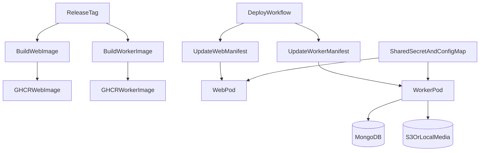

# Dedicated Node.js Backup Worker

## Goal

Ship the backup/restore processor as a separate Node.js worker image instead of running TypeScript with `tsx` inside the cluster. The worker deployment will continue to use the shared `envFrom` refs so it gets `MONGODB_URI`, `S3_*`, `BACKUP_*`, and other runtime settings from the same Kubernetes secret/configmap as the web app.

## Implementation

### 1. Build a real Node worker artifact

- Add a dedicated worker build path that produces a plain JavaScript entrypoint, not a `.ts` script at runtime.
- Preferred shape:
  - worker source stays in TypeScript
  - build emits something like `dist/worker/run-backup-worker.js`
  - container runs `node /app/dist/worker/run-backup-worker.js`
- Likely files to change:
  - [package.json](/Users/hai.tran/Working/repositories/varc-portal/package.json)
  - [scripts/run-backup-worker.ts](/Users/hai.tran/Working/repositories/varc-portal/scripts/run-backup-worker.ts)
  - add a worker-focused build config if needed, such as `tsconfig.worker.json`

### 2. Create a dedicated worker image target

- Add a worker-specific Docker build target or separate Dockerfile that copies only what the worker needs:
  - compiled worker JS
  - required runtime `node_modules`
  - any runtime assets/config files needed by shared libs
- Keep the existing web image path intact.
- Likely files to change:
  - [Dockerfile](/Users/hai.tran/Working/repositories/varc-portal/Dockerfile)
  - optionally add `Dockerfile.worker` if a separate file is cleaner

### 3. Update Kubernetes worker deployment

- Point the worker deployment to the dedicated worker image instead of the web image.
- Remove the `tsx` command override and replace it with plain Node.
- Keep the shared secret/config wiring unchanged:
  - `envFrom.secretRef: varc-portal-secrets`
  - `envFrom.configMapRef: varc-portal-config`
- Likely file to change:
  - [deploy/k8s/backup-worker.yaml](/Users/hai.tran/Working/repositories/varc-portal/deploy/k8s/backup-worker.yaml)

### 4. Publish both images in release automation

- Extend release CI so tag builds publish:
  - the existing web image
  - a new worker image, e.g. `ghcr.io/<repo>/varc-portal-backup-worker:vX.Y.Z` or a second tag scheme on the same package
- Keep versioning aligned so one release produces matching web and worker images.
- Likely file to change:
  - [.github/workflows/release.yml](/Users/hai.tran/Working/repositories/varc-portal/.github/workflows/release.yml)

### 5. Deploy both images together

- Extend deploy automation so the worker deployment image is bumped alongside the web deployment image.
- If the worker uses a separate image name, update deploy logic to patch each manifest with its own image reference rather than reusing one value for both files.
- Likely file to change:
  - [.github/workflows/deploy.yml](/Users/hai.tran/Working/repositories/varc-portal/.github/workflows/deploy.yml)

## Expected runtime flow

## Verification

- Local:
  - run lint
  - run typecheck if build config/types change
  - run the compiled Node worker locally against `.env`
- Release/deploy:
  - confirm GHCR has both matching image versions
  - confirm `backup-worker` pod starts with `node ...js`, not `tsx`
  - create a backup job and verify it moves from `queued` to `running` with progress updates

## Key constraint

Do not rely on Next.js `instrumentation.ts` or raw TypeScript execution in the cluster for the dedicated worker path. The worker should be a normal long-running Node.js process with its own published image.