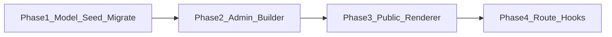

# Page template builder

## Current state
- CMS [Page](src/models/Page.ts) has `template: "default" | "gallery"` only; gallery uses `galleryItems[]`.
- Public [pages/[slug]](src/app/[locale]/(portal)/pages/[slug]/page.tsx) switches on that enum.
- Home ([locale]/page.tsx](src/app/[locale]/page.tsx)) and articles ([news/[slug]](src/app/[locale]/(portal)/news/[slug]/page.tsx)) are **hardcoded React**, not CMS pages.
- No block/layout builder exists (TipTap is content-only).

## Product decisions (locked for this plan)
1. **Templates apply to CMS Pages first** (`/pages/[slug]`). Home / Article / Category become **system templates** that can later be assigned to those routes via Site Settings (phase 2 hooks), but v1 ships the builder + assignment on Pages.
2. **Layout model**: 12-column responsive grid of **sections → rows → blocks**. Blocks have span (resize), order (drag-drop), and horizontal alignment. No free-form absolute positioning in v1 (keeps mobile sane).
3. **Default templates** are seeded system presets (editable copies, not deleteable keys): Home Page, Article Page, Category Page, Blank Page, Custom Page, Gallery Page.

## Data model

### New `PageTemplate` collection
[`src/models/PageTemplate.ts`](src/models/PageTemplate.ts)
- `key`: unique string (`home`, `article`, `category`, `blank`, `custom`, `gallery`)
- `name`, `description`, `isSystem: boolean`
- `layout`: nested JSON (see below)
- timestamps + soft-delete optional

### Layout JSON shape
```ts
type TemplateLayout = {
  sections: TemplateSection[];
};
type TemplateSection = {
  id: string;
  blocks: TemplateBlock[]; // ordered; each has colSpan 1–12
};
type TemplateBlock = {
  id: string;
  type: BlockType;
  colSpan: { mobile: number; tablet: number; desktop: number }; // 1–12
  align: "start" | "center" | "end" | "stretch";
  source: BlockSource; // typed per block
  settings: Record<string, unknown>; // e.g. limit, showExcerpt
};
```

### Block types (v1)
| Type | Content source |
|------|----------------|
| `richText` | Inline HTML (or page locale content) |
| `heading` | Text / optional link |
| `image` / `gallery` | Media library IDs |
| `articleList` | Latest / featured / by category IDs |
| `articleCard` | Single article ID |
| `categoryList` | Category IDs |
| `menu` | Menu location (`navigation` \| `footer`) or menu item subtree |
| `html` | Sanitized HTML snippet |
| `spacer` | Height only |

### Page model changes
[`src/models/Page.ts`](src/models/Page.ts)
- Replace enum `template` with `templateId` (ObjectId ref `PageTemplate`) **or** keep string `templateKey` for system presets.
- Prefer **`templateKey`** for system templates + optional **`layoutOverride`** on the page (clone-on-edit): page can use template as-is or fork layout.
- Migrate existing `default` → `blank`/`custom` with one richText block from `locales.*.content`; `gallery` → `gallery` template with gallery block from `galleryItems`.

## Admin UX

### New admin area: Templates
- Route: `/admin/templates` (+ `/admin/templates/[id]`)
- List seeded templates; **Duplicate** / **Edit layout** (system templates editable but key locked).
- Builder UI (client):
  - Left: block palette
  - Center: canvas with section rows, drag-reorder (reuse patterns from [menu-manager](src/components/admin/menu-manager.tsx) drag)
  - Block resize: col-span stepper or drag handle (12-col)
  - Right: inspector (alignment, source pickers for articles/categories/media/menus — reuse [MediaPickerModal](src/components/admin/media-picker-modal.tsx) patterns)

### Page editor
[`page-editor.tsx`](src/components/admin/page-editor.tsx)
- Replace Default/Gallery select with **Template** dropdown (all templates).
- Optional “Customize layout for this page” → stores `layoutOverride`.
- Keep title/SEO fields; body rich-text only when template uses a bound `pageContent` block.

## Public rendering

### Block renderer
[`src/components/portal/blocks/`](src/components/portal/blocks/) — one React component per `BlockType`, fed resolved data from server loaders in `src/lib/blocks/`.

### Page route
[`pages/[slug]/page.tsx`](src/app/[locale]/(portal)/pages/[slug]/page.tsx)
- Load page → resolve template layout (override ?? template.layout)
- Resolve block sources (articles, categories, menus, media) in parallel
- Render CSS grid: `grid-cols-12`, block `col-span-*` per breakpoint

### Gallery / Home compatibility
- Gallery template renderer wraps existing [GalleryPageView](src/components/portal/gallery-page-view.tsx).
- Home Page template can mirror current [HomeLatestSpotlight](src/components/portal/home-latest-spotlight.tsx) + featured slider blocks; **wiring `/` to a CMS home page** is a follow-up Site Setting (`homePageId` / `homeTemplateKey`).

## Security / validation
- Zod schemas for layout JSON (max sections/blocks, colSpan bounds, allowed block types).
- Sanitize all HTML block content via existing [sanitizeHtml](src/lib/html.ts).
- Source IDs must be valid ObjectIds; public render only published/non-deleted content.
- Safe errors via [failAction](src/lib/safe-error.ts); never log secrets.

## Implementation phases



1. **Model + seed + migrate** — `PageTemplate`, seed 6 defaults, migrate Page `template`/`galleryItems` → templateKey + blocks.
2. **Admin builder** — CRUD templates, drag-drop order, col-span resize, alignment, source pickers.
3. **Public renderer** — block components + page route resolution.
4. **Route hooks (later)** — Site Settings to assign Home/Article/Category templates to hardcoded routes; public category archive page if Category template is used.

## Key files to add/change
- Add: `src/models/PageTemplate.ts`, `src/lib/blocks/*`, `src/components/admin/template-builder/*`, `src/components/portal/blocks/*`, `src/app/admin/(dashboard)/templates/**`
- Change: `src/models/Page.ts`, `src/lib/validations/article.ts` (page schema), `src/lib/actions.ts`, `src/components/admin/page-editor.tsx`, `src/app/[locale]/(portal)/pages/[slug]/page.tsx`, admin sidebar nav
- Seed script: extend or add `scripts/seed-templates.ts`

## Out of scope for v1
- Absolute free-form canvas / pixel positioning
- A/B testing or versioned template history
- Fully replacing hardcoded `/` and `/news/[slug]` (documented as phase 4)
- Nested blocks deeper than section → block
