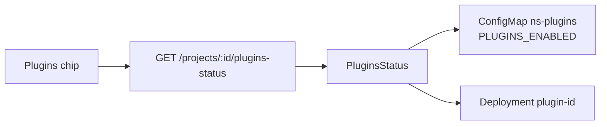

## Plugins sidecar status chip

Add a `Plugins` chip alongside Namespace / MongoDB / Redis / Deployments on the Properties tab. It reports how many sidecars are wired up and whether they are running. Read-only: no install/uninstall in this change.

### Data source

No plugin list is persisted on the project, so status is derived from what the portal already writes to the cluster:

- `<namespace>-plugins` ConfigMap → `PLUGINS_ENABLED` (comma-separated ids), written by `SyncPluginConfigMaps` in [backend/internal/service/project_plugins.go](backend/internal/service/project_plugins.go)
- For each id, `GetDeploymentReplicas(ns, "plugin-<id>")` → live sidecar availability

Both `GetConfigMapData` and `GetDeploymentReplicas` are already on `NamespaceManager` in [backend/internal/service/kubernetes_namespace.go](backend/internal/service/kubernetes_namespace.go), so no interface changes.



### Backend

In [backend/internal/service/project_plugins.go](backend/internal/service/project_plugins.go):

- `parsePluginsEnabled(data map[string]string) []string` — split `PLUGINS_ENABLED` on comma, trim, drop empties, normalize via existing `normalizePluginID`, sort
- Response types:

```go
type ProjectPluginStatus struct {
	ID        string `json:"id"`
	Available bool   `json:"available"`
	Status    string `json:"status"`
	Replicas  int32  `json:"replicas"`
	URL       string `json:"url"`
}

type ProjectPluginsStatus struct {
	Namespace  string                `json:"namespace"`
	Management string                `json:"management"`
	Plugins    []ProjectPluginStatus `json:"plugins"`
	Available  bool                  `json:"available"`
	CheckedAt  time.Time             `json:"checked_at"`
}
```

- `func (s *projectService) PluginsStatus(ctx, ownerID, projectID) (*ProjectPluginsStatus, error)` — resolve project via `s.Get`, namespace via `namespaceForProject`, read the ConfigMap, then one `GetDeploymentReplicas` per id. `URL` reuses existing `pluginServiceURL`. An empty plugin set returns `Available: true` with no entries, so a project with no plugins is healthy, not a warning. A missing ConfigMap yields an empty map (documented `GetConfigMapData` behaviour), which is the same empty-set case.

Add `PluginsStatus` to the `ProjectService` interface in [backend/internal/service/project_service.go](backend/internal/service/project_service.go) next to `AppRuntimeStatus`.

Handler in [backend/internal/handler/project_handler.go](backend/internal/handler/project_handler.go), copying the `AppRuntimeStatus` shape (auth, ObjectID parse, `ErrProjectNotFound` → 404, otherwise 503, `Cache-Control: no-store`).

Route in [backend/cmd/server/main.go](backend/cmd/server/main.go) beside the existing runtime status line:

```go
projects.GET("/:id/plugins-status", projectHandler.PluginsStatus)
```

### Frontend

[frontend/src/stores/projects.ts](frontend/src/stores/projects.ts): add `ProjectPluginStatus` / `ProjectPluginsStatus` interfaces and `fetchPluginsStatus(id)` mirroring `fetchHostnameStatus`, exported from the store.

[frontend/src/components/ProjectOverviewPanel.vue](frontend/src/components/ProjectOverviewPanel.vue):

- Add `pluginsStatus` / `loadingPlugins` / `pluginsError` refs and `loadPluginsStatus()`, called in `onMounted` and inside the existing 5s poll alongside the other loaders
- Add `retryable?: boolean` to the `ResourceCard` type and render the hover retry button with `v-if="card.retryable !== false"`. The plugins chip sets `retryable: false` because there is no safe reprovision action (rebuilding the catalog ConfigMap without pack manifests would drop data); it refreshes on the normal poll.
- Insert the chip into `resourceCards` right after `deployments`:

```ts
{
  key: 'plugins',
  title: 'Plugins',
  loading: loadingPlugins.value,
  error: pluginsError.value,
  available: Boolean(pluginsStatus.value?.available),
  statusHint: pluginHint(),
  retryable: false,
}
```

- `pluginHint()` wording: no plugins → `No plugins installed`; all up → `1 plugin running` / `N plugins running`; some down → `1 of 3 unavailable`

### Tests

Extend [backend/internal/service/project_plugins_test.go](backend/internal/service/project_plugins_test.go):

- `parsePluginsEnabled` — empty/missing key, whitespace, mixed case, ordering
- `PluginsStatus` — no ConfigMap → available with zero plugins; two enabled with one sidecar unavailable → `Available: false` and the right per-plugin entries

The existing `fakeNamespaceManager` in `project_service_test.go` already supports both `GetConfigMapData` (via `configMaps`) and `GetDeploymentReplicas` (via `deployReplicas`), so no test-double changes are needed.