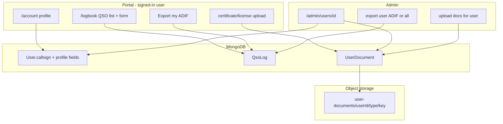

# QSO logbook, ADIF export, and user documents

## Current baseline

The portal already has **Google sign-in for `reader` users** and session in [`src/app/[locale]/layout.tsx`](src/app/[locale]/layout.tsx), but:

- No profile/account pages exist (only account menu in [`src/components/portal/site-account-menu.tsx`](src/components/portal/site-account-menu.tsx))
- [`src/models/User.ts`](src/models/User.ts) has no callsign or document fields
- **Credentials login blocks non-admins** in [`src/auth.ts`](src/auth.ts) (`canAccessAdmin` gate) — readers created with a password cannot sign in today
- Callsign **directory** models (`Callsign`, `CallsignLicense`, …) are unrelated to user logbooks; reuse only for optional lookup/autocomplete, not validation
- Upload/storage patterns exist in [`src/lib/media/storage.ts`](src/lib/media/storage.ts); download streaming pattern in [`src/app/api/admin/backup/artifacts/[id]/route.ts`](src/app/api/admin/backup/artifacts/[id]/route.ts)
- **No ADIF/CSV export** exists yet

## Product decisions (confirmed)

| Topic | Choice |
|-------|--------|
| Export format | **ADIF** (`.adi` file) |
| Profile callsign | **Required**, free text with format check (not directory match) |
| Logbook access | **Any signed-in portal user** |

## Architecture

## Phase 1 — Auth + profile callsign

### 1.1 Allow credential sign-in for all users

Update [`src/auth.ts`](src/auth.ts) `authorize()` to return a valid user for **any** correct email/password, not only `canAccessAdmin`. Keep admin protection in [`src/proxy.ts`](src/proxy.ts) (unchanged: `/admin/*` still requires admin capabilities).

Update [`src/app/admin/(auth)/login/page.tsx`](src/app/admin/(auth)/login/page.tsx) copy/redirect behavior:

- After sign-in, **admins** → `callbackUrl` or `/admin`
- **Non-admins** → portal home or intended portal path (e.g. `/account`)

Add a portal-friendly login entry (account menu “Sign in” can pass `callbackUrl=/account`).

### 1.2 Extend User model

Add to [`src/models/User.ts`](src/models/User.ts):

- `callsign: string` — required before first QSO (enforced in actions, not DB `required` for migration)
- Optional later-friendly fields: `grid`, `qth` (can defer to v2 if scope is tight)

Validation helper in new [`src/lib/validations/qso.ts`](src/lib/validations/qso.ts):

- Callsign regex/normalizer aligned with existing [`src/lib/callsigns-normalize.ts`](src/lib/callsigns-normalize.ts) patterns (uppercase, strip spaces, basic structure check)

### 1.3 Portal account page

New routes under portal:

- [`src/app/[locale]/(portal)/account/page.tsx`](src/app/[locale]/(portal)/account/page.tsx) — edit name (optional v1), **callsign** (required), links to logbook + documents
- Server actions in new [`src/lib/account-actions.ts`](src/lib/account-actions.ts): `updateProfileAction`, guarded by `auth()` session

Update [`src/components/portal/site-account-menu.tsx`](src/components/portal/site-account-menu.tsx) with **Account** and **Logbook** links for signed-in users.

## Phase 2 — QSO logging

### 2.1 QSO model

New [`src/models/QsoLog.ts`](src/models/QsoLog.ts):

| Field | Notes |
|-------|-------|
| `userId` | owner (indexed) |
| `workedCallsign` | required contact call |
| `qsoAt` | UTC `Date` (single field; split on ADIF export) |
| `band` | e.g. `20m` (ADIF `BAND`) |
| `freqMhz` | optional number (ADIF `FREQ`) |
| `mode` | e.g. `SSB`, `FT8` |
| `rstSent`, `rstRcvd` | strings |
| `grid` | optional |
| `notes` | optional (ADIF `COMMENT`) |
| `createdAt`, `updatedAt` | timestamps |

Indexes: `{ userId: 1, qsoAt: -1 }`, text/search on `workedCallsign` if list filtering is needed.

### 2.2 Portal logbook UI

New [`src/app/[locale]/(portal)/logbook/page.tsx`](src/app/[locale]/(portal)/logbook/page.tsx):

- Requires session; if profile callsign missing → redirect to `/account` with message
- Table of QSOs (sort by date desc), add/edit/delete
- Form component [`src/components/portal/qso-form.tsx`](src/components/portal/qso-form.tsx)

Server actions in [`src/lib/qso-actions.ts`](src/lib/qso-actions.ts):

- `createQsoAction`, `updateQsoAction`, `deleteQsoAction`
- Ownership check: `qso.userId === session.user.id` (admins can bypass only where explicitly allowed)

Optional UX: callsign autocomplete against public directory via existing [`src/lib/callsigns.ts`](src/lib/callsigns.ts) search — **suggest only**, not required match.

## Phase 3 — ADIF export

### 3.1 ADIF serializer

New [`src/lib/adif/export.ts`](src/lib/adif/export.ts):

- Build ADIF header + records from `QsoLog[]`
- Map fields: `CALL`, `QSO_DATE`, `TIME_ON`, `BAND`/`FREQ`, `MODE`, `RST_SENT`, `RST_RCVD`, `STATION_CALLSIGN` (from user profile), `GRIDSQUARE`, `COMMENT`
- Filename pattern: `{callsign}_{YYYYMMDD}.adi`

Add unit tests for field formatting and escaping (ADIF length-prefixed tags).

### 3.2 User export

New route [`src/app/api/account/qso/export/route.ts`](src/app/api/account/qso/export/route.ts):

- Auth required
- Query own QSOs; stream response with `Content-Type: text/plain; charset=utf-8` and `Content-Disposition: attachment`
- Reuse streaming pattern from backup artifact route

Portal logbook page: **Export ADIF** button.

### 3.3 Admin export

Extend [`src/app/admin/(dashboard)/users/page.tsx`](src/app/admin/(dashboard)/users/page.tsx) or add [`src/app/admin/(dashboard)/users/[id]/page.tsx`](src/app/admin/(dashboard)/users/[id]/page.tsx):

- View user callsign, QSO count, documents
- **Export ADIF** for that user (`canManageUsers`)
- Optional admin-wide export route [`src/app/api/admin/qso/export/route.ts`](src/app/api/admin/qso/export/route.ts) with `userId` filter

## Phase 4 — Certificate & license uploads

### 4.1 UserDocument model

New [`src/models/UserDocument.ts`](src/models/UserDocument.ts):

| Field | Notes |
|-------|-------|
| `userId` | document owner |
| `kind` | `certificate` \| `license` |
| `key`, `url` | storage object |
| `originalName`, `contentType`, `size` | metadata |
| `uploadedByUserId` | self or admin |
| `createdAt` | timestamp |

Storage prefix: `user-documents/{userId}/{kind}/{uuid}-{filename}` via [`buildObjectKey`](src/lib/media/storage.ts) variant.

Allowed MIME: PDF + common images (`application/pdf`, `image/jpeg`, `image/png`, `image/webp`); max size ~10–20MB (align with form upload limits in [`src/lib/validations/forms.ts`](src/lib/validations/forms.ts)).

Update [`src/lib/html.ts`](src/lib/html.ts) sanitizer only if these URLs appear in HTML (they won't — direct download links).

### 4.2 Upload/download APIs

- [`src/app/api/account/documents/route.ts`](src/app/api/account/documents/route.ts) — `POST` upload, `GET` list (auth, own user only)
- [`src/app/api/account/documents/[id]/route.ts`](src/app/api/account/documents/[id]/route.ts) — `DELETE` own doc
- [`src/app/api/admin/users/[id]/documents/route.ts`](src/app/api/admin/users/[id]/documents/route.ts) — admin upload/list (`canManageUsers`)

Downloads: either public `/media/{key}` (if acceptable) or authenticated GET that streams from storage (preferred for private docs).

### 4.3 UI

- Account page section: upload/list certificate + license
- Admin user detail: same controls acting on selected user

## Security & permissions summary

| Action | Guard |
|--------|-------|
| Edit own profile / QSO / docs | `auth()` + `session.user.id` |
| Export own ADIF | `auth()` |
| Admin view user / upload docs / export ADIF | `canManageUsers` via [`src/lib/admin-access.ts`](src/lib/admin-access.ts) |
| Admin panel | existing middleware (unchanged) |

No new RBAC capability flag needed (per your choice: any signed-in user).

## i18n & navigation

- Add strings to [`messages/en.json`](messages/en.json) and [`messages/vi.json`](messages/vi.json) for account, logbook, ADIF export, document types
- Optional footer/nav link to logbook for signed-in users only

## Migration & rollout

1. Deploy schema changes (additive fields on `User`, new collections)
2. Existing users: callsign empty until they visit `/account`
3. Block QSO create until callsign set (clear UX, not DB constraint)
4. No changes to callsign directory import/admin flows

## Suggested implementation order

Build in vertical slices so each phase is testable:

1. Auth fix + account/callsign
2. QSO CRUD (portal only)
3. ADIF user export
4. User documents (self-upload)
5. Admin user detail + admin export + admin document upload

## Out of scope (v1)

- ADIF **import**
- Linking users to `CallsignOperator` directory records
- QSO approval workflow / club log aggregation
- New role capability flags
- FT8-specific auto fields beyond free-text mode/RST

## Verification

- Sign in as Google reader → set callsign → log QSO → export `.adi` → open in common log software
- Sign in as admin → export another user's ADIF
- Upload certificate/license as user; admin uploads for another user; delete works and storage object removed
- Credential reader (non-admin) can sign in and use logbook; still blocked from `/admin`
- `pnpm lint` + `npx tsc --noEmit`
