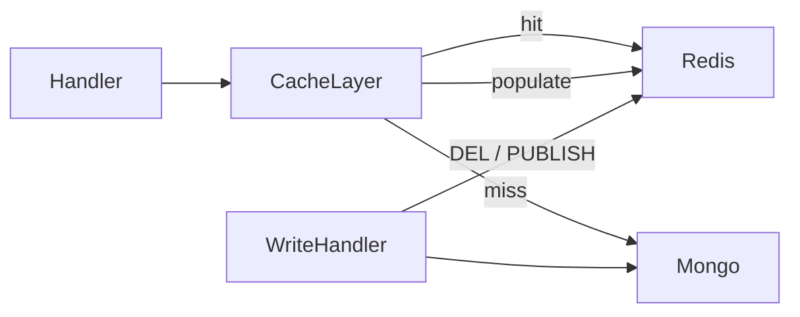
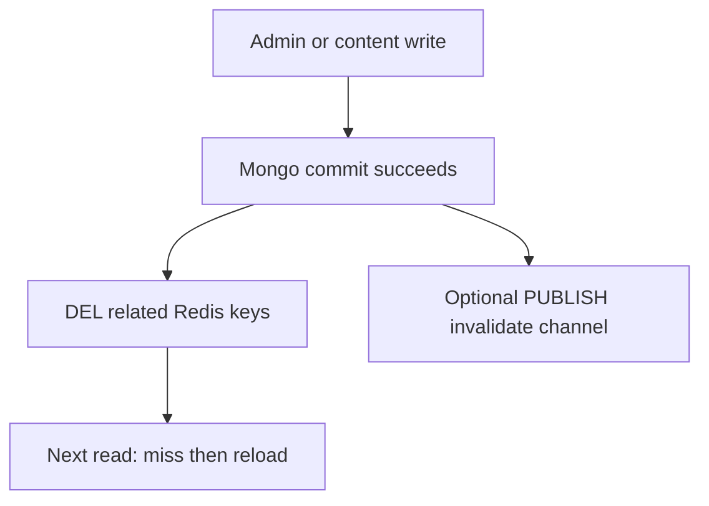

# Redis caching design draft

Today there is **no Redis**. Existing “cache” is process-local (mail/media config), Cloudflare CDN for media bytes, and HTTP `Cache-Control`. JWT auth remains **stateless** (email in token); every authenticated request still hits Mongo via [`IsSignInBlocked`](backend/internal/users/) and content/admin routes add role/permission lookups.

## Goals

- Cut Mongo load on hot paths (settings + per-request authz).
- Stay correct under writes: **invalidate first**, then rely on TTL as backstop.
- Work with multiple API replicas (process-local caches cannot).
- Graceful degrade: if Redis is down, read/write Mongo as today (log errors; do not fail requests).

## Architecture

- New package: `backend/internal/cache` (Redis client + key helpers + `GetOrLoad` / `Delete` / `DeletePrefix`).
- Config: `REDIS_URL` (empty = cache disabled). Optional `REDIS_KEY_PREFIX=hamcheck:`.
- Serialization: JSON for struct payloads; small bool/string keys for authz.
- **Never** put Cloudflare API tokens or decrypted PII in Redis; use redacted/public projections where needed ([`RedactMailSecrets`](backend/internal/users/settings.go)).

## What to cache (priority order)

### P0 — Application settings + public auth config

| Item | Key (example) | Value | TTL |
|------|---------------|-------|-----|
| Full settings (internal, redacted token) | `settings:app` | JSON of `ApplicationSettings` without secret plaintext | 5–15 min |
| Public branding subset | `settings:public` | site name/description/footer/logo/theme/login_page/register_page + forgot-password flags | 5–15 min |

**Why:** [`GetApplicationSettings`](backend/internal/users/settings.go) is a single Mongo doc decoded on almost every feature path (`/api/auth/config`, enrollment settings, quiz flags, mail site name, soft-delete, admin GET).

### P0 — Per-request authz

| Item | Key | Value | TTL |
|------|-----|-------|-----|
| Sign-in blocked | `authz:blocked:{email}` | `"0"` / `"1"` | 2–5 min |
| Role permissions | `authz:role:{roleName}` | JSON string list of permission IDs | 5–15 min |
| User role name (optional) | `authz:user:{email}:role` | role string | 2–5 min |

**Why:** Auth middleware calls Mongo on **every** request; content/admin routes also load role → permissions ([`UserHasPermission`](backend/internal/users/), [`RequirePermission`](backend/internal/middleware/)).

### P1 — Published exam catalog

| Item | Key | Value | TTL |
|------|-----|-------|-----|
| Latest public exams (fixed page) | `exams:public:latest:{limit}` | JSON list | 1–5 min |
| Self-enroll published page | `exams:self:{page}:{pageSize}` | JSON page | 1–5 min |
| Exam summary by id | `exams:id:{examId}` | JSON exam (published fields only) | 1–5 min |

**Why:** Learner dashboards / public lists are read-heavy; avoid caching every free-text search combination—only stable list keys + by-id.

### P2 — Small reference data

| Item | Key | Notes |
|------|-----|-------|
| Categories list | `quiz:categories` | Invalidate on category CRUD |
| Permission catalog | `rbac:permissions` | Rarely changes; seed/admin |

### Explicitly out of scope (do not cache in Redis)

- Live `quiz_sessions` answers / timers / conflict versioning
- MFA / reset / activation tokens
- Full user profiles / certificates with PII
- Mail outbox, activity logs, notification unread (high churn)
- Media **bytes** (already CDN); optional later: media meta by id only
- Using Redis as the JWT session store (keep JWT; optional future: revoke deny-list only)

## Invalidation strategy

**Rule:** On every successful write, delete related keys **before or immediately after** Mongo commit. Combine with TTL so a missed invalidate self-heals.

### Settings writes → clear `settings:*`

| Trigger | Code area |
|---------|-----------|
| Update application / mail / CDN settings | [`admin/handler.go`](backend/internal/admin/handler.go) `UpdateSettings`, `UpdateMailSettings` |
| Initialize app | [`users/setup.go`](backend/internal/users/setup.go) |
| Export template meta / level-suggestion reset | settings helpers in [`users/settings.go`](backend/internal/users/settings.go) |

Also keep existing process-local refresh (`mail.Configure`, `media.SetPublicURLConfig`).

### Authz writes → clear user/role keys

| Trigger | Keys to delete |
|---------|----------------|
| Role create/update/delete | `authz:role:{name}` (+ old name on rename) |
| User create/update/delete (role, blocked) | `authz:blocked:{email}`, `authz:user:{email}:role` |
| RBAC seed/sync | flush `authz:role:*` (or known role names) |

### Exam / content writes → clear catalog keys

| Trigger | Keys |
|---------|------|
| Exam create/update/delete/clone (esp. published / enrollment_type) | `exams:id:{id}`, `exams:public:*`, `exams:self:*` |
| Question create/update/delete / import / wipe | by-id question keys if added; exam keys if exam embeds counts |
| Category CRUD | `quiz:categories` |
| Soft-delete / purge | same as exam/question deletes |

### Enrollment / session writes (if P1 enrollments list cached later)

Invalidate `enrollments:{email}` on enroll, start, submit, admin reset/delete—not the live session document itself.

## Versioning / stampede control

- Include a logical version in key namespace (`hamcheck:v1:...`) so a bad payload can be abandoned by bumping prefix in config.
- Optional: after invalidate, do **not** pre-warm under admin write (lazy fill on next read).
- For settings: single key, thundering herd is cheap (one Mongo read); for catalogs, use short TTL + invalidate.

## Implementation phases (when building)

1. **Infra:** Redis in compose, `REDIS_URL`, `cache` package, health check / soft fail.
2. **Wrap** `GetApplicationSettings` + public config projection + invalidate from admin settings updates.
3. **Wrap** `IsSignInBlocked` + role permission resolution + invalidate from admin user/role handlers.
4. **Wrap** published exam list/by-id + invalidate from quiz exam/content handlers.
5. Metrics/logging: hit/miss counters (debug) and fail-open behavior.

## Success criteria

- Authenticated traffic no longer does a Mongo user lookup on every request when Redis is warm (blocked/role cache hit).
- Settings reads mostly Redis after first hit; admin save clears cache and next request sees new branding within one round trip.
- Disabling Redis (`REDIS_URL` empty) restores current behavior with no functional change.
