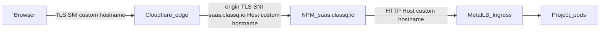

# Cloudflare for SaaS: shared fallback origin (no per-custom NPM hosts)

## Current config (already matches)

| Piece | Status |
|--------|--------|
| Fallback origin | `saas.classq.io` — **active** |
| DNS | `saas.classq.io` A → `103.238.68.88`, **proxied** |
| NPM | Host id 58 for `saas.classq.io` → `http://192.168.3.240:80`, cert present, **http2=false** |
| Zone SSL | `full` |
| Custom hostname `two.bluecylabs.com` | CF **active**, no `custom_origin_server` today |
| Extra | Dedicated NPM host for `two.bluecylabs.com` (id 60) — only needed under the *current* portal behavior |

`https://saas.classq.io` returning **404** is expected: there is no K8s Ingress for Host `saas.classq.io`. Fallback only needs NPM to terminate TLS and forward; customer Host headers are the custom hostnames.

## Why per-custom NPM hosts seemed required

With **no** `custom_origin_server`, Cloudflare connects to the fallback IP using **SNI = Host = custom hostname** (e.g. `two.bluecylabs.com`). NPM then needs a cert/server_name for that hostname → dedicated proxy host, or you get **525**.

That is *not* required if every custom hostname sets **`custom_origin_server: saas.classq.io`**:
- Origin SNI = `saas.classq.io` → matches the single NPM host cert
- Host header = custom hostname → Ingress still routes per project
- `http2=false` on the saas NPM host avoids the **421** Host≠SNI issue (already true on host 58)

You do **not** have Enterprise `custom_origin_sni` rewrite; the shared-origin model above is the workable non-Enterprise approach.

## Code changes

1. **Create CF custom hostname with shared origin** in [`backend/internal/service/cloudflare_custom_hostname.go`](backend/internal/service/cloudflare_custom_hostname.go):
   - Send `"custom_origin_server": "saas.classq.io"` (configurable via env, e.g. `CLOUDFLARE_SAAS_FALLBACK_ORIGIN`, default `saas.classq.io`)
   - Remove / stop using `ClearCustomOriginServer` on the happy path (or only clear *wrong* origins, never the configured fallback)

2. **Stop provisioning NPM per custom hostname** in [`backend/internal/service/project_service.go`](backend/internal/service/project_service.go):
   - `ensureCustomHostnameProxyWhenCloudflareActive` should **not** call `AddCustomDomain`
   - Background job should not treat missing custom NPM hosts as work
   - Keep deleting custom NPM hosts on custom-hostname delete as best-effort cleanup for legacy hosts
   - Keep project primary NPM host for `{alias}.classq.io` (unchanged)

3. **Wire config** in [`backend/cmd/server/main.go`](backend/cmd/server/main.go) + [`.env.example`](.env.example): document `CLOUDFLARE_SAAS_FALLBACK_ORIGIN=saas.classq.io`

4. **Tests**: update create/provision expectations (no `AddCustomDomain` after CF active); assert create body includes `custom_origin_server`

5. **Ops (one-time)**: PATCH existing `two.bluecylabs.com` to `custom_origin_server=saas.classq.io`; optionally delete NPM host id 60 after verifying 200; ensure saas NPM stays `http2=false` with a valid cert

## What stays the same

- Customer go-live **CNAME** target in UI remains `{alias}.classq.io` (portal DNS / orange-cloud entry point)
- Per-custom **Kubernetes Ingress** for Host = custom hostname (still required for routing)
- Cloudflare TXT ownership / SSL validation flow
