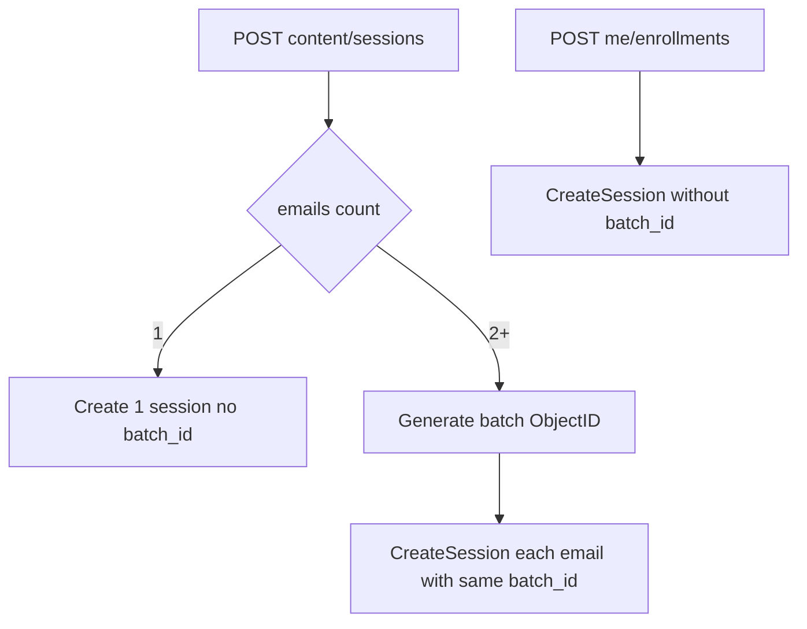

# Sessions table: group vs individual rows

## Decisions (confirmed)

- **Group** = admin enrolls **2+ users in one grant** (new `enrollment_batch_id`).
- **Individual** = self-enroll or admin enroll of a single user (no batch, or batch of size 1 → treat as individual).
- Group row shows **aggregates** (e.g. completed/enrolled, passed count); **expand/click** to list each member session.

## Data model

In [`backend/internal/quiz/models.go`](backend/internal/quiz/models.go):

- Add optional `EnrollmentBatchID string` (`bson:"enrollment_batch_id,omitempty"` / `json:"enrollment_batch_id,omitempty"`) on `SessionRecord` and API `Session`.
- Optional `EnrollmentSource` (`self` | `admin`) for clearer typing later; **minimum needed is batch id** — source can be inferred (batch present → admin group; `scheduled_start_at` often self) but prefer writing `enrollment_source` on create for reliability.

Index: non-unique index on `enrollment_batch_id` where `is_deleted: false` (equality partial filter).

## Create path

[`CreateSession`](backend/internal/quiz/sessions.go) / [`Handler.CreateSession`](backend/internal/quiz/handler.go):



- When `len(emails) >= 2`, generate one `primitive.NewObjectID().Hex()` (or ObjectID) and pass into each `CreateSession`.
- When `len(emails) == 1` or self-enroll: leave `enrollment_batch_id` empty → **individual** row.

## List API reshape

Change [`ListSessionsPaged`](backend/internal/quiz/sessions.go) (or add `ListSessionEntriesPaged`) so the Content Management list returns **entries**, not raw flat sessions:

| Entry kind | Identity | Fields |
|---|---|---|
| `individual` | one session | exam, type=`individual`, user (email + display_name), status/score/result/passed, session id |
| `group` | one `enrollment_batch_id` | exam, type=`group`, `enrolled_count`, aggregates (`completed_count`, `passed_count`, …), `created_at` = batch max/min |

Aggregation approach:

1. Match `is_deleted: false` (+ search filter adapted to exam title / user email / display).
2. `$addFields` grouping key: use `enrollment_batch_id` when set, else `$_id` (each solo session is its own group).
3. `$group` by that key; for solo keys, preserve session fields; for batch keys, compute counts and keep `exam_id`, sample title, `enrolled_count`.
4. Sort by latest activity (`max(created_at)`), paginate groups (not raw sessions).
5. Enrich users for individual rows via existing `LookupPublicProfilesByEmails`.

Response shape (example):

```json
{
  "entries": [
    {
      "kind": "individual",
      "type": "individual",
      "exam_id": "...",
      "exam_title": "...",
      "session": { /* Session */ }
    },
    {
      "kind": "group",
      "type": "group",
      "enrollment_batch_id": "...",
      "exam_id": "...",
      "exam_title": "...",
      "enrolled_count": 12,
      "completed_count": 8,
      "passed_count": 5,
      "created_at": "..."
    }
  ],
  "total": 40,
  "page": 1,
  "page_size": 10
}
```

Add `GET /api/content/sessions/batches/{batchID}` (or query `?batch_id=`) returning member `Session[]` for expand UI. Pass calculation: reuse same `passing_score`/`passing_type` logic as today (`examPassed` / server equivalent when aggregating).

Keep learner APIs (`/me/enrollments`) unchanged — still one session per row.

## Frontend table ([`ContentManagementView.vue`](frontend/src/views/ContentManagementView.vue))

Column order:

1. **Exam name**
2. **Type** — `group` | `individual` (i18n badges)
3. **User enrolled** — individual: display name + email under (same pattern as admin session list); group: `N enrolled`
4. **Result** — individual: passed/failed/`—`; group: e.g. `{completed}/{enrolled} completed`
5. **Passed** — individual: badge or `—`; group: `{passed} passed` (or passed/completed)
6. **Score** (individual only; group `—` or avg if cheap — default `—`)
7. **Actions** — individual: keep status/cert/re-enroll/delete; group: expand + optional “view members”; no per-user status select on the group row

Expand: chevron or row click on group loads batch members (nested rows or side panel). Nested member rows reuse current session actions/result click → Word result modal.

Update [`frontend/src/api/quiz.js`](frontend/src/api/quiz.js) for list entries + batch members.

## i18n

Add EN/VI under `content.sessions.*`: `type`, `typeGroup`, `typeIndividual`, `enrolledCount`, `completedSummary`, `passedSummary`, columns rename to match new order.

## Backfill

Existing multi-user grants have **no** batch id → they stay **individual** rows (acceptable; only new 2+ enrolls become groups). No heuristic backfill unless you ask for it later.

## Tests

- Create 3 users one POST → same `enrollment_batch_id`; create 1 user → empty.
- List aggregation: 1 group entry + N individual; pagination counts groups.
- Batch members endpoint returns only that batch’s sessions.
- FE smoke: column order + expand load (manual).
