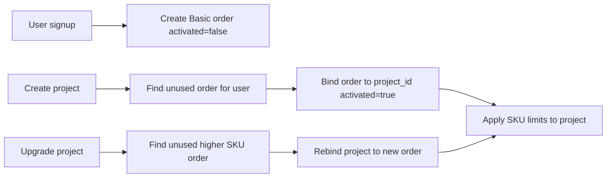

# SKU & Order System — Recommended Plan

## Suggestion (SaaS-standard for this product)

ClassQ Portal is closer to **Heroku/Railway** (many discrete projects) than to **Notion** (one workspace plan). Best fit:

| Decision | Recommendation | Why |
|---|---|---|
| Order ↔ project | **One activated order = one project** | Clear commercial accounting; matches `username \| sku \| activated`; upgrades are per-project |
| Order creation (v1) | **Auto-grant Basic on signup** + admin API to grant Starter+ | Zero-friction first project; payments can plug in later |
| “Networking enabled” | **Custom hostnames allowed** (Hostname tab) | Networking tab is still a placeholder |
| Blob / Mongo “50MB / 500MB” | **Store on SKU; enforce document limits now**; MinIO/Mongo quotas later | Portal does not set MinIO/Mongo quotas today |
| Upgrade | **Consume unused higher-SKU order → reassign project → apply limits** | Old order marked superseded/released, not double-billed |



---

## Data model

### `skus` collection (catalog, seedable)

```go
type SKU struct {
  ID                    ObjectID
  Code                  string   // "basic" | "starter"
  Name                  string
  PriceCents            int      // 0, 10000 for $100 — or PriceUnits int = 100
  BackendReplicas       int
  FrontendReplicas      int
  BlobStorageMB         int      // policy / future MinIO quota
  MongoStorageMB        int      // policy / future Mongo quota
  DocumentsUserStorageMB int     // enforced via ConfigMap today
  DocumentsMaxUploadMB  int
  MaxCustomHostnames    int      // 0 or 1 for Basic, 5 for Starter
  BackupRestoreEnabled  bool
  NetworkingEnabled     bool     // gates AddCustomHostname
  SortOrder             int
  Active                bool
}
```

Seed **Basic** and **Starter** exactly as you specified (map Starter price `100` → `10000` cents or keep integer `100` as display dollars — pick **integer dollars** `Price: 100` for simplicity unless you already use money libs).

### `orders` collection (entitlements)

```go
type Order struct {
  ID          ObjectID
  OwnerID     ObjectID  // user id (prefer over username — usernames/emails can change)
  OwnerEmail  string   // denormalized for admin lists
  SKUCode     string   // "basic" | "starter"
  Status      string   // available | activated | superseded | cancelled
  ProjectID   *ObjectID // set when activated
  ActivatedAt *time.Time
  CreatedAt   time.Time
  UpdatedAt   time.Time
  Source      string   // signup | admin | payment (future)
}
```

**Improvement vs your sketch:** use `owner_id` + `status` + optional `project_id` instead of only `username | sku | activated`. Keep `activated` as derived (`status == activated`) in API responses if you want that shape.

Indexes: `{owner_id, status}`, `{project_id}` unique sparse, `{sku_code}`.

---

## Enforcement map (what to wire now)

| SKU field | Enforce how | Exists today? |
|---|---|---|
| Replicas | Cap `ScaleRuntime` + set initial replicas on create from SKU | Yes — [project_service.go](backend/internal/service/project_service.go) `0–10` |
| Documents storage/upload | Write ConfigMap-RO + `Settings.AppConfig` | Yes — `DOCUMENTS_*` |
| Backup & restore | `ADVANCE_BACKUP_RESTORE_ENABLED` | Yes — default false |
| Custom hostnames | Reject `AddCustomHostname` when count ≥ `MaxCustomHostnames` or `!NetworkingEnabled` | **Limit missing today** — add |
| Blob / Mongo MB | Persist on project as `plan_limits`; **do not fake MinIO/Mongo quotas in v1** | Quotas not implemented |
| Price | Display only until payments | N/A |

Store applied plan on the project for fast reads:

```go
Project.Settings.Plan = {
  SKUCode, OrderID, BackendReplicas, FrontendReplicas,
  MaxCustomHostnames, NetworkingEnabled, BackupRestoreEnabled,
  DocumentsUserStorageMB, DocumentsMaxUploadMB,
  BlobStorageMB, MongoStorageMB, // informational
}
```

---

## API & flows

### Signup
After user create in [auth_service.go](backend/internal/service/auth_service.go): insert one **Basic** order (`status=available`) if none exists.

### Create project
In [project_service.go](backend/internal/service/project_service.go) `Create`:
1. Find oldest `available` order for owner (any SKU, or prefer highest? → **prefer highest available**, else Basic).
2. If none → `402/403` “No plan entitlement”.
3. Create project → atomically mark order `activated` + `project_id`.
4. Apply SKU limits (replicas, app config, flags).

### Upgrade project
`POST /api/projects/:id/plan/upgrade { sku_code: "starter" }`:
1. Require target SKU rank > current.
2. Require unused `available` order with that SKU for owner.
3. Mark old order `superseded`, activate new order on project.
4. Re-apply limits (enable backup, raise hostname cap, bump document MB, optionally scale replicas up to new default if currently below).

### Admin (v1)
- `GET/POST /api/admin/orders` (role=`admin`) grant Starter orders.
- `GET /api/skus` public/authenticated catalog.
- `GET /api/me/orders` list user’s entitlements.

### Frontend
- Dashboard/create: show available entitlements; block create if none.
- Project header / Plan section: current SKU + **Upgrade** if unused higher order exists.
- Hostname add: surface limit errors.
- Seed admin grant UI later; v1 can be API-only.

---

## What to improve beyond the minimal ask

1. **Identity:** orders keyed by `owner_id`, not username.
2. **SKU rank:** explicit `Rank` (Basic=1, Starter=2) for upgrade rules and future Pro.
3. **Idempotent activation:** Mongo transaction or find-and-update so two creates cannot consume one order.
4. **Downgrade:** defer (destructive); only upgrade in v1.
5. **Existing projects:** migration script — attach a free Basic order per project missing `Settings.Plan`.
6. **Payments:** leave `Source=payment` stub; Stripe webhook can `POST` orders later without schema change.
7. **True storage quotas:** follow-up epic (MinIO quota API / Mongo Atlas limits) — document as “policy fields” in UI (“Soft limit”) until enforced.
8. **Networking tab:** either hide until real, or redirect to Hostname when `NetworkingEnabled`.

---

## Implementation phases

**Phase 1 — Core**  
Models + repos + seed SKUs + signup Basic order + create consumes order + project `Settings.Plan` + enforce hostname cap + backup/documents/replicas from SKU.

**Phase 2 — Upgrade UX**  
Upgrade API + project Plan panel + orders list on account/dashboard.

**Phase 3 — Admin**  
Admin grant order API (+ simple UI).

**Phase 4 — Hard quotas / payments** (out of immediate scope)  
MinIO/Mongo enforcement, Stripe.

---

## Key files to touch

- New: `backend/internal/model/sku.go`, `order.go`
- New: `backend/internal/repository/sku_repository.go`, `order_repository.go`
- [backend/internal/service/project_service.go](backend/internal/service/project_service.go) — Create, AddCustomHostname, ScaleRuntime caps, new Upgrade
- [backend/internal/service/auth_service.go](backend/internal/service/auth_service.go) — signup grant
- [backend/cmd/server/main.go](backend/cmd/server/main.go) — routes + seed
- Frontend: create-project flow, project plan badge/upgrade, hostname error copy
