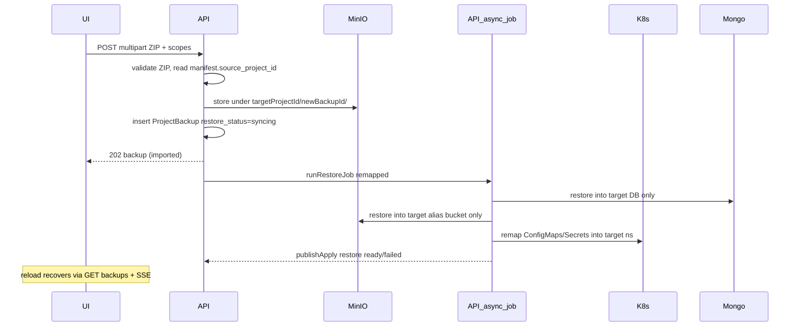

# Upload snapshot and restore into current project

## What 2.A (restore source JWT/PII) affects

When the ZIP includes `app-settings` from project A and is restored into project B:

| Restored from ZIP into B | Effect |
|---|---|
| `JWT_SECRET` on `{B}-app` + portal credentials | B’s login/session signing matches A’s data; existing B sessions may invalidate |
| `PII_ENCRYPTION_KEY` on `{B}-app` + portal PII settings | Encrypted PII fields imported with Mongo stay readable; data previously encrypted with B’s old key may become unreadable |
| Setup-admin password (if present in snapshot) | B’s tenant admin password becomes the one from A |

| Never taken from ZIP (always keep B) | Why |
|---|---|
| Mongo DB user/password/connection | B must keep talking to B’s DB |
| Redis username/password/prefix | Avoid hijacking A’s redis ACL / keyspace |
| MinIO/S3 access keys + bucket | Avoid writing into A’s bucket; storage restore already targets `storageBucketForAlias(B)` |
| Namespace / project ID / alias | Restore only writes into B’s namespace |
| Default hostname (`{alias}.classq.io`) | Derived from B’s alias + Cloudflare DNS already owned by B |
| Custom hostnames (CF SaaS + NPM + ingress) | Live on B’s project document / external DNS — not a backup scope; importing A’s domains would steal/conflict routing |

**Practical rule:** restoring `mongodb` + `app-settings` together with 2.A is the coherent path (data + keys match). Restoring only `app-settings` JWT/PII without mongo can brick B’s existing encrypted rows.

## Hostname policy (default + custom)

Hostnames are **not** a backup scope. A ZIP does not contain structured Cloudflare/NPM hostname records; at most `app-settings` ConfigMaps hold URL strings (e.g. `MEDIA_PUBLIC_BASE_URL`).

**Chosen rule: keep this project’s hostnames.**

| Kind | On restore into B | Why |
|---|---|---|
| **Default hostname** | Keep B’s `{alias}.classq.io` (and its Cloudflare/NPM wiring). Do not change alias or recreate DNS from the ZIP. | Default hostname is identity of B; A’s default belongs to A’s alias |
| **Custom hostnames** | Keep B’s existing `CustomHostnames` list, CF custom hostname IDs, validation TXT, and NPM proxy hosts. Do **not** import/recreate A’s custom domains from the ZIP. | A custom domain can only be attached to one CF SaaS hostname; cloning would conflict or break A |
| **App URL config** | Rewrite `MEDIA_PUBLIC_BASE_URL` (and any similar public base URL keys found in `{dst}-configmap-ro`) to `defaultMediaPublicBaseURL(B.Alias)` / `https://{B-default-hostname}` | Prevents the restored app from advertising A’s hostname while traffic hits B |

After settings restore, do **not** call custom-hostname provisioners from snapshot data. Optional follow-up (out of scope): user can add custom hostnames again via the existing Hostnames UI.

UI copy should state: “Default and custom hostnames stay this project’s; only app data/URLs are remapped.”

## Chosen product shape

- **One-shot:** `Upload ZIP` → import under this project → start restore immediately (no separate confirm restore step beyond scope checkboxes on the upload modal).
- **Durable session:** progress lives on the durable `ProjectBackup` document (`restore_status: syncing|ready|failed`) + existing `project-apply` SSE; UI recovers on reload by listing backups and resuming poll/banner whenever any backup has `restore_status === 'syncing'` (already partially wired in [`ProjectBackupRestorePanel.vue`](frontend/src/components/ProjectBackupRestorePanel.vue)).

## Isolation rules (even if ZIP is from another project)

1. **Import destination:** always `{targetProjectID}/{newBackupID}/` in the portal backup bucket — never write under the source project’s prefix.
2. **Decrypt:** `app-settings.json.enc` with AAD from `manifest.project_id` (source). Optionally re-encrypt under target AAD after import so later same-project restores stay simple.
3. **Mongo:** drop/replace collections only in **target** DB name (current behavior already ignores archive `database`).
4. **Storage:** copy objects only into `storageBucketForAlias(target.Alias)` with clear-first.
5. **App-settings names:** remap `{srcNs}-*` → `{dstNs}-*` for known suffixes only; skip unknown keys.
6. **Infra secrets:** after applying remapped snapshot, **re-ensure** target mongo/redis/storage secrets from portal credentials (overwrite anything foreign).
7. **App secrets (2.A):** apply source JWT/PII + setup-admin into target `{dst}-app` / setup-admin and mirror into portal via existing [`mirrorRestoredAppSettingsToPortal`](backend/internal/service/project_backup.go).
8. **Hostnames:** keep target default + custom hostnames unchanged; never mutate `project.CustomHostnames` or call Cloudflare/NPM hostname APIs from the ZIP.
9. **Identity-bound ConfigMap values:** rewrite `MEDIA_PUBLIC_BASE_URL` (and similar public base URL keys) to the target project’s default hostname / `defaultMediaPublicBaseURL(target.Alias)`.

## Backend

**Model** ([`project_backup.go`](backend/internal/model/project_backup.go)):
- `source_project_id` (from ZIP manifest; may equal current project)
- `imported` bool / `imported_at`
- reuse `restore_status` / `restore_message` / `restore_scopes` for the one-shot job

**New service** in [`project_backup.go`](backend/internal/service/project_backup.go) (or sibling file):
- `RestoreBackupFromUpload(ctx, ownerID, projectID, zip, scopes) (*ProjectBackup, error)`
  - entitlement: `planSupportsBackupRestore`
  - zip-slip + size caps (e.g. max upload 1GiB, max uncompressed ratio, max entries)
  - require `manifest.json` with `project_id` + `scopes`
  - create backup row owned by **target** project
  - stream entries into MinIO under target prefix
  - set `restore_status=syncing`, publish apply event, run existing restore pipeline asynchronously with remapping hooks
  - return 202 immediately so UI can track durable state

**Remap helpers:**
- `remapAppSettingsSnapshot(srcNs, dstNs, snap) (appSettingsSnapshot, error)`
- decrypt with source AAD; preserve/re-ensure infra secrets after apply
- wire into `restoreAppSettings` via optional `sourceProjectID`

**API:**
- `POST /api/projects/:id/backups/restore-upload` multipart: `file`, `scopes` (comma or repeated form fields)
- handler in [`project_handler.go`](backend/internal/handler/project_handler.go); register in [`main.go`](backend/cmd/server/main.go)
- gin max multipart memory / reverse-proxy body size noted in `.env.example` if needed

## Frontend

[`ProjectBackupRestorePanel.vue`](frontend/src/components/ProjectBackupRestorePanel.vue) + [`projects.ts`](frontend/src/stores/projects.ts):
- Snapshot tab: **Upload & restore** opens modal (file picker + scope checkboxes constrained after reading client-side is optional; server validates against manifest scopes)
- On submit: call restore-upload → prepend returned backup → `startPolling()` immediately
- On mount / project change: `loadBackups()`; if any `restore_status === 'syncing'` or `status === 'syncing'`, start polling + show status banner (already mostly true via `busy`)
- Keep SSE watcher for `kind: restore` so reload + live updates both work
- Warn in modal when restoring: “If this ZIP is from another project, app data is remapped into this project; Mongo/Redis/MinIO credentials and default/custom hostnames stay this project’s. JWT/PII keys from the ZIP will replace this project’s.”

## Tests

- ZIP import under target prefix only
- Cross-project app-settings: decrypt with source AAD, names remapped to target ns, infra secrets unchanged after re-ensure, JWT/PII applied, `MEDIA_PUBLIC_BASE_URL` rewritten to target default hostname, `CustomHostnames` unchanged
- Mongo restore targets target DB name only
- Zip-slip / missing manifest / wrong entitlement rejected
- Reload durability: list returns `restore_status=syncing` while job in flight (unit-level status transitions)

## Out of scope

- Cross-portal ZIPs encrypted with a different `CREDENTIALS_ENCRYPTION_KEY` (cannot decrypt)
- Signed manifests / AV scanning
- Changing alias-collision behavior of storage buckets
- Importing/recreating custom hostnames (Cloudflare SaaS / NPM) from a foreign ZIP
- Changing this project’s default hostname / alias as part of restore
