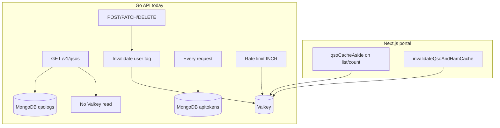
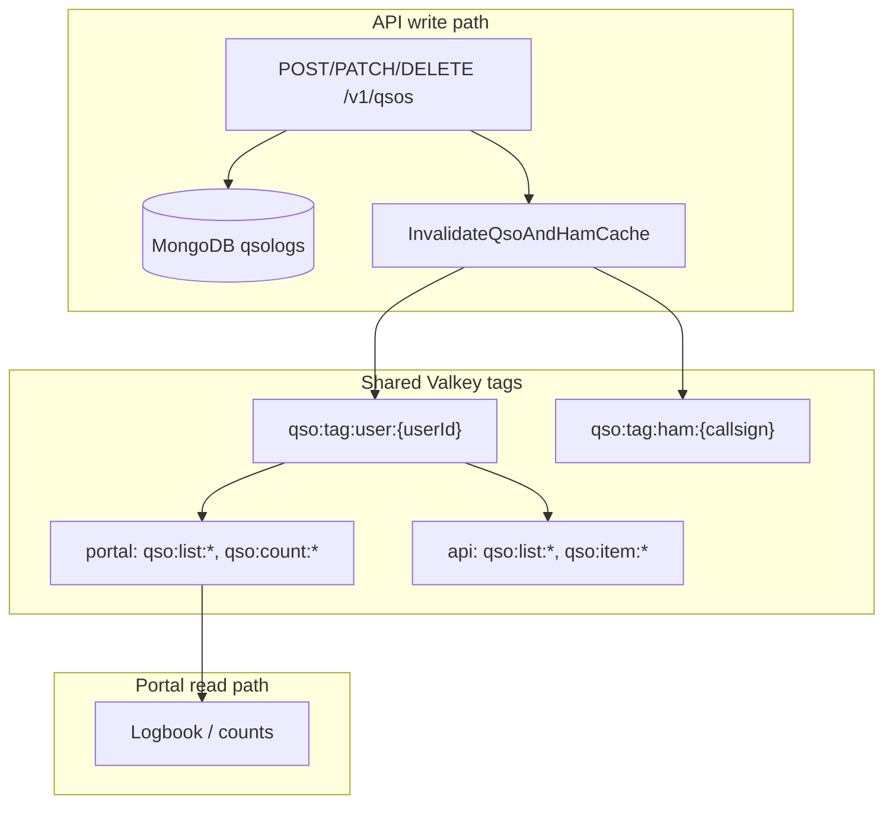
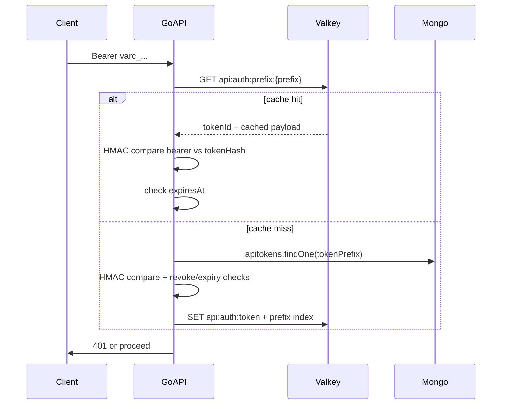
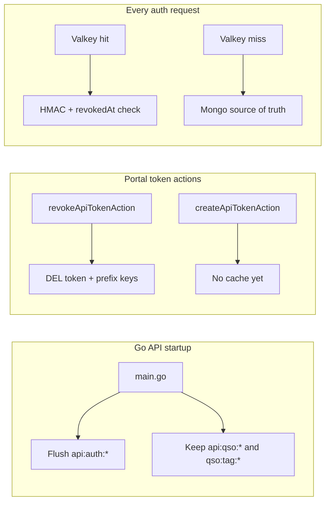

# Valkey performance plan for Go QSO API

## Current state



| Layer | Portal ([`src/lib/cache/qso-cache.ts`](src/lib/cache/qso-cache.ts)) | Go API ([`apps/api/internal/cache/valkey.go`](apps/api/internal/cache/valkey.go)) |
|-------|---------------------------------------------------------------------|-----------------------------------------------------------------------------------|
| QSO list read cache | Yes — `qsoCacheAside`, TTL 300s | **No** — always `CountDocuments` + `Find` |
| QSO write invalidation | Yes — tag `qso:tag:user:{userId}` | Yes — same tag prefix (already wired in handlers) |
| Auth token lookup | N/A (session cookies) | **No cache** — Mongo lookup every request |
| Rate limiting | Mail only | API IP + token limits |

**Gap:** The API clears portal-compatible cache tags on writes but never **reads** from Valkey, so repeated `GET /v1/qsos` still hits Mongo twice (count + find) on every request.

---

## Recommended implementations (priority order)

### 1. QSO list cache-aside in Go API (highest impact)

Mirror portal `qsoCacheAside` in new [`apps/api/internal/cache/qso_cache.go`](apps/api/internal/cache/qso_cache.go):

- **Cache key** — include full query fingerprint (pagination + sort + all filters):

```go
// api:qso:list:user:{userId}:p{page}:s{pageSize}:f{filterHash}:sort{key}:{dir}:v1
```

- **filterHash** — SHA1 of canonical JSON of [`ListFilters`](apps/api/internal/qso/list_filters.go) + page/pageSize/sort (reuse pattern from [`PageQueryHash`](apps/api/internal/qso/service.go) but include all filter fields).
- **Value** — serialize full [`PageResult`](apps/api/internal/qso/dto.go) JSON (items + pagination + filters echo).
- **TTL** — `300s` (match `QSO_LIST_CACHE_TTL_SEC` in portal).
- **Tags** — on SET, `SADD qso:tag:user:{userId} {cacheKey}` + tag TTL (same as portal [`qso-cache.ts`](src/lib/cache/qso-cache.ts) lines 74–78).

Wire into [`Service.List`](apps/api/internal/qso/service.go):

```go
return cache.QsoListAside(ctx, valkey, key, tags, func() (PageResult, error) { /* existing Mongo logic */ }, 300)
```

Pass `*cache.Valkey` into `qso.Service` (constructor change) or inject at handler level.

**Fail-open:** If Valkey miss/unavailable, fall through to Mongo (same as portal).

**Invalidation:** Already done on API writes via [`InvalidateQsoAndHamCache`](apps/api/internal/cache/valkey.go) — see [Cross-app QSO cache consistency](#cross-app-qso-cache-consistency) for portal ↔ API guarantees.

---

## Cross-app QSO cache consistency

**Requirement:** When a user publishes or changes QSOs via the **API**, the **portal logbook** (and subsequent API reads) must show the same data immediately — no stale cached pages.



### Already in place today

[`QsoHandler`](apps/api/internal/handler/qso.go) calls `invalidate()` after every successful **Create**, **Update**, and **Delete**:

```138:145:apps/api/internal/handler/qso.go
func (h QsoHandler) invalidate(r *http.Request, userID string) {
	callsign, err := h.Service.RequireUserCallsign(r.Context(), userID)
	if err != nil {
		cache.InvalidateQsoAndHamCache(r.Context(), h.Valkey, userID, nil)
		return
	}
	cache.InvalidateQsoAndHamCache(r.Context(), h.Valkey, userID, []string{callsign})
}
```

This uses the **same tag prefixes** as the portal ([`qso-cache.ts`](src/lib/cache/qso-cache.ts) lines 8–9):

- `qso:tag:user:{userId}` — busts portal list/count caches registered under that tag
- `qso:tag:ham:{callsign}` — busts public ham profile cache

Portal list/count loaders tag keys with `QsoCacheTags.user(userId)`, so **API writes already invalidate portal read caches** when Valkey is configured.

### Must-do when adding API read cache

Every new API cache key **must** register under `qso:tag:user:{userId}` on SET (same `SADD` + tag TTL pattern as portal). Then existing API write invalidation automatically clears:

| Cache | Key prefix | Cleared by |
|-------|------------|------------|
| Portal logbook list | `qso:list:user:...` | User tag bust |
| Portal QSO count | `qso:count:user:...` | User tag bust |
| API list (new) | `api:qso:list:...` | User tag bust |
| API single GET (new) | `api:qso:item:...` | User tag bust |

**Do not** use a separate API-only invalidation tag — one shared user tag keeps portal and API consistent.

### Harden invalidation on API writes (implement)

Improve [`QsoHandler.invalidate`](apps/api/internal/handler/qso.go) to accept affected callsigns from the mutation:

| Mutation | Callsigns to bust |
|----------|-------------------|
| **Create** | Logger callsign + `workedCallsign` from created QSO |
| **Update** | Logger callsign + previous `workedCallsign` + new `workedCallsign` if changed |
| **Delete** | Logger callsign + `workedCallsign` from deleted QSO |

Today only the logger callsign is passed; worked-station ham pages may stay stale for up to TTL. Fix in the same PR as read cache.

Always invalidate **after** Mongo commit succeeds (current order is correct). Best-effort if Valkey is down — Mongo remains source of truth; cache repopulates on next miss.

### Consistency checklist (acceptance)

- [ ] POST via API → portal logbook refresh shows new QSO (within same Valkey cluster)
- [ ] PATCH/DELETE via API → portal reflects change
- [ ] GET via API after write → cache miss → fresh Mongo data (once read cache is added)
- [ ] Portal write → API read also fresh (portal already calls `invalidateQsoAndHamCache`)

---

For `GET /v1/qsos/:id`:

- Key: `api:qso:item:user:{userId}:id:{qsoId}:v1`
- TTL: 300s
- Tag: same `qso:tag:user:{userId}`
- Invalidate on PATCH/DELETE of that id (optional targeted `DEL` in addition to tag bust, or rely on user tag wipe)

Lower priority than list cache (one doc vs count+find).

---

### 3. Auth token cache in Valkey — **yes, recommended** (with strict rules)

**Decision:** Cache the **verified auth result**, not the plaintext API key. This removes one Mongo `apitokens` lookup per request for busy clients while keeping crypto verification on every request.

#### What to store (never the secret)

| Store in Valkey? | Item |
|------------------|------|
| **Never** | Plaintext `Bearer varc_…` |
| **Never** | Full token in any key name |
| **Yes** | Post-verify metadata keyed by `tokenId` + index by `tokenPrefix` |

Cached value (JSON, TTL **60–120s**):

```json
{
  "tokenId": "...",
  "userId": "...",
  "scopes": ["qso:read", "qso:write"],
  "tokenHash": "<same HMAC as Mongo>",
  "expiresAt": "2026-12-31T00:00:00Z"
}
```

Keys:

- `api:auth:token:{tokenId}` → payload above
- `api:auth:prefix:{tokenPrefix}` → `{tokenId}` (optional index to skip Mongo on prefix-only lookup)

#### Verify flow (every request)



**Important:** HMAC comparison still runs on **every** request (constant-time). Valkey only skips the Mongo round-trip.

#### Invalidation (required for security)

| Event | Action |
|-------|--------|
| User **revokes** token in portal | [`revokeApiTokenAction`](src/lib/api-token-actions.ts) → `invalidateApiAuthCache({ tokenId, tokenPrefix })` — `DEL api:auth:token:{id}` + `DEL api:auth:prefix:{prefix}` |
| User **creates** token | No Valkey write needed (nothing cached yet). Optional: no-op call for symmetry. |
| User **updates** token (future: rename, expiry) | Same as revoke — `DEL` both keys so next request re-reads Mongo |
| TTL expires | Automatic |
| Pepper rotation | Flush `api:auth:*` on API startup (below) + tokens re-auth from Mongo |
| **Go API or portal restart** | See [Cache lifecycle on restart](#cache-lifecycle-on-restart) |

Add [`src/lib/cache/api-auth-cache.ts`](src/lib/cache/api-auth-cache.ts) in portal:

```ts
export async function invalidateApiAuthCache(params: {
  tokenId: string;
  tokenPrefix: string;
}): Promise<void>

export async function invalidateApiAuthCacheForUser(userId: string): Promise<void>
// SCAN api:auth:token:* where payload.userId matches — use on bulk revoke if added later
```

Call `invalidateApiAuthCache` from [`revokeApiTokenAction`](src/lib/api-token-actions.ts) **after** Mongo update succeeds (best-effort; log error but do not fail revoke if Valkey is down).

**Defense in depth on cache hit:** include `revokedAt: null` in cached JSON; reject immediately if non-null (handles missed invalidation until TTL).

#### Fail-open on Valkey down

If Valkey is unavailable, **fall back to Mongo** (current behavior). Do not block auth — same pattern as QSO read cache.

#### Why not cache only by prefix without hash re-check?

Prefix alone is not enough (collision/theft risk). Always re-verify HMAC of the presented bearer against `tokenHash` from cache or Mongo.

#### Priority

Implement **after** QSO list cache (item 1) unless API traffic is auth-bound (many clients, few QSO reads) — then do auth cache first.

---

## Cache lifecycle on restart

Valkey is **external and persistent** — cached data survives process restarts. Without explicit handling, a redeploy could serve stale auth metadata (e.g. token revoked in Mongo while API was down, but Valkey still has a valid cache entry).



### Go API startup (required)

In [`apps/api/cmd/server/main.go`](apps/api/cmd/server/main.go), after Valkey connect:

```go
if err := valkeyClient.FlushAuthCache(ctx); err != nil {
  log.Printf("valkey: auth cache flush failed: %v", err)
}
```

Implement `FlushAuthCache` in [`apps/api/internal/cache/valkey.go`](apps/api/internal/cache/valkey.go):

- `SCAN` + `DEL` keys matching `api:auth:*` (token + prefix index)
- **Do not** flush `api:qso:*` or `qso:tag:*` on restart — QSO data remains valid; writes already bust tags
- Controlled by env `API_AUTH_CACHE_FLUSH_ON_START` (default **true**); set `false` only for local dev if needed

Rationale: auth cache is short-lived and security-sensitive; QSO read cache is performance-only and invalidated by user tag on writes.

### Portal restart

Portal does not read auth cache today. No startup flush required in Next.js.

Token **revoke/create/update** actions run in the portal and must push invalidation to Valkey at mutation time (not on portal boot).

### Token lifecycle summary

| Action | Mongo | Valkey |
|--------|-------|--------|
| Create token | Insert new doc | Nothing (cache miss on first API call) |
| Revoke token | Set `revokedAt` | `DEL api:auth:token:{id}` + `DEL api:auth:prefix:{prefix}` |
| Update token (future) | Update doc | Same `DEL` as revoke |
| API restart | — | Flush all `api:auth:*` |
| API request (cache hit) | — | HMAC verify + reject if `revokedAt` set or expired |

---

### 4. Keep rate limiting as-is (already implemented)

Current middleware in [`apps/api/internal/middleware/middleware.go`](apps/api/internal/middleware/middleware.go):

- Per-IP: 30/min on `/v1/*`
- Per-token: configurable read/write limits

Optional later: sliding window Lua script (portal mail limiter pattern) for smoother bursts — not required for v1 perf.

---

### 5. Mongo indexes (verify, low code)

Existing indexes on [`QsoLog`](src/models/QsoLog.ts):

- `{ userId: 1, qsoAt: -1 }` — good for default list sort
- `{ workedCallsign: 1 }`

For API filter combos, consider compound index if profiling shows slow queries:

- `{ userId: 1, qsoAt: -1, band: 1 }` — only if `band` + date filters are hot

**Do not add indexes until cache + explain() on real traffic** — premature indexes add write cost.

---

## What NOT to cache

| Data | Reason |
|------|--------|
| POST/PATCH/DELETE responses | Mutations must be fresh; invalidation is enough |
| Health check | Must reflect live Mongo |
| Token **creation** response | Secret shown once; never cache plaintext token |
| Plaintext Bearer in Valkey | Security — only store tokenHash + metadata after verify |
| Full logbook unfiltered export | API already caps pageSize at 1000 |

---

## Shared key contract (document in [`docs/api.md`](docs/api.md))

| Key pattern | Owner | Invalidated by |
|-------------|-------|----------------|
| `qso:tag:user:{userId}` | Portal + API | Any QSO write (portal actions, API CRUD, import) |
| `api:qso:list:...` | API reads | User tag bust |
| `api:qso:item:...` | API reads | User tag bust |
| `api:auth:token:{id}` | API auth | Portal revoke/update + API startup flush + TTL |
| `api:auth:prefix:{prefix}` | API auth | Portal revoke/update + API startup flush + TTL |
| `rate:api:token:*` | API middleware | TTL only |

Portal list keys (`qso:list:user:...:v2`) remain portal-only; API uses `api:` prefix to avoid filter-schema collisions while sharing the **same invalidation tag**.

---

## Implementation order

1. Implement `QsoListAside` + wire `Service.List` + tests (mock Valkey or integration)
2. Wire `Valkey` into `qso.Service` + **harden write invalidation** (logger + worked callsigns)
3. Implement `QsoListAside` + wire `Service.List` + tests
4. Add single-QSO GET cache (optional v1.1)
5. Auth token cache + portal lifecycle invalidation + API startup flush
6. Update [`docs/api.md`](docs/api.md) caching section; note shared tag contract + `VALKEY_URL` required in prod

---

## Expected gains

| Endpoint | Before | After (cache hit) |
|----------|--------|-------------------|
| `GET /v1/qsos` | 2 Mongo ops (count + find) | 1 Valkey GET |
| `GET /v1/qsos/:id` | 1 Mongo findOne | 1 Valkey GET |
| Authenticated request | 1 Mongo apitokens find | 0 Mongo (within TTL) |

Cache hits help mobile/loggers polling the same page or syncing incrementally. Writes still bust cache immediately via existing tag invalidation.
