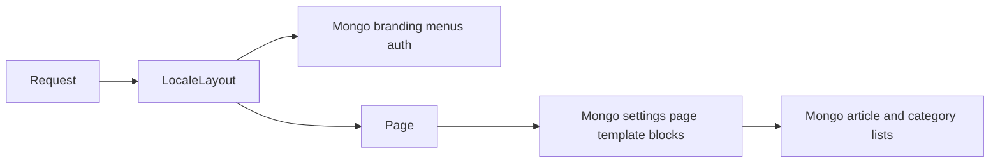
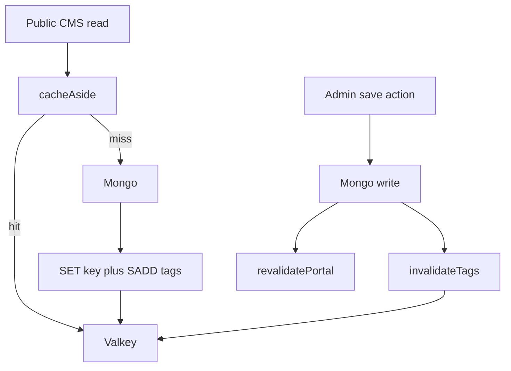

# Valkey CMS cache + instant invalidation

## Defaults (locked)

- **Scope:** All public portal CMS reads (layout + pages/articles/categories/templates/lists used by blocks). Admin-only queries stay uncached only where they include trash/draft filters that differ; shared helpers like `listCategories()` without trash are safe to cache and invalidate on write.
- **Freshness:** **Instant invalidation** on write (same path as `revalidatePortal()`). Long safety TTL (1h) as backup only — not the primary freshness mechanism.
- **Failure mode:** If `VALKEY_URL` is unset or Valkey errors, fall through to Mongo (fail-open). Never fail a page because cache is down.
- **Library:** official `redis` (node-redis) — Redis protocol compatible with Valkey.

## Why current TTFB is slow

Every public request is `force-dynamic` and hits Mongo for branding, menus, settings, page/article docs, and block list queries. There is no shared app cache today ([`src/app/[locale]/layout.tsx`](src/app/[locale]/layout.tsx)], [`src/lib/cms.ts`](src/lib/cms.ts), [`src/lib/articles.ts`](src/lib/articles.ts), [`src/lib/blocks/resolve.ts`](src/lib/blocks/resolve.ts)).

## Architecture

### Cache helper ([`src/lib/cache/valkey.ts`](src/lib/cache/valkey.ts) + [`src/lib/cache/cms-cache.ts`](src/lib/cache/cms-cache.ts))

- Singleton client from `process.env.VALKEY_URL` (already in ConfigMap as `redis://valkey:6379`).
- `cacheAside<T>(key, tags, ttlSec, loader)`:
  - GET JSON → return on hit
  - else loader() → SET with TTL → register key in each tag set (`SADD tag:{name} key`) → return
- `invalidateTags(...tags)`:
  - for each tag: `SMEMBERS` → `DEL` all member keys → `DEL` tag set
  - use a pipeline; log errors, never throw to callers
- Serialize lean Mongo docs with `JSON.stringify` / `JSON.parse` (dates become ISO strings — already how public cards expose `publishedAt`).

### Key + tag catalog

| Read function | Key pattern | Tags |
|---|---|---|
| `getPublicSiteBranding(locale)` | `cms:branding:{locale}` | `branding`, `settings` |
| `getSiteSettingsDocument` | `cms:settings` | `settings` |
| `listPublicMenuLinks(loc, locale)` | `cms:menu:{loc}:{locale}` | `menus` |
| `getPublishedPageBySlug` | `cms:page:{locale}:{slug}` | `pages`, `page:{id}` |
| `getPageById` (published/home path) | `cms:pageid:{id}` | `pages`, `page:{id}` |
| `getPublishedArticleBySlug` | `cms:article:{locale}:{slug}` | `articles`, `article:{id}` |
| `listPublishedArticles(...)` | `cms:articles:{locale}:p{page}:s{size}:x{hash}` | `articles` |
| `listFeaturedArticles` | `cms:featured:{locale}:{limit}` | `articles` |
| `listCategories()` (not trash) | `cms:categories` | `categories` |
| `getPageTemplateByKey` | `cms:tpl:{key}` | `templates` |

Do **not** cache: `auth()`, admin trash lists, preview (`getArticleForPreview`), mutations, media binary.

`/api/favicon` keeps using `getPublicSiteBranding` (inherits branding cache).

## Invalidation (no stale after change)

Extend [`revalidatePortal()`](src/lib/actions.ts) into a single portal refresh helper that still calls `revalidatePath` **and** Valkey tag deletes. Prefer **domain-specific** invalidation from each action so we do not over-flush unnecessarily, but always cover every write:

| Write action(s) | Invalidate tags |
|---|---|
| `saveSiteSettingsAction` | `settings`, `branding`, `menus` (home/nav branding), plus `pages` if `homePageId` changes |
| Menu save/reorder/delete/restore/trash | `menus` |
| Page save/delete/restore/trash/empty | `pages`, `page:{id}`, `menus` (nav can reference pages), `settings` only if home page assignment affected |
| Article save/delete/restore/trash/empty/clone | `articles`, `article:{id}` |
| Category save/reorder/delete/restore/trash | `categories`, `menus` (category links), `articles` (category-filtered lists) |
| Template save/duplicate/delete | `templates`, `pages` (layouts resolve via template key) |

Rules to avoid “missing” invalidation:

1. Every existing `revalidatePortal()` call site also invalidates the matching tags (centralize so new actions cannot forget Paths-only).
2. On slug rename: invalidate by tags (`articles` / `pages`) so both old and new slug keys die (tag set tracks both).
3. Publish/unpublish/status change: same as save (full article/page tags).
4. Safety TTL 3600s so a forgotten path self-heals within an hour; primary path is tag delete.

## Code touch points

1. Add dependency `redis`.
2. New modules: `src/lib/cache/valkey.ts`, `src/lib/cache/cms-cache.ts` (keys/tags/invalidate helpers).
3. Wrap loaders in [`src/lib/cms.ts`](src/lib/cms.ts), [`src/lib/articles.ts`](src/lib/articles.ts), [`src/lib/blocks/templates.ts`](src/lib/blocks/templates.ts) (`getPageTemplateByKey` only).
4. Update [`src/lib/actions.ts`](src/lib/actions.ts): replace bare `revalidatePortal()` with `refreshPortal({ tags })` or call `invalidateCmsTags(...)` beside each write.
5. Optional: `GET /api/health` pings Valkey when configured (non-fatal).
6. Docs: `.env.example` / README note `VALKEY_URL` for local optional use.

## Out of scope (this PR)

- Removing `force-dynamic` / ISR / Cloudflare HTML cache (follow-up once data cache is proven).
- Auth.js session store in Valkey.
- Caching full resolved block trees as one blob (lists underneath are enough for v1).

## Verification

- Local or cluster: set `VALKEY_URL`, hit `/vi` twice — second request should show Valkey hits (debug log or `MONITOR`).
- Save article/page/menu/settings in admin — immediate hard refresh must show new content; corresponding keys gone (`SMEMBERS` / `GET`).
- Stop Valkey — site still loads from Mongo.
- `pnpm build` still works without Valkey (CI).
