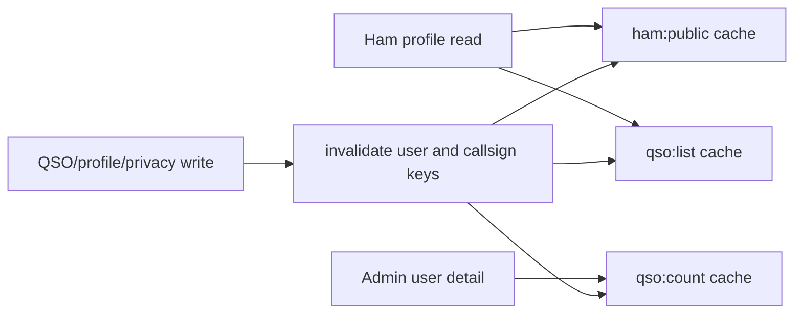

# Valkey Caching Plan

## Goal
Improve manage-user QSO log performance by caching the hot read paths in Valkey while preserving correctness with explicit invalidation on every relevant write.

## Existing fit in the codebase
The repo already has a working Valkey/Redis setup and a cache-aside pattern we should extend rather than replace.

Relevant files:
- [package.json](/Users/hai.tran/Working/repositories/varc-portal/package.json)
- [src/lib/cache/valkey.ts](/Users/hai.tran/Working/repositories/varc-portal/src/lib/cache/valkey.ts)
- [src/lib/cache/cms-cache.ts](/Users/hai.tran/Working/repositories/varc-portal/src/lib/cache/cms-cache.ts)
- [src/lib/ham-profile.ts](/Users/hai.tran/Working/repositories/varc-portal/src/lib/ham-profile.ts)
- [src/lib/qso.ts](/Users/hai.tran/Working/repositories/varc-portal/src/lib/qso.ts)
- [src/lib/qso-actions.ts](/Users/hai.tran/Working/repositories/varc-portal/src/lib/qso-actions.ts)
- [src/lib/qso-import-actions.ts](/Users/hai.tran/Working/repositories/varc-portal/src/lib/qso-import-actions.ts)
- [src/lib/qso-confirmation.ts](/Users/hai.tran/Working/repositories/varc-portal/src/lib/qso-confirmation.ts)
- [src/lib/account-actions.ts](/Users/hai.tran/Working/repositories/varc-portal/src/lib/account-actions.ts)
- [src/app/[locale]/(portal)/[callsign]/page.tsx](/Users/hai.tran/Working/repositories/varc-portal/src/app/[locale]/(portal)/[callsign]/page.tsx)
- [src/app/admin/(dashboard)/users/[id]/page.tsx](/Users/hai.tran/Working/repositories/varc-portal/src/app/admin/(dashboard)/users/[id]/page.tsx)

## Scope for the first pass
Cache only these reads:
- `findPublicHamByCallsign(callsign)` in [src/lib/ham-profile.ts](/Users/hai.tran/Working/repositories/varc-portal/src/lib/ham-profile.ts)
- `listUserQsos(userId, limit?)` in [src/lib/qso.ts](/Users/hai.tran/Working/repositories/varc-portal/src/lib/qso.ts)
- `countUserQsos(userId)` in [src/lib/qso.ts](/Users/hai.tran/Working/repositories/varc-portal/src/lib/qso.ts)

Leave export payload caching out of this pass.

## Proposed design
Create a small QSO-specific cache helper, likely [src/lib/cache/qso-cache.ts](/Users/hai.tran/Working/repositories/varc-portal/src/lib/cache/qso-cache.ts), that:
- reuses `getValkey()` from [src/lib/cache/valkey.ts](/Users/hai.tran/Working/repositories/varc-portal/src/lib/cache/valkey.ts)
- uses simple cache-aside reads with JSON serialization
- uses a dedicated QSO namespace, not the CMS generation key
- fails open when Valkey is unavailable

Suggested key shapes:
- `ham:public:{CALLSIGN}:v1`
- `qso:list:user:{USER_ID}:limit:{LIMIT_OR_ALL}:v1`
- `qso:count:user:{USER_ID}:v1`

Suggested TTLs for the first pass:
- public ham profile: 5 to 10 minutes
- QSO list: 1 to 5 minutes
- QSO count: 1 to 5 minutes

## Read-path changes
Update [src/lib/ham-profile.ts](/Users/hai.tran/Working/repositories/varc-portal/src/lib/ham-profile.ts):
- wrap `findPublicHamByCallsign()` in cache-aside lookup
- key by normalized callsign
- cache the full `PublicHamProfile | null` payload

Update [src/lib/qso.ts](/Users/hai.tran/Working/repositories/varc-portal/src/lib/qso.ts):
- wrap `listUserQsos()` in cache-aside lookup
- include `limit` in the key so capped and uncapped reads do not collide
- wrap `countUserQsos()` in cache-aside lookup

No UI changes should be needed because these readers already feed:
- [src/app/[locale]/(portal)/[callsign]/page.tsx](/Users/hai.tran/Working/repositories/varc-portal/src/app/[locale]/(portal)/[callsign]/page.tsx)
- [src/app/admin/(dashboard)/users/[id]/page.tsx](/Users/hai.tran/Working/repositories/varc-portal/src/app/admin/(dashboard)/users/[id]/page.tsx)

## Invalidation plan
Add QSO-specific invalidation helpers, likely in the new cache helper, for:
- per-user QSO list cache
- per-user QSO count cache
- public ham profile cache by callsign

Invalidate after these write paths:
- `createQsoAction()` in [src/lib/qso-actions.ts](/Users/hai.tran/Working/repositories/varc-portal/src/lib/qso-actions.ts)
- `updateQsoAction()` in [src/lib/qso-actions.ts](/Users/hai.tran/Working/repositories/varc-portal/src/lib/qso-actions.ts)
- `deleteQsoAction()` in [src/lib/qso-actions.ts](/Users/hai.tran/Working/repositories/varc-portal/src/lib/qso-actions.ts)
- `adminDeleteQsoAction()` in [src/lib/qso-actions.ts](/Users/hai.tran/Working/repositories/varc-portal/src/lib/qso-actions.ts)
- `deleteAllUserQsosAction()` in [src/lib/qso-actions.ts](/Users/hai.tran/Working/repositories/varc-portal/src/lib/qso-actions.ts)
- `importQsoAdifAction()` in [src/lib/qso-import-actions.ts](/Users/hai.tran/Working/repositories/varc-portal/src/lib/qso-import-actions.ts)
- `confirmQsoByToken()` in [src/lib/qso-confirmation.ts](/Users/hai.tran/Working/repositories/varc-portal/src/lib/qso-confirmation.ts)
- `updateProfileAction()` in [src/lib/account-actions.ts](/Users/hai.tran/Working/repositories/varc-portal/src/lib/account-actions.ts) for old/new callsign changes
- `updateSecuritySettingsAction()` in [src/lib/account-actions.ts](/Users/hai.tran/Working/repositories/varc-portal/src/lib/account-actions.ts) for privacy changes

Important detail:
- keep the existing `revalidatePath()` behavior in place
- Valkey invalidation handles data freshness
- `revalidatePath()` handles Next.js route freshness

## Safety rules
- If Valkey is down, all reads should fall back to MongoDB without breaking the page
- Cache keys must be scoped tightly by callsign or user ID
- Do not cache client-side filtered/paginated table state from [src/components/portal/qso-logbook.tsx](/Users/hai.tran/Working/repositories/varc-portal/src/components/portal/qso-logbook.tsx); cache only the server-side source data

## Verification
- confirm cached reads return the same payloads as current Mongo reads
- create/update/delete/import a QSO and verify the owner page, public page, and admin user count all refresh correctly
- change callsign or privacy settings and verify old/new public profile lookups do not serve stale data
- confirm QSO confirmation still updates badges correctly after token confirmation
- run `pnpm lint`
- run `npx tsc --noEmit`

## Expected payoff
This should reduce repeated Mongo reads for:
- public ham profile page metadata and render
- full per-user logbook loads on profile pages
- admin user-detail QSO counts

It keeps the first pass small, local, and consistent with the existing Valkey architecture.