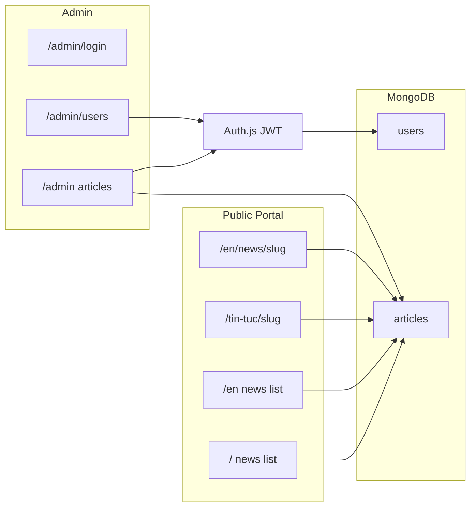
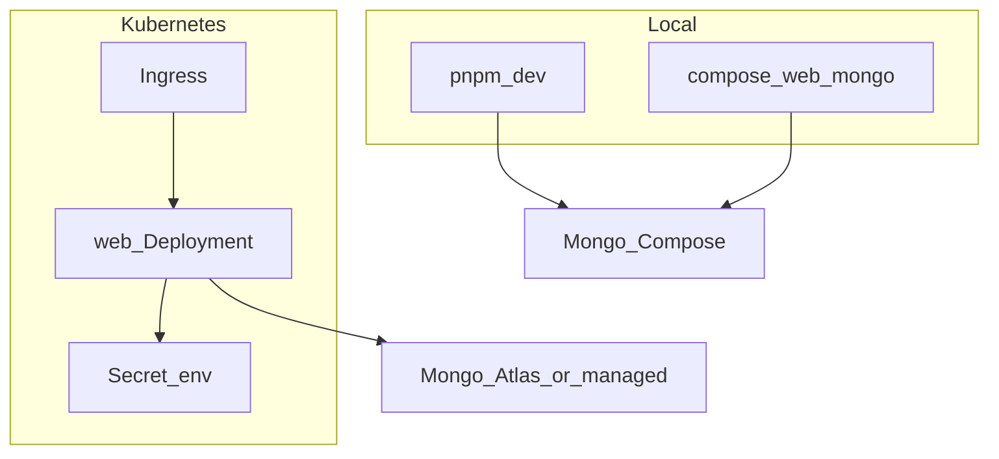

# VARC Portal CMS (Next.js + MongoDB)

**Design read:** Public association portal for Vietnamese amateur radio members/visitors (VI default, EN secondary), trust-first civic language; admin is functional (not marketing). Dials for public pages: Variance 5 / Motion 3 / Density 4.

## Locked decisions

- **Stack:** Next.js (App Router) + TypeScript + Tailwind v4 + MongoDB
- **ODM:** Mongoose
- **i18n:** `next-intl` — locales `vi` (default) and `en`; URL prefix **as-needed** (`/` = Vietnamese, `/en/...` = English)
- **Auth:** Auth.js (NextAuth v5) — Credentials + Google OAuth
- **Roles:** `system_admin` (seeded bootstrap) and `administrator`; only `system_admin` grants/revokes admin roles
- **Content:** Articles stored with per-locale fields (VI required to publish; EN optional until filled)
- **Run targets:** local `pnpm dev`, Docker Compose (app + MongoDB), Kubernetes (app Deployment + env Secrets; Mongo via `MONGODB_URI`)

## Architecture



Admin routes stay **locale-agnostic** (`/admin/...`); admin UI language defaults to Vietnamese with a simple VI/EN toggle optional later. Public portal is fully bilingual.

## Data model (MongoDB)

**User** (unchanged intent)
- `email` (unique), `name`, `passwordHash` (nullable for Google-only)
- `role`: `user` | `administrator` | `system_admin`
- `image`, Auth.js linkage as needed
- timestamps

**Article** (localized)
- Shared: `status` (`draft` | `published`), `publishedAt`, `authorId`, `coverImageUrl`, `ogImageUrl` (shared or per-locale override)
- `locales.vi` and `locales.en`, each:
  - `title`, `slug`, `excerpt`, `content`
  - `metaTitle`, `metaDescription`
- Publish rules: `locales.vi.title` + `locales.vi.slug` + `locales.vi.content` required; EN may be empty (EN pages show fallback notice or hide from EN list until translated)
- Indexes: unique sparse on `locales.vi.slug` and `locales.en.slug`; `{ status: 1, publishedAt: -1 }`

## i18n and routing (SEO)

| Locale | Home | Article |
|--------|------|---------|
| `vi` (default) | `/` | `/tin-tuc/[slug]` |
| `en` | `/en` | `/en/news/[slug]` |

- `app/[locale]/...` for portal; middleware from `next-intl` + Auth.js for `/admin`
- UI strings in `messages/vi.json` and `messages/en.json`
- Language switcher: same article via alternate slug when EN exists; otherwise link to EN home
- SEO per locale:
  - `generateMetadata` using that locale’s title/description
  - `alternates.languages` / `hreflang` (`vi`, `en`, `x-default` → VI)
  - Canonical per locale URL
  - `sitemap.xml` emits both locale URLs for published articles that have that locale’s slug
  - JSON-LD `inLanguage`: `vi` or `en`

## Auth and bootstrap

1. Seed / container entry or `pnpm seed`: create `system_admin` from `INITIAL_ADMIN_EMAIL` / `INITIAL_ADMIN_PASSWORD` / `INITIAL_ADMIN_NAME`
2. Credentials + Google; `/admin` requires `administrator` or `system_admin`
3. Google upsert by email; preserve role
4. `/admin/users`: `system_admin` grants `administrator` / demotes to `user`; cannot remove last `system_admin`
5. Middleware: protect `/admin/*` except login; next-intl for locale prefixes

## Admin backend

| Route | Purpose |
|-------|---------|
| `/admin/login` | Email/password + Google |
| `/admin` | Article list (status filter; show VI title + EN translation status) |
| `/admin/articles/new` | Create with VI + EN tabs/sections |
| `/admin/articles/[id]` | Edit / publish / unpublish / delete |
| `/admin/users` | Role management (`system_admin` only) |

Editor: per-locale title, slug (auto from title), excerpt, content (Markdown), meta fields; shared cover URL and status. Zod validates VI on publish. Server Actions + `revalidatePath` for both locale trees.

## Project structure

```
app/
  [locale]/(portal)/page.tsx
  [locale]/(portal)/tin-tuc/[slug]/page.tsx   # vi path mapping
  [locale]/(portal)/news/[slug]/page.tsx      # en path mapping
  admin/(auth)/login/page.tsx
  admin/(dashboard)/layout.tsx
  admin/(dashboard)/page.tsx
  admin/(dashboard)/articles/...
  admin/(dashboard)/users/page.tsx
  api/auth/[...nextauth]/route.ts
  sitemap.ts
  robots.ts
messages/vi.json
messages/en.json
lib/ db.ts auth.ts i18n.ts articles.ts slug.ts
models/ User.ts Article.ts
components/ portal/ admin/
scripts/seed-admin.ts
Dockerfile
docker-compose.yml
deploy/k8s/  # deployment, service, ingress, configmap, secret example
```

Path mapping: use next-intl pathnames so VI uses `/tin-tuc/[slug]` and EN uses `/news/[slug]` under `/en`.

## Container and deploy

**Local development**
- MongoDB via Compose (`mongo` service) or local install
- `pnpm dev` with `.env.local` pointing at `mongodb://localhost:27017/varc`

**Docker Compose** (`docker-compose.yml`)
- Services: `web` (Next.js standalone), `mongo`
- `web` depends on `mongo`, env from `.env`
- Seed: one-shot `seed` service or `web` startup hook that upserts initial admin if missing
- Ports: `3000:3000`, mongo internal only (or `27017` published for host `pnpm dev`)

**Dockerfile**
- Multi-stage: deps → build (`output: 'standalone'`) → slim runner
- Non-root user; `PORT=3000`; healthcheck on `/` or `/api/health`

**Kubernetes** (`deploy/k8s/`)
- `Deployment` (web) + `Service` + `Ingress` (TLS host)
- `Secret` for `MONGODB_URI`, `NEXTAUTH_SECRET`, Google + initial admin (or external secret manager later)
- `ConfigMap` for public config (`NEXTAUTH_URL`, locale defaults)
- MongoDB **not** in-cluster for v1: use Atlas or existing Mongo operator; `MONGODB_URI` only. Document optional Compose Mongo for local parity.
- Probes: liveness/readiness on `/api/health`
- Resources requests/limits documented for small association load



## Env vars

```
MONGODB_URI=
NEXTAUTH_URL=
NEXTAUTH_SECRET=
GOOGLE_CLIENT_ID=
GOOGLE_CLIENT_SECRET=
INITIAL_ADMIN_EMAIL=
INITIAL_ADMIN_PASSWORD=
INITIAL_ADMIN_NAME=
NEXT_PUBLIC_SITE_URL=
```

`.env.example` + README sections: local, Compose, k8s apply order.

## Implementation order

1. Scaffold Next.js + Tailwind + next-intl + deps
2. Models (localized Article) + DB + seed
3. Auth.js + middleware (locale + admin)
4. Admin bilingual article CRUD + revalidation
5. Public locale routes + metadata / hreflang / sitemap / JSON-LD
6. Admin users roles
7. Dockerfile + Compose + k8s manifests + `/api/health`
8. README runbooks

## Out of scope for v1

- Image upload/storage (URL field only)
- In-cluster MongoDB operator / StatefulSet
- Member directory, events, callsign DB
- Public registration / member self-service
- Comments
- Automatic machine translation

## Success criteria

- Seeded admin logs in with email/password and publishes a VI article (optional EN)
- `/` and `/en` show the correct locale lists; article URLs work with hreflang
- Google user blocked from admin until granted `administrator`
- `docker compose up` runs app + Mongo; k8s manifests deploy web against external `MONGODB_URI`
- All article data in MongoDB only
