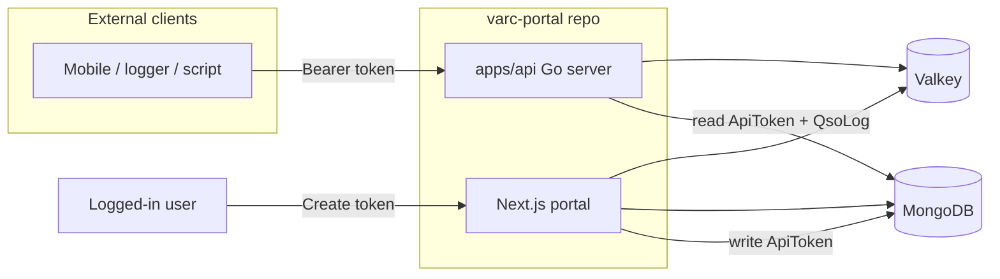
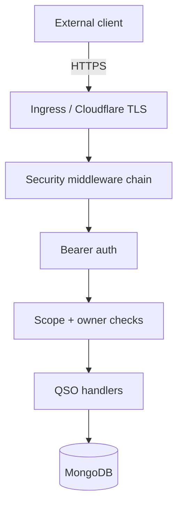

# VARC QSO API Application Plan

## Decisions (confirmed)

| Topic | Choice |
|-------|--------|
| API runtime | **Go** (standalone HTTP service), not Node/Hono |
| Auth | **Bearer tokens** created by users in **Profile → Security** |
| Local env | **Single root `.env`** shared by portal, workers, and Go API |
| K8s env | **Same Secret + ConfigMap** as portal (`varc-portal-secrets`, `varc-portal-config`) |
| Data store | Same **MongoDB** `QsoLog` / `ApiToken` collections |
| Cache | Same **Valkey** keys as portal ([`src/lib/cache/qso-cache.ts`](src/lib/cache/qso-cache.ts)) |
| Local dev | **`pnpm dev:all` always starts the Go API** as its own OS process (separate from Next.js), alongside portal + workers |



---

## Repo layout

Keep the portal at repo root (no large move). Add Go API alongside:

```
varc-portal/
  .env                    # shared local/dev (existing)
  .env.example            # document new API_* vars
  apps/
    api/                  # Go module (module path e.g. github.com/varc-vietnam/varc-portal/apps/api)
      cmd/server/main.go
      internal/
        config/           # load env (MONGODB_URI, VALKEY_URL, API_PORT, …)
        auth/             # Bearer middleware
        handler/          # HTTP handlers
        qso/              # CRUD + validation
        mongo/            # repositories (QsoLog, ApiToken, User)
        cache/            # Valkey invalidation (mirror portal keys)
      Dockerfile
      go.mod
  src/                    # existing Next.js portal (unchanged root)
  deploy/k8s/
    api-deployment.yaml   # new
    api-service.yaml      # new
    …                     # existing portal manifests
```

**No TypeScript shared package for Go.** Business rules are implemented once in Go, aligned with existing portal behavior documented below and in [`src/lib/qso-actions.ts`](src/lib/qso-actions.ts). Portal keeps its server actions; both sides must stay in sync on schema and validation until an OpenAPI contract is added.

---

## Phase 1: API tokens (portal)

### Mongo model `ApiToken`

New file [`src/models/ApiToken.ts`](src/models/ApiToken.ts):

| Field | Type | Notes |
|-------|------|-------|
| `userId` | ObjectId | Token owner |
| `name` | string | User label ("Mobile logger") |
| `tokenPrefix` | string | Index; e.g. first 12 chars of `varc_…` for lookup |
| `tokenHash` | string | HMAC-SHA256 or SHA-256 of full secret + pepper |
| `scopes` | string[] | v1: `qso:read`, `qso:write` (both on create) |
| `expiresAt` | Date | Optional; null = no expiry |
| `lastUsedAt` | Date | Updated by Go API on successful auth |
| `revokedAt` | Date | Soft revoke |
| `createdAt` / `updatedAt` | Date | timestamps |

**Token format:** `varc_<random>` (32+ bytes base62/hex). Show full value **once** in UI after create; store only hash + prefix.

**Pepper:** `API_TOKEN_PEPPER` env var (falls back to `AUTH_SECRET` if unset). Same pepper in portal (hash on create) and Go API (hash on verify).

### Server actions ([`src/lib/account-actions.ts`](src/lib/account-actions.ts) or new `api-token-actions.ts`)

| Action | Behavior |
|--------|----------|
| `listApiTokensAction()` | Current user's non-revoked tokens (no secret) |
| `createApiTokenAction({ name, expiresAt? })` | Generate secret, persist hash, return `{ token, prefix, … }` once |
| `revokeApiTokenAction(id)` | Set `revokedAt`; owner only |

### Profile UI — Security tab

Extend [`src/components/portal/security-tab-panel.tsx`](src/components/portal/security-tab-panel.tsx):

1. **Card: Change password** (existing)
2. **Card: API tokens** (new)
   - List: name, prefix (`varc_ab12…`), created, last used, Revoke button
   - **Create token** → modal (name, optional expiry) → success modal with copy-once secret + warning
   - Link to API base URL docs (`API_PUBLIC_URL` or README)

i18n keys in `messages/en.json` / `vi.json`.

---

## Phase 2: Go API service

### Stack

- **Go 1.22+**
- Router: **chi** or stdlib `net/http` + small wrapper
- **mongo-driver** for MongoDB
- **go-redis** for Valkey
- Validation: struct tags + manual checks mirroring [`qsoInputSchema`](src/lib/validations/qso.ts)

### Config (from environment)

Load from process env (same vars as portal where applicable):

| Variable | Source | Purpose |
|----------|--------|---------|
| `MONGODB_URI` | shared Secret / `.env` | Mongo |
| `VALKEY_URL` | ConfigMap / `.env` | Cache invalidation |
| `VALKEY_PASSWORD` | Secret | Valkey auth |
| `API_PORT` | ConfigMap / `.env` | Default `3100` |
| `API_TOKEN_PEPPER` | Secret / `.env` | Token hashing (fallback `AUTH_SECRET`) |
| `API_PUBLIC_URL` | ConfigMap | Shown in portal UI (e.g. `https://api.hamvn.com`) |

### Local dev orchestration (required)

The Go API is **never embedded in Next.js**. It is always a **separate application process** — same as backup/email workers today.

**`pnpm dev:all`** ([`scripts/dev-local.sh`](scripts/dev-local.sh)) must start **four** background processes:

| Process | Command | Port |
|---------|---------|------|
| Portal | `pnpm dev` | 3099 |
| Backup worker | `pnpm worker:backup` | — |
| Email worker | `pnpm worker:email` | — |
| **Go API** | `./scripts/dev-api.sh` | **3100** (default) |

Updated [`scripts/dev-local.sh`](scripts/dev-local.sh) sketch:

```sh
pnpm dev &
APP_PID=$!

pnpm worker:backup &
BACKUP_WORKER_PID=$!

pnpm worker:email &
EMAIL_WORKER_PID=$!

./scripts/dev-api.sh &
API_PID=$!

# cleanup trap kills all four PIDs on Ctrl+C
wait "$APP_PID" "$BACKUP_WORKER_PID" "$EMAIL_WORKER_PID" "$API_PID"
```

**`scripts/dev-api.sh`** — loads shared root `.env`, runs Go with hot reload optional:

```bash
#!/bin/sh
set -eu
set -a && . ./.env && set +a
cd apps/api
# v1: go run ./cmd/server
# optional later: air for file-watch reload
exec go run ./cmd/server
```

**Root `package.json` scripts:**

```json
"dev:all": "./scripts/dev-local.sh",
"dev:api": "./scripts/dev-api.sh"
```

- `dev:all` — full stack (portal + workers + **Go API**); this is the default local workflow
- `dev:api` — API only (for focused API work without starting Next.js)

**Prerequisite check:** `dev-local.sh` should fail fast with a clear message if `go` is not installed (same pattern as workers requiring a built `dist/`).

Update [`.env.example`](.env.example) with `API_PORT=3100`, `API_PUBLIC_URL=http://localhost:3100`, `API_TOKEN_PEPPER`.

**Local URLs after `pnpm dev:all`:**

- Portal: `http://localhost:3099`
- API: `http://localhost:3100` (`GET /health`, `GET /v1/qsos`, …)

### Auth middleware

1. Parse `Authorization: Bearer <token>`
2. Extract prefix → `ApiToken.findOne({ tokenPrefix, revokedAt: null })`
3. Hash token with pepper → constant-time compare to `tokenHash`
4. Check `expiresAt` if set
5. Attach `userId`, `scopes` to request context
6. Async update `lastUsedAt`

### REST endpoints (v1)

| Method | Path | Scope | Notes |
|--------|------|-------|-------|
| `GET` | `/health` | — | Mongo ping |
| `GET` | `/v1/qsos` | `qso:read` | Paginated list for token owner |
| `POST` | `/v1/qsos` | `qso:write` | Create |
| `GET` | `/v1/qsos/:id` | `qso:read` | 404 if not owner |
| `PATCH` | `/v1/qsos/:id` | `qso:write` | Update |
| `DELETE` | `/v1/qsos/:id` | `qso:write` | Delete |

**List query params:** `page`, `pageSize`, `q`, `sort`, `dir` — match [`listUserQsosPage`](src/lib/qso.ts).

**JSON body (create/update):** same fields as `qsoInputSchema`:

- `workedCallsign`, `qsoAt`, `band`, `freqMhz`, `mode`, `rstSent`, `rstRcvd`, `qso_sent`, `grid`, `notes`

**Response DTO:** align with [`QsoListItemDto`](src/lib/account-types.ts).

**Errors:** `{ "error": "…" }` or `{ "ok": false, "error": "…" }` — same status codes as portal API routes.

### Business rules (must match portal)

- Owner-only read/write/delete (`userId` on `QsoLog`)
- [`requireUserCallsign`](src/lib/qso.ts) — reject create if user has no callsign
- Set `source: "api"` on create (add `"api"` to [`QSO_SOURCES`](src/lib/qso-source.ts))
- **No confirmation emails via API** — API create/update must **never** call [`enqueueQsoConfirmationRequest`](src/lib/qso-confirmation.ts). The `qso_sent` field may still be stored if the client sends it, but no email job, no confirmation token, and no `QSO_EMAIL_LIMIT` checks on the API path. Confirmation emails remain **portal-only** (server actions / UI).
- After mutations: invalidate Valkey keys from [`qso-cache.ts`](src/lib/cache/qso-cache.ts) (same key/tag functions, reimplemented in Go)

---

## API security plan

Security is layered: **token auth**, **authorization**, **abuse controls**, and **safe failure modes**. The Go API reuses portal patterns where they already exist (Valkey rate limits, [`publicErrorMessage`](src/lib/safe-error.ts)).



### 1. Authentication (Bearer tokens)

| Control | v1 behavior |
|---------|-------------|
| Scheme | `Authorization: Bearer varc_…` only; reject Basic/cookies/query-string tokens |
| Storage | **Never** store plaintext; persist `tokenHash` + `tokenPrefix` only |
| Hashing | HMAC-SHA256(`token`, `API_TOKEN_PEPPER` \|\| `AUTH_SECRET`) — same pepper in portal + Go |
| Lookup | Index on `tokenPrefix`; verify with **constant-time** compare |
| Lifecycle | Optional `expiresAt`; soft revoke via `revokedAt`; reject expired/revoked before handler |
| Issuance | Portal session required; secret shown **once**; no token value in logs, DB, or list API |
| Scopes | `qso:read` / `qso:write`; middleware checks scope per route |
| Audit | Update `lastUsedAt` on successful auth (async, non-blocking) |

**Unauthenticated responses:** always `401` with `{ "error": "Unauthorized" }` — same generic message for missing, malformed, invalid, expired, or revoked tokens (no oracle).

### 2. Authorization (what a token can do)

| Control | v1 behavior |
|---------|-------------|
| Data scope | Token acts as **owner only** — all QSO queries filter `userId == token.userId` |
| Cross-user access | `GET/PATCH/DELETE /v1/qsos/:id` for another user's row → **404** (not 403) to avoid ID enumeration |
| Admin bypass | **None** in v1 — no `qso:admin` scope |
| Callsign gate | Reject `POST /v1/qsos` if owner has no callsign (same as portal) |
| Confirmation emails | **Never** from API — skip [`enqueueQsoConfirmationRequest`](src/lib/qso-confirmation.ts) on create and update; users who want confirmations use the portal logbook |

### 3. Token management security (portal)

| Control | v1 behavior |
|---------|-------------|
| Who can create/revoke | Logged-in user only; actions scoped to `session.user.id` |
| Max tokens | Cap at **10 active tokens per user** (configurable); reject create with clear error |
| UI | Copy-once modal; warn not to commit tokens to git; link to revoke flow |
| Session for tokens | Creating a token requires active portal session (not the API token itself) |

### 4. Transport and edge

| Control | v1 behavior |
|---------|-------------|
| Production TLS | HTTPS at Cloudflare / edge (same as portal); `API_PUBLIC_URL` uses `https://` |
| Ingress | Dedicated `api.*` host → `varc-api` Service; no path mixing with Next.js |
| Health | `GET /health` unauthenticated but returns only `{ "ok": true }` — no version/env leakage |
| Internal | API pod listens HTTP on 3100 inside cluster; TLS terminates at edge |

### 5. Rate limiting and abuse (Valkey)

Reuse the Valkey sliding-window pattern from [`src/lib/mail/rate-limit.ts`](src/lib/mail/rate-limit.ts).

| Limit | Default | Key | Response |
|-------|---------|-----|----------|
| Per token | 120 req / 1 min | `rate:api:token:<tokenId>` | `429` `{ "error": "Too many requests" }` |
| Per IP (unauthenticated) | 30 req / 1 min | `rate:api:ip:<ip>` | `429` on `/v1/*` and failed auth |
| Write burst | 30 writes / 1 min per token | same token key, write-only counter | `429` on POST/PATCH/DELETE |

ConfigMap / `.env` (optional overrides):

```yaml
API_RATE_LIMIT: "120"
API_RATE_LIMIT_WINDOW: "1m"
API_RATE_LIMIT_WRITE: "30"
```

If Valkey is unavailable: **fail open** for reads, **fail closed** for writes (log warning) — or fail closed everywhere if you prefer stricter posture (document choice in implementation).

### 6. Request validation and input hardening

| Control | v1 behavior |
|---------|-------------|
| Body size | Max **64 KiB** JSON (`http.MaxBytesReader`) |
| Content-Type | Require `application/json` on POST/PATCH |
| Validation | Mirror [`qsoInputSchema`](src/lib/validations/qso.ts): callsign format, dates, band/mode enums, numeric bounds |
| `:id` param | Must be valid Mongo ObjectId; else 400 |
| List params | Cap `pageSize` at 100; sanitize `sort`/`dir` to allowlist |
| Mass assignment | Explicit field allowlist on PATCH — no updating `userId`, `confirmationToken`, etc. |

### 7. CORS and browser exposure

The API targets **machine clients** (loggers, scripts, mobile apps), not browser SPAs.

| Control | v1 behavior |
|---------|-------------|
| Default | **No CORS headers** (browser cross-origin calls blocked) |
| Optional | `API_CORS_ORIGINS` comma-list; if set, enable CORS only for those origins |
| Credentials | Never use `Access-Control-Allow-Credentials` with Bearer tokens |

### 8. Error handling and logging

Mirror [`src/lib/safe-error.ts`](src/lib/safe-error.ts):

| Control | v1 behavior |
|---------|-------------|
| Client errors | Generic messages only; redact `password`, `token`, `mongodb://`, etc. |
| Server errors | Log full detail server-side; client gets `{ "error": "Something went wrong" }` |
| Auth logging | Log `tokenPrefix` + `userId` on success; **never** log full Bearer value |
| Response headers | `X-Content-Type-Options: nosniff`, `Cache-Control: no-store` on `/v1/*` |

### 9. Security headers and HTTP hardening

Go middleware stack (order matters):

1. Recover panics → 500 without stack trace
2. Request ID (`X-Request-Id`)
3. Security headers
4. Rate limit
5. Body size limit
6. Bearer auth (skip `/health` only)
7. Scope check
8. Handler

Disable `Server` banner or set generic value. Reject non-GET on `/health`.

### 10. Secrets and K8s

| Control | v1 behavior |
|---------|-------------|
| Shared secret | `API_TOKEN_PEPPER` in `varc-portal-secrets` (fallback `AUTH_SECRET`) |
| Least privilege | API Deployment needs Mongo + Valkey + mail job write — **does not** need Google OAuth or MapTiler keys for QSO CRUD (harmless if present via shared `envFrom`) |
| Rotation | Rotating pepper invalidates all tokens — document that pepper rotation requires users to re-create tokens |
| Image | Non-root user in Dockerfile; read-only root FS where practical |

### 11. Security tests (Phase 4)

| Case | Expected |
|------|----------|
| No `Authorization` header | 401 |
| Wrong token | 401 (same body as missing) |
| Revoked / expired token | 401 |
| Valid token, wrong scope | 403 `{ "error": "Forbidden" }` |
| Access another user's QSO id | 404 |
| Oversized body | 413 or 400 |
| Rate limit exceeded | 429 |
| Token create without portal session | blocked (portal action) |
| Hash verification | constant-time path covered in unit test |
| `POST /v1/qsos` with `qso_sent: true` | QSO saved; **no** `EmailJob` created; **no** `confirmationToken` set |

---

## Phase 3: K8s and CI (shared secrets)

### Deployment

New [`deploy/k8s/api-deployment.yaml`](deploy/k8s/api-deployment.yaml):

```yaml
envFrom:
  - secretRef:
      name: varc-portal-secrets    # same as portal
  - configMapRef:
      name: varc-portal-config      # same as portal
ports:
  - containerPort: 3100
```

Add to [`deploy/k8s/configmap.yaml`](deploy/k8s/configmap.yaml):

```yaml
API_PORT: "3100"
API_PUBLIC_URL: "https://api.hamvn.com"   # or ingress host
API_RATE_LIMIT: "120"
API_RATE_LIMIT_WINDOW: "1m"
API_RATE_LIMIT_WRITE: "30"
```

Add to [`deploy/docs/secret.example.yaml`](deploy/docs/secret.example.yaml):

```yaml
API_TOKEN_PEPPER: "replace-or-leave-empty-to-use-AUTH_SECRET"
```

**No separate API Secret** — one secret object for the whole stack.

### Ingress

- Prefer subdomain: `api.hamvn.com` → `varc-api` Service
- Or path-based on main host if subdomain not available

### Release workflow

Extend [`.github/workflows/release.yml`](.github/workflows/release.yml):

- Build/push `ghcr.io/varc-vietnam/varc-api:vX.Y.Z` from `apps/api/Dockerfile`
- Tag/version aligned with portal `VERSION` file

---

## Phase 4: Tests and documentation

- **Go tests:** `apps/api/..._test.go` — httptest + test Mongo (or testcontainers in CI)
- Cases: missing/invalid token, CRUD, owner isolation, callsign gate, validation
- **Docs:** `docs/api.md` or README section — base URL, Bearer header, endpoints, example `curl`, how to create token in profile
- Optional later: `apps/api/openapi.yaml` as contract

---

## Implementation order

1. Go scaffold: config, Mongo, `/health` + **`dev-api.sh` + wire into `dev-local.sh` immediately** so `pnpm dev:all` always runs the API
2. `ApiToken` model + portal server actions + Security tab UI
3. Go auth middleware + token lookup
4. Go QSO CRUD + cache invalidation (no email enqueue on API path)
5. `.env.example` + README dev section (document four-process `dev:all`)
6. Dockerfile + K8s manifests + release workflow
7. Tests + API documentation

---

## Out of scope for v1

- Admin API token management for other users
- OAuth2 / JWT (static Bearer tokens only)
- ADIF import/export over API
- Webhook signing / mTLS client certs
- Extracting portal QSO logic into a shared TS package (Go duplicates rules instead)

---

## v1.1+ improvement backlog (suggested)

Prioritized additions beyond the Valkey performance plan ([`valkey_api_performance.plan.md`](valkey_api_performance.plan.md)).

### Fix now (correctness / parity)

| Item | Why |
|------|-----|
| **Maidenhead grid validation on POST/PATCH** | List filters validate grid; [`ValidateInput`](apps/api/internal/qso/validate.go) only checks length — portal [`qsoInputSchema`](src/lib/validations/qso.ts) uses `isValidMaidenheadGrid` |
| **Worked callsign in cache invalidation** | API writes only bust logger callsign ham tag; include `workedCallsign` (and old+new on PATCH) — see Valkey plan |
| **Consistent error envelope** | Mix of `{ "error" }` (401/403/500) vs `{ "ok": false, "error" }` (400) — unify and include `requestId` from `X-Request-Id` |

### High value for ham-radio clients

| Item | Why |
|------|-----|
| **`updatedSince` list filter** | Incremental sync for mobile/loggers — `?updatedSince=2026-08-22T10:00:00Z` on `GET /v1/qsos` |
| **`createdAt` / `updatedAt` in ListItem** | Clients need timestamps for dedup and sync cursors |
| **Idempotency-Key on POST** | `Idempotency-Key` header stores hash → same response on retry; prevents duplicate QSOs from flaky networks |
| **Read-only tokens in portal UI** | Model supports scopes; allow create with `qso:read` only for export/sync tools |
| **Rate-limit response headers** | `Retry-After`, `X-RateLimit-Limit`, `X-RateLimit-Remaining` on 429 |

### API ergonomics

| Item | Why |
|------|-----|
| **True partial PATCH** | Today PATCH requires full body (all fields via `ValidateInput`); accept omitted fields and merge with existing doc |
| **OpenAPI 3 spec** | `apps/api/openapi.yaml` — client SDKs, contract tests, portal/Go drift detection |
| **Structured error codes** | e.g. `{ "error": "validation_failed", "code": "invalid_grid", "message": "..." }` |
| **Bulk create** | `POST /v1/qsos/batch` (max N items) for ADIF/sync imports |
| **ADIF export** | `GET /v1/qsos/export?format=adif&fromDate=…` — common logger expectation |

### Operations / production

| Item | Why |
|------|-----|
| **Health depth** | `/health` checks Mongo only; optional Valkey ping + `{ "ok": true, "version": "…" }` for probes (no secrets) |
| **Structured request logging** | Log `requestId`, `userId`, `tokenPrefix`, method, path, latency — never Bearer |
| **Prometheus metrics** | Request count, latency histogram, cache hit rate, rate-limit hits |
| **CORS preflight completeness** | If `API_CORS_ORIGINS` set, return `Access-Control-Allow-Methods` + `Allow-Headers` on OPTIONS |

### Later / optional

| Item | Why |
|------|-----|
| **ETag + If-Match** | Optimistic concurrency on PATCH/DELETE |
| **Client reference field** | Optional `clientRef` on QSO for external dedup without idempotency store |
| **Webhook on QSO create** | Push to user-configured URL (out of scope v1) |
| **Contract test suite** | Shared golden fixtures between portal Zod and Go validate |

---

## Key reference files (portal)

| Concern | File |
|---------|------|
| QSO schema | [`src/models/QsoLog.ts`](src/models/QsoLog.ts) |
| Validation | [`src/lib/validations/qso.ts`](src/lib/validations/qso.ts) |
| CRUD actions | [`src/lib/qso-actions.ts`](src/lib/qso-actions.ts) |
| List/pagination | [`src/lib/qso.ts`](src/lib/qso.ts) |
| DTO | [`src/lib/account-types.ts`](src/lib/account-types.ts) |
| Security tab UI | [`src/components/portal/security-tab-panel.tsx`](src/components/portal/security-tab-panel.tsx) |
| K8s secret pattern | [`deploy/k8s/deployment.yaml`](deploy/k8s/deployment.yaml) |
| Secret template | [`deploy/docs/secret.example.yaml`](deploy/docs/secret.example.yaml) |
