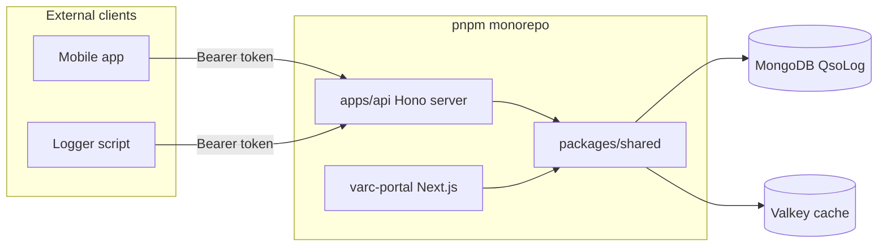

# VARC QSO API Application Plan

## Context

Today QSO CRUD lives only in Next.js **server actions** ([`src/lib/qso-actions.ts`](src/lib/qso-actions.ts)); HTTP routes cover export and email confirm only. You chose:

- **Separate API application** (not Next.js route handlers)
- **Bearer token auth** for external clients (mobile, scripts, loggers)

The portal stays as-is initially; the API reads/writes the **same MongoDB** `QsoLog` collection ([`src/models/QsoLog.ts`](src/models/QsoLog.ts)).



---

## Target architecture

### Monorepo layout

Extend [`pnpm-workspace.yaml`](pnpm-workspace.yaml):

```yaml
packages:
  - "."
  - "apps/*"
  - "packages/*"
```

| Package | Role |
|---------|------|
| `.` (existing) | Next.js portal — unchanged entry point for now |
| `packages/shared` | Models, Zod schemas, DB connect, QSO service, cache invalidation, token helpers |
| `apps/api` | Standalone Node HTTP server (port e.g. **3100**) |

Portal imports move **incrementally** to `@varc/shared` so QSO rules are not duplicated.

### API stack (recommended)

- **Hono** + `@hono/node-server` — small, TypeScript-native, easy OpenAPI later
- **Zod** — reuse existing [`qsoInputSchema`](src/lib/validations/qso.ts)
- **Mongoose** — same patterns as [`src/lib/db.ts`](src/lib/db.ts)

---

## Phase 1: Shared library extraction

Extract the minimum needed for QSO CRUD into `packages/shared`:

| Module | Source today | Notes |
|--------|--------------|-------|
| `models/QsoLog.ts`, `models/User.ts` (partial) | `src/models/*` | Move or re-export; keep schema identical |
| `validations/qso.ts` | `qsoInputSchema`, list query schema | No Next-specific imports |
| `qso/service.ts` | Logic from `createQsoAction`, `updateQsoAction`, `deleteQsoAction`, `listUserQsosPage` | Pure async functions `(userId, input, ctx)` |
| `qso/dto.ts` | `toQsoListItemDto`, `QsoListItemDto` | JSON API shape |
| `db/connect.ts` | `connectDb()` | Shared `MONGODB_URI` |
| `cache/qso-cache.ts` | [`src/lib/cache/qso-cache.ts`](src/lib/cache/qso-cache.ts) | Call on every mutation |

**Service context** (replace Next-only deps):

```ts
type QsoServiceContext = {
  clientKey?: string;        // from X-Forwarded-For / req IP (confirmation rate limit)
  bypassEmailLimit?: boolean; // false for API tokens in v1
};
```

**Source field:** add `"api"` to [`QSO_SOURCES`](src/lib/qso-source.ts); API-created QSOs use `source: "api"`.

**Portal refactor (thin wrapper):** [`src/lib/qso-actions.ts`](src/lib/qso-actions.ts) calls `@varc/shared` service + keeps Next-only `revalidateLogbook()`.

---

## Phase 2: API token auth

New Mongoose model `ApiToken` in `@varc/shared`:

| Field | Purpose |
|-------|---------|
| `userId` | Owner of the token |
| `name` | Label ("Mobile logger", etc.) |
| `tokenHash` | SHA-256 of secret (never store plaintext) |
| `tokenPrefix` | First 8 chars for UI identification (`varc_abc1…`) |
| `scopes` | v1: `["qso:read", "qso:write"]` |
| `expiresAt` | Optional expiry |
| `lastUsedAt` | Audit |
| `revokedAt` | Soft revoke |

**Auth middleware:** `Authorization: Bearer <secret>` → lookup by prefix + constant-time hash compare → attach `{ userId, scopes }` to request context.

**Token issuance (v1 — no portal UI yet):**

- CLI script: `pnpm --filter @varc/api seed-token --user=<email> --name="Dev logger"`
- Returns secret **once** (same pattern as GitHub PAT)

**Portal UI for token management** — defer to Phase 2 follow-up (Account → Security tab card).

---

## Phase 3: REST endpoints (v1)

Base path: `/v1` (health unversioned).

| Method | Path | Scope | Behavior |
|--------|------|-------|----------|
| `GET` | `/health` | none | Mongo ping (mirror portal health) |
| `GET` | `/v1/qsos` | `qso:read` | Paginated list for token owner |
| `POST` | `/v1/qsos` | `qso:write` | Create QSO |
| `GET` | `/v1/qsos/:id` | `qso:read` | Single QSO (404 if not owner) |
| `PATCH` | `/v1/qsos/:id` | `qso:write` | Update (same rules as portal) |
| `DELETE` | `/v1/qsos/:id` | `qso:write` | Delete own QSO |

**List query params** (align with existing logbook): `page`, `pageSize`, `q`, `sort`, `dir` — reuse [`listUserQsosPage`](src/lib/qso.ts).

**Request/response JSON** (stable DTO):

```json
{
  "ok": true,
  "qso": {
    "id": "...",
    "workedCallsign": "XV1ABC",
    "qsoAt": "2026-08-22T10:00:00.000Z",
    "band": "20m",
    "freqMhz": 14.074,
    "mode": "FT8",
    "rstSent": "59",
    "rstRcvd": "59",
    "qso_sent": true,
    "qso_confirmed": false,
    "source": "api",
    "grid": "OK30",
    "notes": ""
  }
}
```

**Error shape** (match existing API conventions):

| Status | Body |
|--------|------|
| 401 | `{ "error": "Unauthorized" }` |
| 403 | `{ "error": "Forbidden" }` (missing scope) |
| 404 | `{ "error": "Not found" }` |
| 400 | `{ "ok": false, "error": "validation message" }` |
| 500 | `{ "error": "..." }` via `publicErrorMessage` |

**Business rules preserved from portal:**

- [`requireUserCallsign`](src/lib/qso.ts) — block create if owner has no callsign
- Confirmation email on `qso_sent: true` ([`enqueueQsoConfirmationRequest`](src/lib/qso-confirmation.ts))
- Owner-only update/delete (no admin override in v1 API unless you want `qso:admin` scope later)
- Cache invalidation after every write

---

## Phase 4: Local dev and deploy

**Dev scripts** (root `package.json`):

```json
"dev:api": "pnpm --filter @varc/api dev",
"dev:all": "./scripts/dev-local.sh"   // add API alongside portal + workers
```

**Env** (API `.env` or shared `.env`):

- `MONGODB_URI`, `VALKEY_URL` (if cache used)
- `API_PORT=3100`
- `API_TOKEN_PEPPER` (optional extra secret mixed into hash)

**Docker / K8s:**

- New `apps/api/Dockerfile` (multi-stage, Node 24)
- New manifests: `deploy/k8s/api-deployment.yaml`, `api-service.yaml`
- Ingress: subdomain `api.example.com` **or** path prefix `/v1` on existing host (subdomain cleaner for Bearer clients)
- Extend [`.github/workflows/release.yml`](.github/workflows/release.yml) to build/push `ghcr.io/.../varc-api:vX.Y.Z`

---

## Phase 5: Tests and docs

- **Integration tests** in `apps/api` using Hono test client + test Mongo (or in-memory)
- Cases: auth failure, CRUD happy path, owner isolation, callsign gate, validation errors
- **README section** in [`README.md`](README.md): auth header, endpoints, example `curl`
- Optional: OpenAPI via `@hono/zod-openapi` once v1 stabilizes

---

## Suggested implementation order

1. Scaffold monorepo + `packages/shared` with db connect and QsoLog model
2. Move `qsoInputSchema` + extract `qso/service.ts` from server actions
3. Refactor portal `qso-actions.ts` to call shared service (verify no behavior regression)
4. Add `ApiToken` model + seed-token script
5. Build `apps/api` with auth middleware + 5 QSO routes
6. Wire `dev:api`, Docker, K8s, release workflow
7. Integration tests + README

---

## Out of scope for v1 (explicit follow-ups)

- Portal UI to create/revoke API tokens
- Admin deleting another user's QSO via API
- ADIF import/export via API (export exists on portal only today)
- OAuth2 / JWT — Bearer static tokens only
- Rate limiting middleware (recommended soon after v1)
- Moving the entire portal into `apps/portal`

---

## Key files to leverage

| Concern | Existing file |
|---------|---------------|
| QSO schema | [`src/models/QsoLog.ts`](src/models/QsoLog.ts) |
| Validation | [`src/lib/validations/qso.ts`](src/lib/validations/qso.ts) |
| CRUD logic | [`src/lib/qso-actions.ts`](src/lib/qso-actions.ts) |
| List/pagination | [`src/lib/qso.ts`](src/lib/qso.ts) |
| DTO | [`src/lib/account-types.ts`](src/lib/account-types.ts) (`QsoListItemDto`) |
| API route patterns | [`src/app/api/account/qso/export/route.ts`](src/app/api/account/qso/export/route.ts) |
| Error handling | [`src/lib/safe-error.ts`](src/lib/safe-error.ts) |
