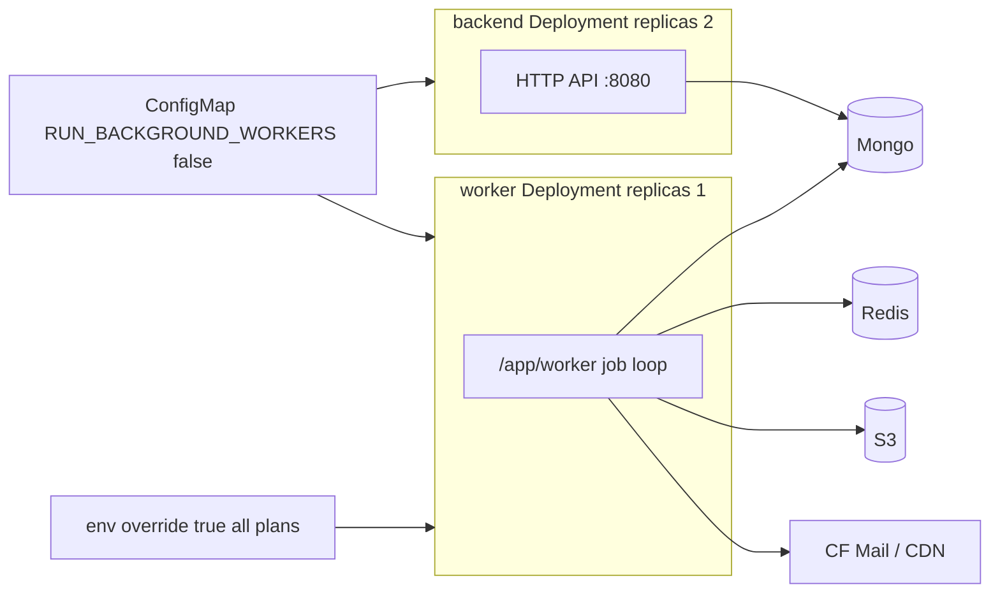

# Worker Deployment change analysis (classqIO)

Source: [`classqIO/deploy/k8s/example/ham-check.example.yaml`](/Users/hai.tran/Working/repositories/classqIO/deploy/k8s/example/ham-check.example.yaml) — commit **b040790** (“Enable background worker for heavy task”).

## Product decision (portal)

**`RUN_BACKGROUND_WORKERS` is enabled for every app plan** (Starter / Standard / Pro / Premium — no SKU gate, no plan-templated true/false).

K8s topology stays the classqIO split so only one claimer runs:

| Surface | Value | Why |
|---------|--------|-----|
| Shared ConfigMap (API) | `RUN_BACKGROUND_WORKERS: "false"` | Multi-replica API must not drain jobs |
| Worker Deployment env | `RUN_BACKGROUND_WORKERS: "true"` | Dedicated claimer; **same for all plans** |
| `JOB_POLL_INTERVAL` | e.g. `2s` | Shared via ConfigMap |

“True for all plans” means every provisioned project gets the **worker Deployment with override true**, not that API pods run in-process workers.

## What changed (classqIO)

Previously, API pods ran HTTP **and** in-process background jobs (default `RUN_BACKGROUND_WORKERS=true` in [`backend/internal/config/config.go`](/Users/hai.tran/Working/repositories/classqIO/backend/internal/config/config.go)).

The example now uses a **two-process** model:

| Piece | Behavior |
|--------|----------|
| ConfigMap | `RUN_BACKGROUND_WORKERS: "false"`, `JOB_POLL_INTERVAL: 2s` |
| `backend` Deployment | Inherits `false` → no in-process job drain |
| **New `worker` Deployment** | Same backend image; `command: ["/app/worker"]`; `RUN_BACKGROUND_WORKERS=true`; `replicas: 1`; same secrets; no Service / probes |

## What the worker process does

[`backend/cmd/worker/main.go`](/Users/hai.tran/Working/repositories/classqIO/backend/cmd/worker/main.go) runs mail delivery, backup/export jobs, and other registered handlers — no HTTP server.

## Gap vs classq-portal

[`templates/apps/__NAMESPACE__/base/`](templates/apps/__NAMESPACE__/base/) has backend + frontend only — no worker, no `RUN_BACKGROUND_WORKERS`. Tenants still use ClassQ’s default in-process `true` on every API replica.

## Portal adoption plan

1. **[`configmap-ro.yaml`](templates/apps/__NAMESPACE__/base/configmap-ro.yaml)** — add fixed (not plan-templated) keys:
   - `RUN_BACKGROUND_WORKERS: "false"`
   - `JOB_POLL_INTERVAL: "2s"`
2. **`worker-deployment.yaml`** — mirror classqIO worker: same image as backend, `command: ["/app/worker"]`, env override `RUN_BACKGROUND_WORKERS=true`, `replicas: 1`, same envFrom/secrets/volumes as backend needs for jobs.
3. **[`kustomization.yaml`](templates/apps/__NAMESPACE__/base/kustomization.yaml)** — include the worker resource.
4. **Tests / ops** — [`manifest_git_test.go`](backend/internal/service/manifest_git_test.go); include `worker` in restart-deployment helpers so portal “Restart” rolls the job claimer too.
5. Confirm tenant backend image contains `/app/worker`.

No SKU / plan catalog changes — worker is unconditional for all projects.
